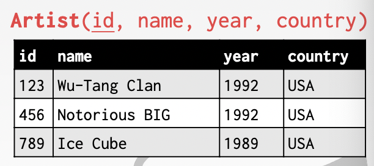
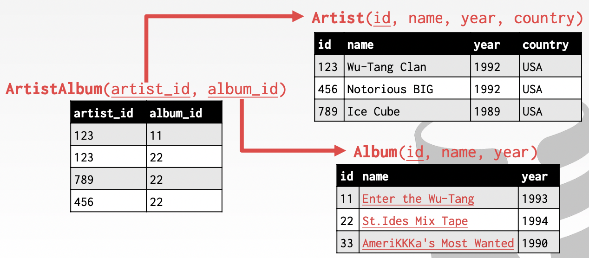

# Lecture 01. Relational Model

注意区分**数据库Database**和**数据库管理系统Database Management System, DBMS**，前者是对真实世界建模后的数据，后者是管理数据的程序

各种各样的数据模型：

- 关系 Relational
- 键值 Key/Value
- 文档 Document
- Column-family
- Array/Matrix
- 层级 Hierarchical
- 网络 Network
- Multi-Value

## 普通文件 Flat File Strawman

例如采用一个`.csv`文件作为数据库，则会有以下问题：

- **完整性 Data Integirty**
  - 如何保证不同数据间的一致性，例如对同一个album的artist都是一致的
  - 如何防止无效数据覆盖了真实数据
  - 一个album有多个artists时如何存储
- **实现 Implementation**
  - 如何找到一个指定的记录
  - 如何处理并发读写同一个文件
- **持久化 Durability**
  - 如果在更新数据时机器故障宕机如何处理
  - 如何在多个机器上备份以实现高可用性

## 关系型 Relational Model

一个关系relation就是一组描述实例的属性集合，一个元组tuple就是一组属性值

**n-ary Relation = Table with n columns**

### 主键 Primary Keys

主键是用来唯一标识每一个元组的，通常若没有定义主键，则数据库会自动生成主键



自动生成唯一整数主键的方式：

- `SEQUENCE` (SQL:2003)
- `AUTO_INCREMENT` (MySQL)

### 外键 Foreign Keys

外键是用来指定一个属性值必须对应到另一个关系中的一个元组



### 数据操纵语言 Data Manipulation Languages, DML

用来存储和获取数据库中数据的语言

- **过程式/命令式 Procedural**：查询会显式指定获取结果的策略，对应关系代数 Relational Algebra
- **非过程式/声明式 Non-Procedural**：查询只会给出所需数据，而不是指定获取方法，对应关系计算 Relational Calculus

#### 关系代数 Relational Algebra

- `SELECT`

    ```sql
    SELECT * FROM R
        WHERE a_id='a2' AND b_id>102;
    ```

- `PROJECTION`

    ```sql
    SELECT b_id-100, a_id
        FROM R WHERE a_id='a2';
    ```

- `UNION`

    ```sql
    (SELECT * FROM R)
        UNION ALL
    (SELECT * FROM S);
    ```

- `INTERSECTION`

    ```sql
    (SELECT * FROM R)
        INTERSECT
    (SELECT * FROM S);
    ```

- `DIFFERENCE`

    ```sql
    (SELECT * FROM R)
        EXCEPT
    (SELECT * FROM S);
    ```

- `PRODUCT`

    ```sql
    SELECT * FROM R CROSS JOIN S;

    SELECT * FROM R, S;
    ```

- `JOIN`

    ```sql
    SELECT * FROM R NATURAL JOIN S;
    ```

其余还有`Rename, Assignment, Duplicate Elimination, Aggregation, Sorting, Division`

### 查询 Query

关系模型与查询语言的实现无关，SQL是事实上的标准（有非常多的变种）

> SQL is the defacto standard
