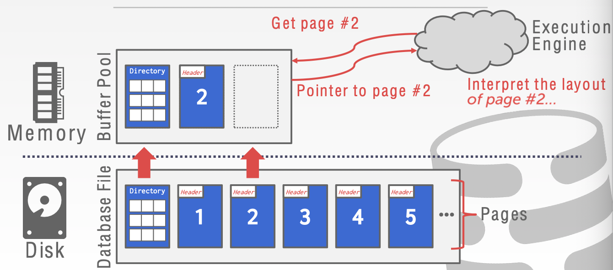
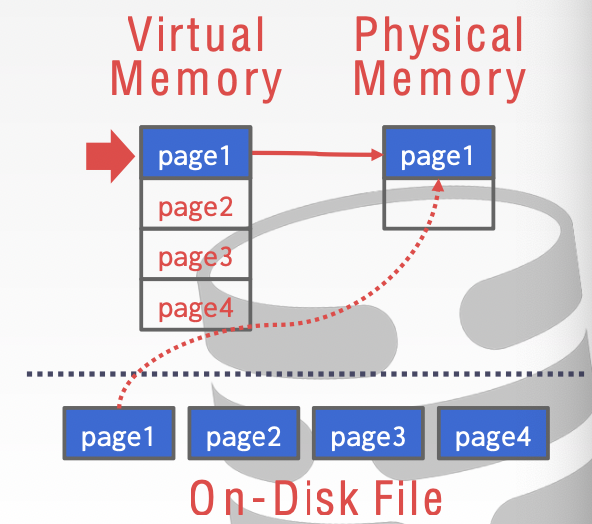
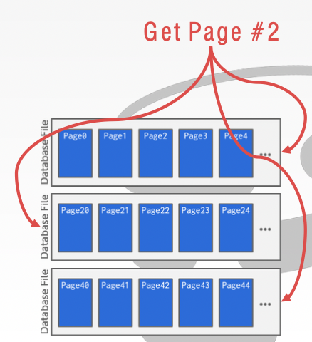
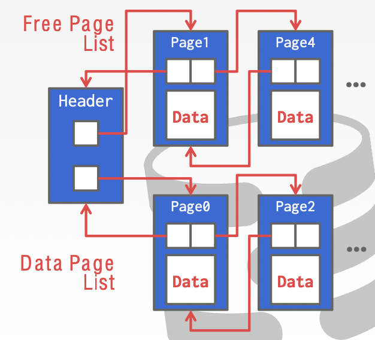
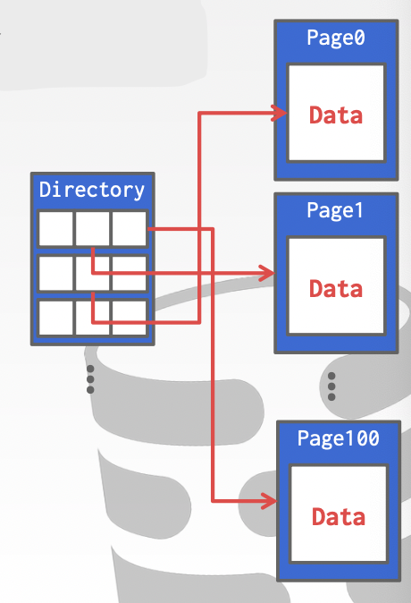
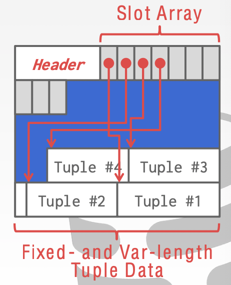
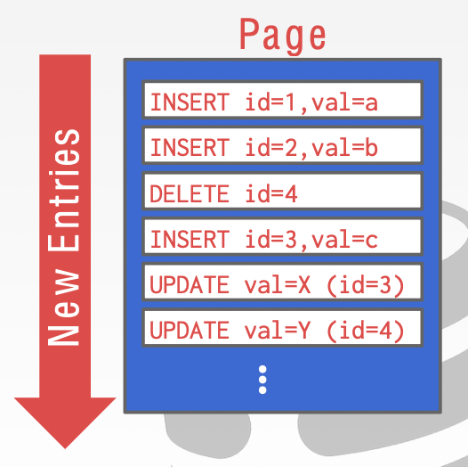
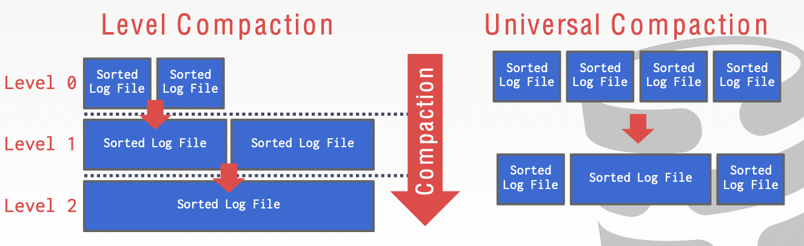

# Lecture 03. Database Storage I

## 存储层次 Storage Hierarchy

*延迟数据随着硬件发展变化很大（主要是DRAM/NVM/SSD），但层次关系基本不变*

1. 寄存器 CPU Registers
2. 高速缓存 CPU Caches
   - L1缓存 0.5 ns
   - L2缓存 7.0 ns
3. 内存 DRAM
   - 100.0 ns
4. 非易失内存 Non-volatile Memory
5. 固态磁盘 SSD
   - 顺序读取1MB 1M ns
6. 高速网络存储 Fast Network Storage
7. 磁盘 HDD
   - 顺序读取1MB 20M ns
8. 网络存储 Network Storage

- **易失存储设备 volatile devices**
  数据在掉电时会丢失，通常允许高速**随机访问random access**，例如普通内存（对应intel的persistent memory）
- **非易失存储设备 non-volatile devices**
  数据可以持久可靠的保存，通常按页/块访问，并且在**顺序访问sequential access**时性能更高，例如磁盘（包括固态磁盘SSD和普通磁盘HDD）

## 顺序访问与随机访问 Sequential vs. Random Access

**通常随机访问在非易失存储器（例如磁盘等）会比顺序访问慢很多**，因此Log-Structured Merge Tree就通过将随机访问转变为顺序访问从而提供更好的性能

但是目前的一些NVMe协议的SSD随机访问性能已经非常优越，甚至使得基于LSM树的存储引擎在运行时[CPU成为了瓶颈]()

面向普通磁盘（例如HDD）设计的DBMS依然需要考虑到顺序访问更快，在运行时尽可能减少磁盘随机访问IO次数来减少延迟提高性能

## 面向磁盘的数据库管理系统 Disk-Oriented DBMS

- 磁盘需要考虑的问题
  - 寻道时间 2-3 ms
  - 旋转延迟 0-4 ms (15000 RPM)
  - 传输时间 0.25 ms / 64 KiB page
- 基本设计如图

  

- **为什么不采用OS的缓存？**
  通过使用内存映射`mmap`可以直接将文件映射到进程的地址空间，并且由操作系统来维护页缓存，但是缺点在于OS对数据库的负载无感知，更容易使得因缺物理帧不足等问题导致DBMS暂停，通过以下方式可以缓解，因此OS缓存实际上也被部分DBMS采用
  - `madvise`：告诉OS如何访问固定的页
  - `mlock`：锁定页使其不会被置换
  - `msync`：刷新内存的页数据到磁盘上
  
  

- **DBMS直接管理文件的好处**
  - 按正确的顺序刷回脏页
  - 优化的预读取
  - 缓存置换策略
  - 线程/进程调度

另外SSD则有以下特点：

- 细粒度的读（4-8K），粗粒度的写（1-2M)
- 寿命短于HDD，通常只有2-3K的擦除次数，同时需要经常调整热点读写块，即**NAND负载均衡 NAND wear leveling**
- 存在**写放大问题 write amplification**
- 读取速度快（顺序/随机）写入速度慢（顺序/随机）

## DBMS如何使用文件来代表数据库

### 文件种类

- **无序堆文件 unordered heap files**：记录随意存放在各个页中，适合全记录扫描
- **聚合堆文件和散列文件 clustered heap files and hash files**：记录和页分组，快速查询扫描
- **有序文件 sorterd files**：记录和页是有顺序存放的，适合有序/范围扫描
- **索引文件 index files**：B+树、散列表等，快速查询和高效修改、连接

### 文件存储 File Storage

- **存储管理器stroage manager**
  使用storage manager维护数据库的文件，将文件组织为**页pages**的集合，一个page就是一个固定大小的数据块fixed-size block of data并且有一个**唯一的page id**

  注意，不同层面上都有页的概念：硬件层页（通常4KB），操作系统页（通常4KB，大页可以是2MB甚至1GB），数据库页（512B-16KB）
- **堆文件heap file**
  一个数据库的**heap file就是一组无序的pages**，tuples可以以随机顺序存储在page中

  

  heap file可以由下述方式实现：
  - **链表 linked list**
    在文件头部页header page维护两个指针，一个指向数据页链表头Data Page List HEAD，一个指向空闲页链表头Free Page List HEAD，每个页都维护自己内部还有多少空闲slots

    
  
  - **页表 page directory**
    使用页表内存放指针管理其他数据页，类似索引，同时也会记录相应的数据页内的空闲slots，DBMS需要确保页表和数据页的一致性

    

### 页的布局 Page Layout

- **头page header**
  每一页都有一个header，用以存储page metadata，例如`Size, Checksum, Version, Transaction, Compression`等信息
- **插槽页slotted pages**
  header中保存使用的slots数量，随后跟着slot array倒序记录使用的tuple的偏移量，如下图：

  

  - 新增tuple时，slot array向后扩展，对应的tuple从尾部向前扩展，当array和tuple相遇时就认为该page已满
  - 删除tuple时，可以简单将slot array中的指针置空，但是如果后续增加的tuple长度不同时，可能会导致碎片，也可以通过定期移动tuple合并碎片
- **日志结构式log-structured**
  相比于存储tuples，**DBMS只存储日志记录log records，日志包含了数据库的所有操作**（`insert, update, delete, etc`），从而在需要读取某个数据时，DBMS回放log从而构造出对应的tuples，如图：

  

  特别适用于快速write，而可能导致较慢read，并且可以通过**周期的snapshot和log compaction**来减少每次回放需要的log record数量

  

  图中这种合并方式就是LSM存储引擎的运行原理，参考LSM和SSTable

除了上述设计以外，还可以根据不同的选择（记录的长度固定/不固定、页紧凑/不紧凑）有多种设计：

- 记录长度固定，紧凑：添加记录直接追加到末尾，删除时需要更新
- 记录长度固定，非紧凑：添加记录直接追加到末尾，删除时简单删除，所有操作需要更新位图索引
- 变长记录：即上述设计

### 元组布局 Tuple Layout

- **头tuple header**
  每一记录都有一个header，用以存储tuple metadata，例如位图索引来记录`NULL`的字段
- **数据data**
  所有属性通常按照顺序存储
- **标识tuple id**
  对每个tuple，即数据库的一个record，通过唯一的**record ID来标识，通常会使用`page_id+offset/slot`来表示**
