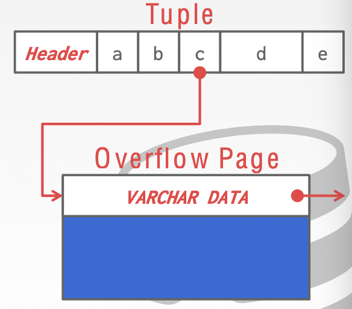
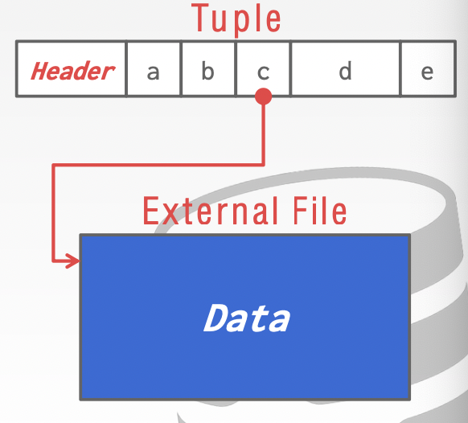
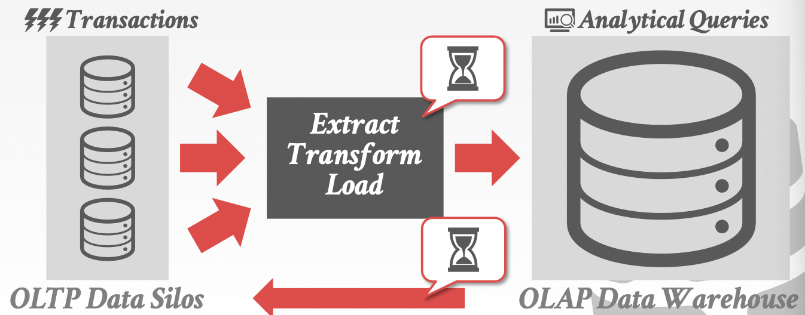
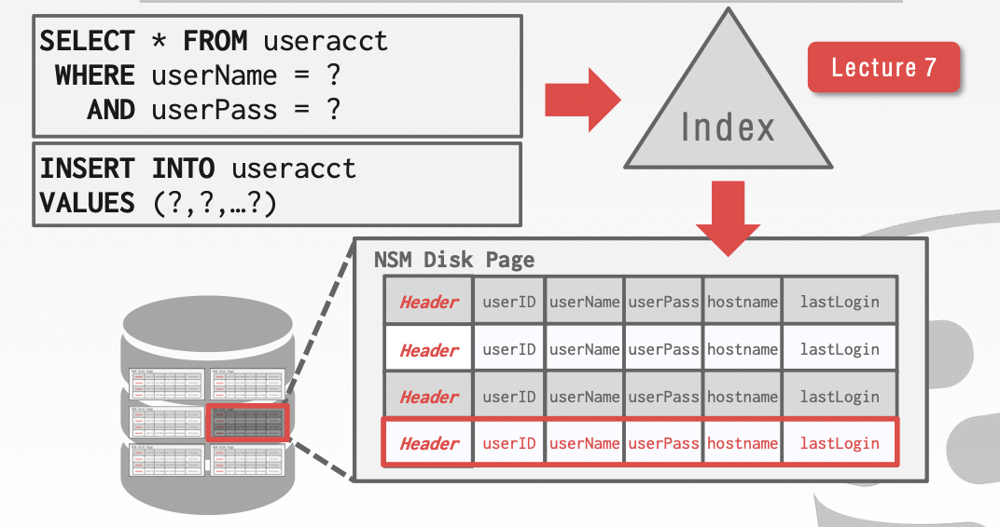
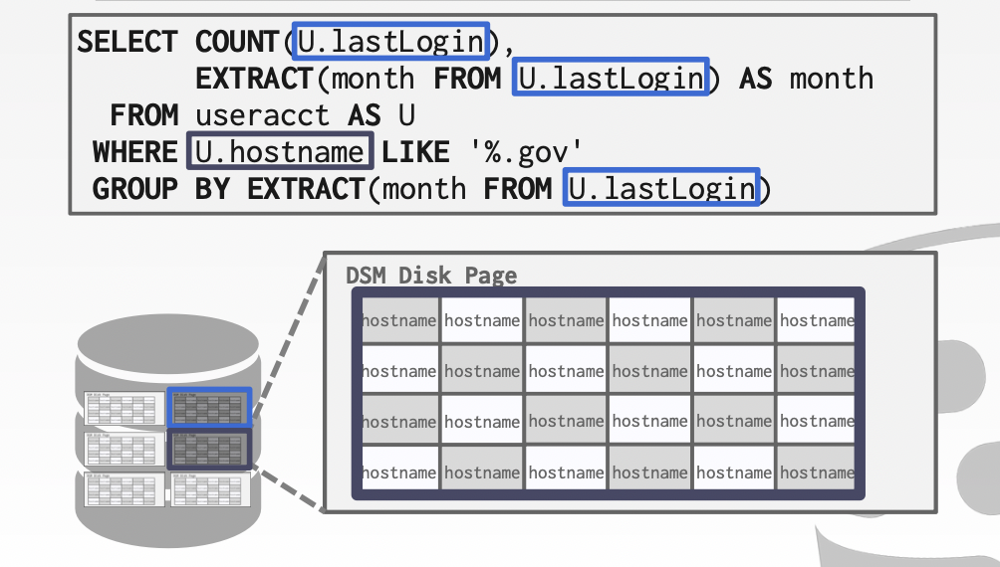
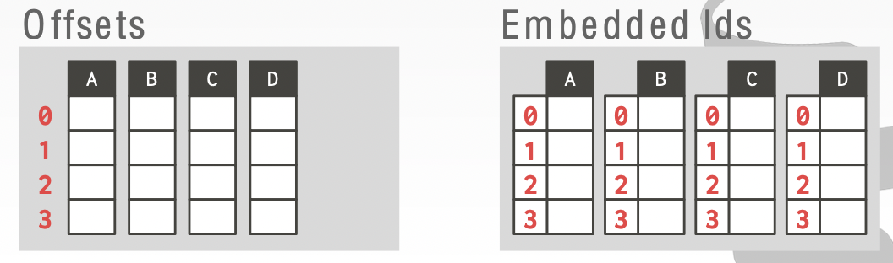

# Lecture 04. Database Storage II

## 数据表示 Data Representation

- `INTEGER, BIGINT, SMALLINT, TINYINT`
  直接采用C/C++的表示
- `FLOAT, REAL, NUMERIC, DECIMAL`
  前两者IEEE-754标准，后两者定点数（Postgres实现如下）

    ```cpp
    typedef unsigned char NumericDigit;
    typedef struct {
      int ndigits; // # of digits
      int weight;  // weight of 1st digit
      int scale;   // scale factor
      int sign;    // positive/negative/NaN
      NumericDigit *digits;  // digit storage
    } numeric;
    ```

- `VARCHAR, VARBINARY, TEXT, BLOB`
  header保存长度，后紧跟数据
- `TIME, DATE, TIMESTAMP`
  32/64位的整数表达秒/微秒精度的Unix epoch时间

对于特别大的数据，大部分DBMS不允许直接存储单个record超过一整个page的数据，而是采用**溢出页overflow storage pages**单独存储部分特别长的字段



也可以采用**外部文件external file**来存储并视为`BLOB`类型的数据



## 系统目录 System Catalogs

DBMS管理的**数据库元信息**（例如表、列名、索引、试图、用户和权限、统计数据等）往往**也会存储在一个数据库中**，这个数据库会被DBMS特殊处理

## 存储模型 Storage Models

### 数据库负载类型 Database Workloads

- **联机事务处理 On-Line Transaction Processing, OLTP**
  逻辑往往简单，读取和更新数据

    ```sql
    SELECT P.*, R.*
        FROM pages AS p
        INNER JOIN revisions AS R
            ON P.latest = R.revID
        WHERE P.pageID = ?
    
    UPDATE useracct
        SET lastLogin = NOW()
            hostname = ?
        WHERE userID = ?
    
    INSERT INTO revisions
        VALUES (?, ?,... ,?)
    ```

- **联机分析处理 On-Line Analytical Processing, OLAP**
  通常是处理OLTP获得数据，逻辑复杂往往只是读取和聚合分析，不会有更新和删除

    ```sql
    SELECT COUNT(U.lastLogin), EXTRACT(month FROM U.lastLogin) AS month
        FROM useracct AS U
        WHERE U.hostname LIKE '%.gov'
        GROUP BY EXTRACT(month FROM U.lastLogin)
    ```

- **混合事务分析处理 Hybrid Transaction + Analytical Processing, HTAP**
  兼有数据修改和分析，高效的实现非常困难



### 数据存储模型 Data Storage Models

对于不同的工作负载，选择不同的存储模型性能更好

- **N-ary Storage Model, NSM**（行存储row storage）
  将一个tuple的所有属性连续放在一个page中，**对OLTP的负载非常具有优势**，因为OLTP往往会局限在一个tuple内（`insert, update, delete`），并且写入新数据也是以tuple为单位的

  

  很明显这种存储模型**对分析型的负载不友好**：聚合分析专注每个tuple的部分属性，从而要访问注定范围内的所有tuple所在的所有pages——大量磁盘IO
- **Decomposition Storage Model, DSM**（列存储column storage）
  将所有tuples的相同属性连续放在一起，**对OLAP的负载非常具有优势**，因为OLAP往往涉及到每个tuples内的部分属性

  

  此时只需要读取处理这部分属性对应的数据文件即可，且相同属性的数据具有相同的类型，可以**适用连续大块数据读取和高效的数据压缩算法**，但同样的如果要修改数据就会导致需要修改分布在多个pages上的tuple的不同属性，**对事务型的负载不友好**
  
  由于每个tuple的相同属性存储在一起，因此还需要识别每一个属性所属的tuple：
  - **定长偏移 Fixed-length Offsets**：相同属性->相同数据类型->相同长度（除了变长数据例如`VARCHAR`）
  - **内置标识 Embedded Tuple IDs**：每个数据带上tuple ID一起存储
  
  
