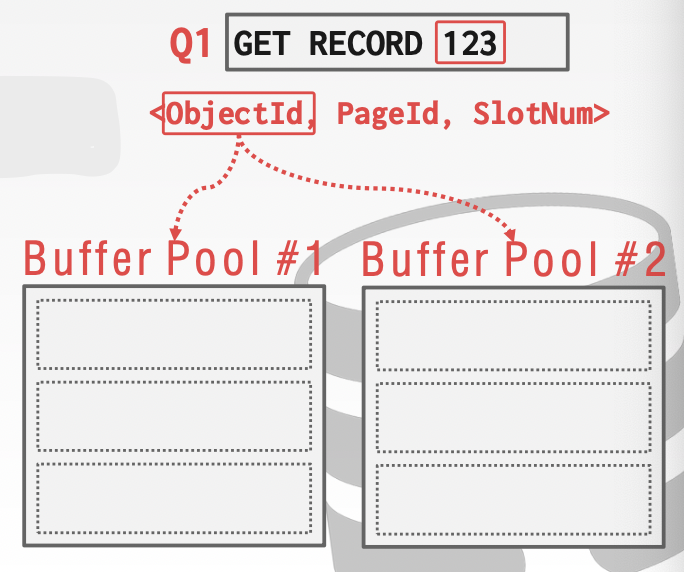
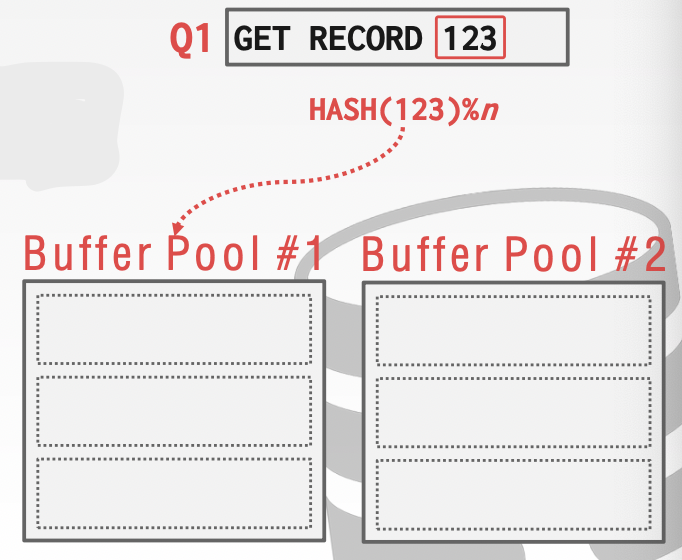
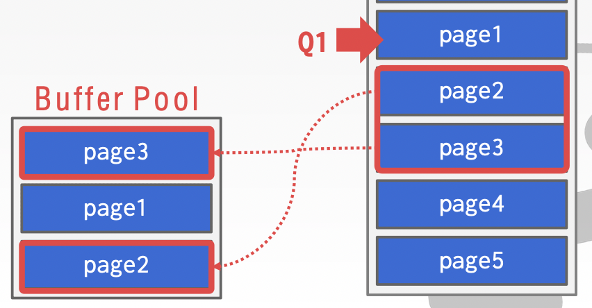
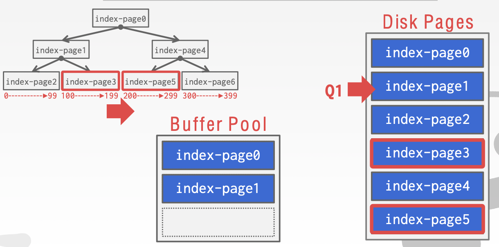
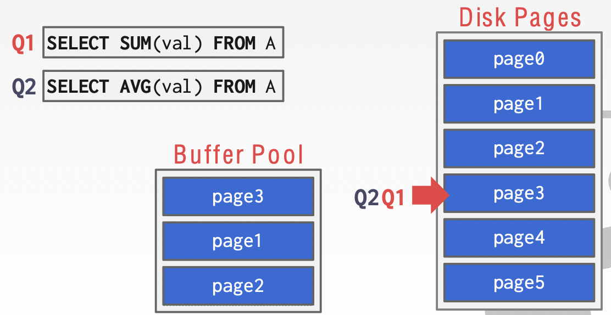
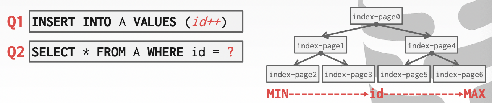

# Lecture 05. Buffer Pools

## 缓存池管理器 Buffer Pool Manager

### 缓存池组织 Buffer Pool Organization

内存空间被组织为一系列固定大小页fixed-size pages的数组，数组的元素就是**帧frame**，当DBMS请求page时，page就会被复制一份并放在frame中

采用一个**页表page table**来追踪所有在内存中的pages并且维护每个page额外的元信息（**脏页标记dirty flag，引用计数pin/reference counter**）

### 锁 Locks vs. Latches

- **Locks**
  保护数据库的内容不被多个事务并发修改，在事务期间持有，需要有回滚修改的能力——更像业务上的锁
- **Latches**
  数据库内部数据的锁，避免内部数据被并发修改，不同的操作需要持有，不需要有回滚修改的能力——更像编程语言层面的锁

### 页表 Page Table vs. Page Directory

- **Page Directory**
  用于将page id映射到数据库文件中的page location
- **Page Table**
  用于将page id映射到缓存池中page对应的frame

### 缓存池优化 Buffer Pool Optimizations

- **多缓存池 Multiple Buffer Pools**
  数据库可以有多个缓存池，更好的避免latch竞争，以及提升数据的局部性，如何将不同的page放置在不同的缓存池中可以通过以下两种方式：
  - **Object ID**：每个record id内嵌一个object id，维护object id到缓存池的映射关系
  

  - **Hashing**：根据page id来选择缓存池
  
  
- **预读取 Pre-Fetching**
  通过分析查询可以预先读取需要的页，通常可以是：
  - **顺序扫描sequential scan**
    
  - **索引扫描index scan**
    
- **共享扫描 Scan Sharing**
  查询可以重用reuse其他查询或操作读取的数据（并不是缓存同样查询的结果），也称为**同步扫描synchronized scans**
  
- **绕过缓存 Buffer Pool Bypass**
  顺序扫描sequential scan往往可以绕过缓存，避免在缓存池中存储page带来开销，而是直接在磁盘文件上顺序读取数据

  DBMS往往会绕过操作系统缓存，采用`O_DIRECT`直接打开文件

## 替换策略 Replacement Policies

缓存池的容量有限，因此需要frame替换策略

- **Least-Recently Used, LRU**
  每次替换掉最久没有被使用的frame（持有最旧的timestamp），难以应对**顺序洪范sequential flooding**：按顺序连续读取大量pages，但是实际上每个page只会访问一次，此时每个page都会被复制到frame但只用一次，缓存命中率接近零

  有一些负载之下最近使用的page是后续最不需要的page
- **Clock**
  对LRU的近似，但不需要timestamp，每个frame持有一个**引用位ref bit**，当被访问时设置为1
  
  所有缓存frame以clock的形式环形组织，当需要替换时顺时钟扫描frames，如果遇到`ref=1`就设置为0，如果遇到`ref=0`就替换掉，下次从该替换frame的下一个frame继续开始扫描

  同样难以应对sequential flooding
- **LRU-K**
  在LRU的基础上，维护最近访问过的K次page，使用这历史K次访问来估计下一个会访问到的page
- **Localization**
  每个事务transaction/查询query**独立进行缓存替换**，从而防止某个查询引入sequential flooding污染缓存池
- **Priority Hints**
  DBMS分析page在查询上下文中的重要性，从而可以给缓存管理器一些hints来更好的管理frames
  

对需要被置换的frame有两种处理方式，也同样可以影响到缓存替换策略：

- **丢弃drop**：对并不脏的页可以直接简单丢弃，**高效**
- **写回write back**：对于**脏页dirty page**需要写回来确保持久性，**较慢**，同时写回脏页也可以作为一个后台服务background service在DBMS空闲时周期性运行（但脏页不能在log持久化前写回，crash recovery时数据一致性）

## 其他内存池 Other Memory Pools

在缓存page以外，DBMS在以下其他方面也会需要用到内存池：

- Sorting + Join Buffers
- Query Caches
- Maintenance Buffers
- Log Buffers
- Dictionary Caches
