# Lecture 06. Hash Tables

## 核心数据结构 Data Structures

- Internal Meta-data：保存数据库和系统状体
- Core Data Storage：tuple的存储
- Temporary Data Structure：临时的数据结构，例如join时的中间结果
- Table Indexes：用于快速定位表中的tuples

## 散列函数 Hash Functions

- CRC-64: networking error detection, 1975
- MurmurHash: fast, general purpose, 2008
- Google CityHash: faster for short keys (<64 bytes), 2011
- Facebook XXHash: from zstd compression, 2012
- Google FarmHash: improved CityHash, 2014

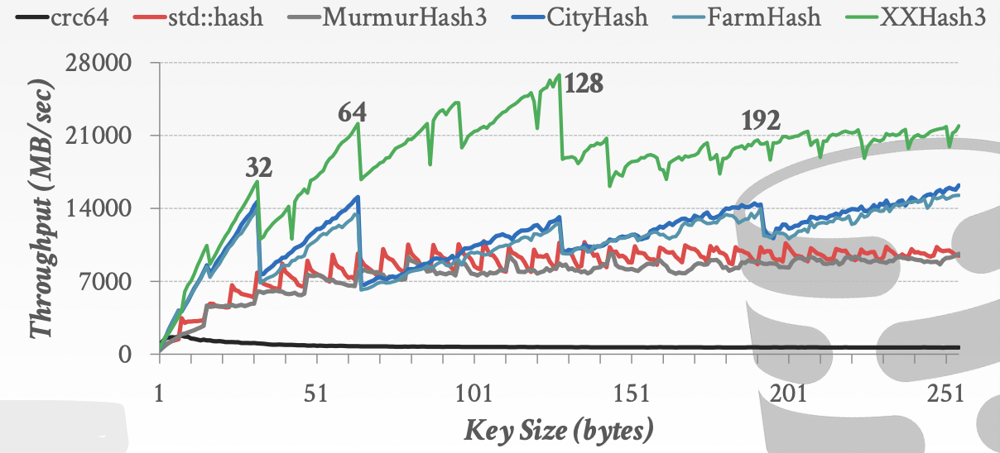

## 静态散列 Static Hashing Schemes

静态散列并不适用于DBMS，静态散列要求事先知道要存储多少数据才能设计的比较合适

### Linear Probe Hashing

单个表用来存放所有数据，当出现冲突时，线性向后查找第一个空位插入，查找时需要从散列的位置线性向后扫描直到找到所需的数据

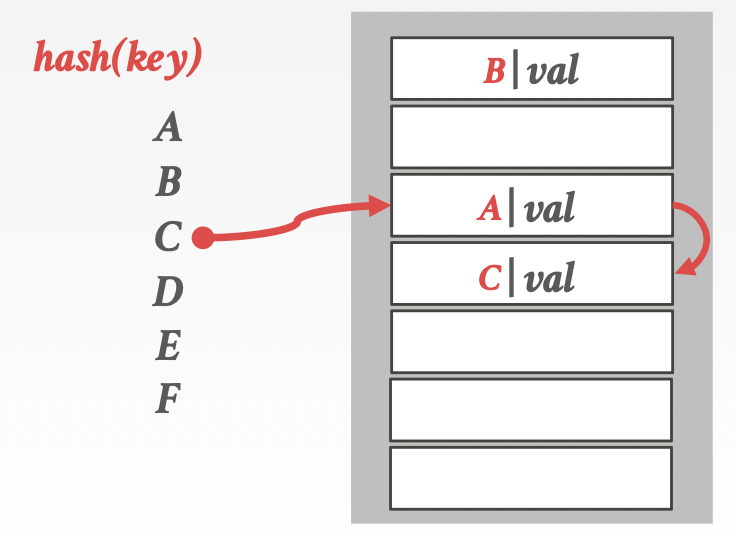

对于key相同的多个value，可以采用：

- **Separate Linked List**
- **Redundant Keys**

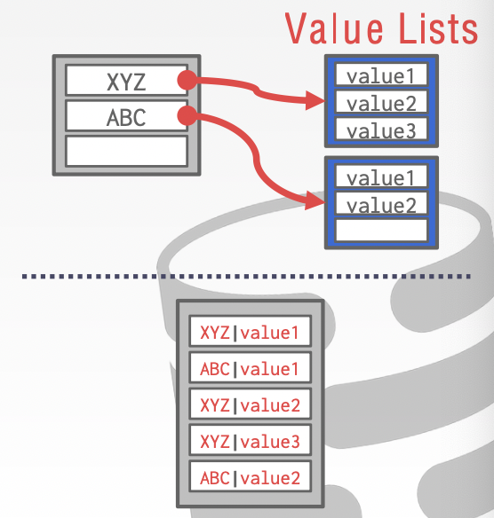

### Robin Hood Hashing

类似Linear Probe Hashing，但是会**平衡相邻的keys的插槽数slots**

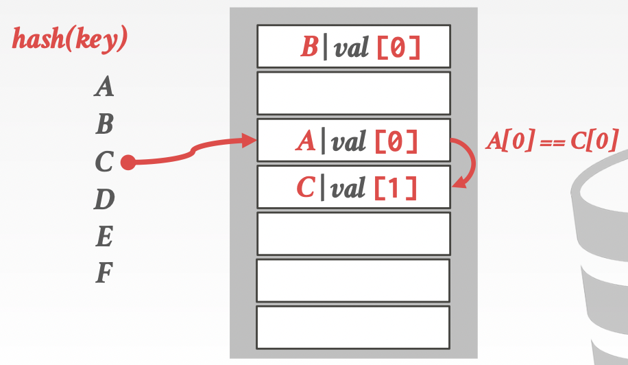

原先下图中`E|val[2]`的位置放置了`D|val[1]`，当插入`E`时如果放置在`D`下面则需要`E|val[3]`，离原始位置过远，此时将`D`下移至`D|val[2]`并将`E`放置在原先`D`的位置成为`E|val[2]`——平衡不同keys

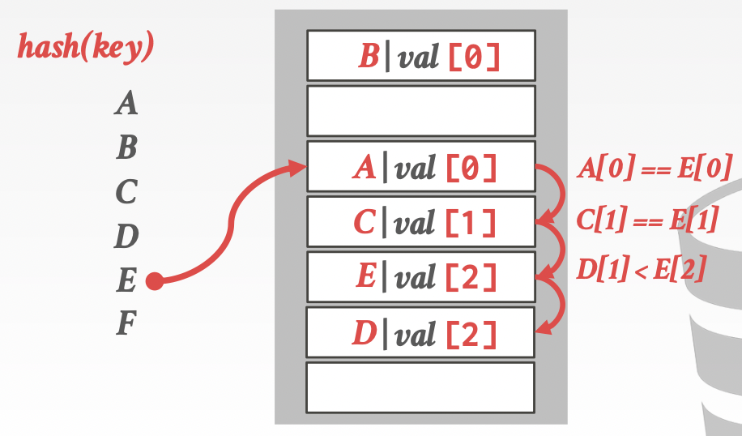

### Cuckoo Hashing

采用**多个散列表，并且有不同的散列函数种子hash function seeds**，当需要插入数据时随机挑选一个散列表并插入，如果发现位置已经有对象，则将该对象插入到另一个表，如果也冲突，则**反复将对象插入到另一张散列表**

插入`A`时加入到空表1中，插入`B`时发现表1位置已被占用，则加入到空表2中，插入`C`时发现表1和表2对应位置都已经有值了

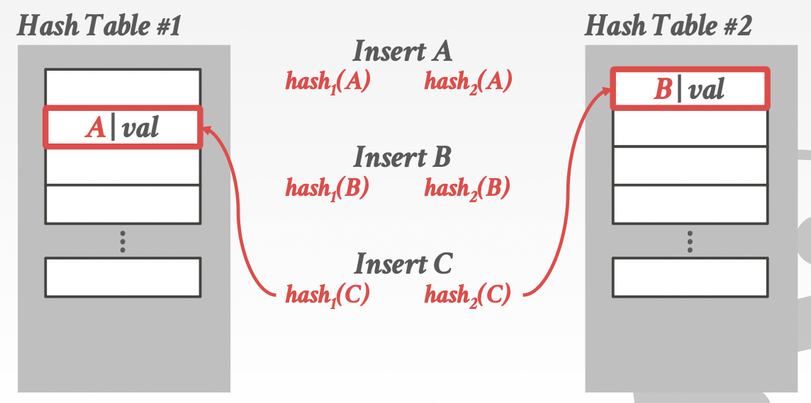

将`C`插入到表2中`B`的位置，将`B`重新散列后加入到表1中`A`的位置，将`A`重新散列后加入到表2中新的位置

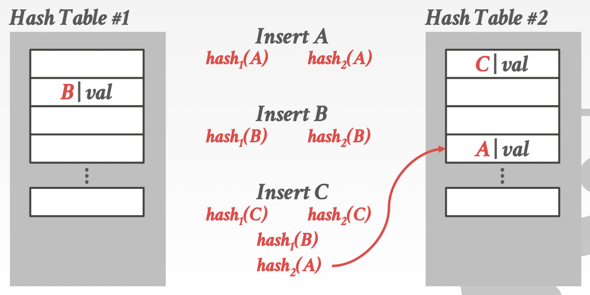

## 动态散列 Dynamic Hashing Schemes

动态散列能够根据需要自适应大小，因此更适合DBMS

### Chained Hashing

维护一系列桶bucket，**每个散列值都对应一个桶链表**，因此所有散列值相同的对象都在相同的桶链中（超出时用链表的形式维护）查找时需要扫描桶中所有元素

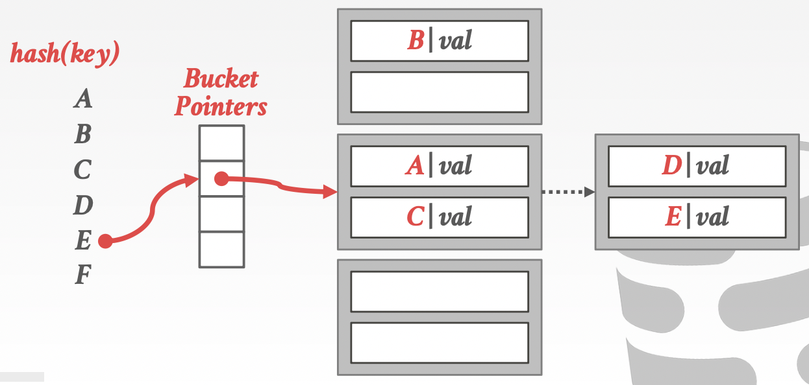

### Extendible Hashing

每个散列值对应一个桶，当桶元素满时采用拓展的散列函数（例如原先基于前2bit的散列拓展为基于前3bit）**将桶进行分割，类似前缀匹配的形式**

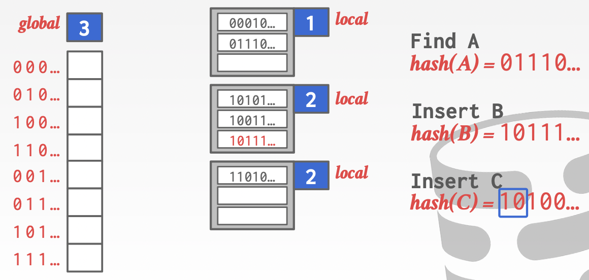

由于此时第二个桶已经满了，因此原先基于前2bit的散列扩展到基于前3bit，从而第二个桶被分裂成2个子桶

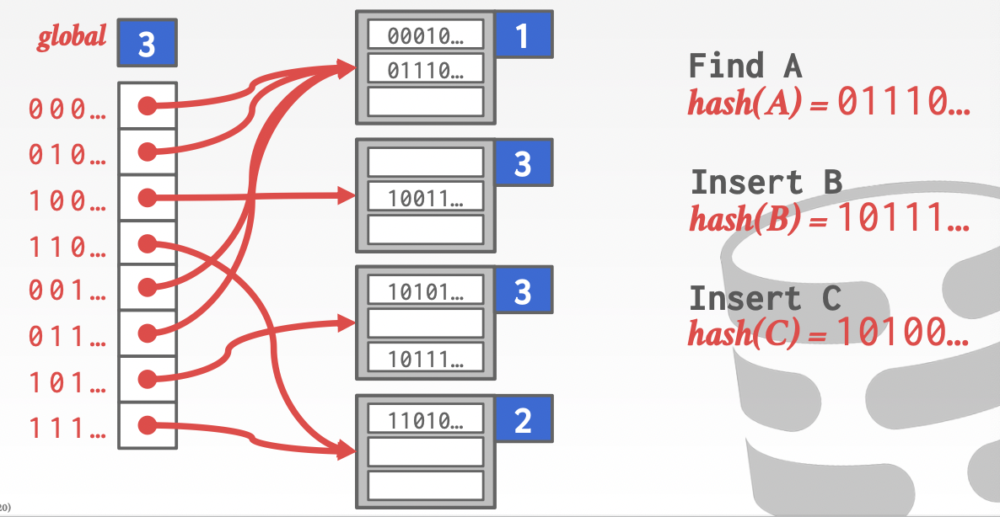

### Linear Hashing

维护一个**分裂指针split pointer**，指向会被分裂的桶，一旦**任意桶溢出都会针对被指向的桶计算出一个新的散列函数并追加一个新桶，即分裂**，从而该桶的部分元素会移进新桶

通常散列函数是一系列`hash_i(key) = key % 2^i`，**split pointer始终指向第一个使用最小`i`散列函数的桶**

原先只有4个桶，散列函数就是`key % 4`，split pointer指向第一个桶，此时的4个桶均使用`hash_2(key) = key % 4`

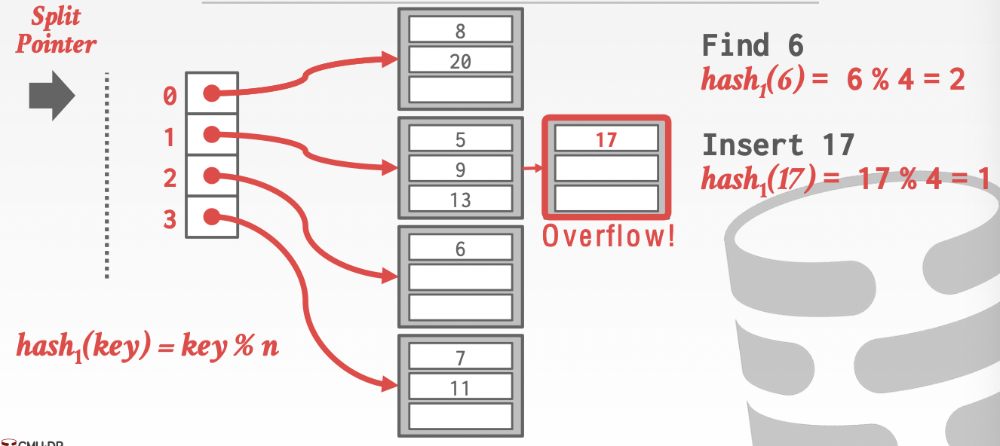

当**第1个桶溢出**时计算出新的散列函数`hash_3(key) = key % 8`并且构建新的桶，重新计算**被分裂的第0个桶**的元素散列值后进行数据迁移

此时第0、4个桶都适用`hash_3`而其余桶适用`hash_2`，此时split pointer就指向第一个使用最小`i`散列函数的桶，即第1个桶，**下一次任意桶溢出就会分裂第1个桶**

最终所有桶都采用相同的`hash_i`后split pointer就会重新指向第0个桶（同样符合“split pointer就指向第一个使用最小`i`散列函数的桶”的要求）

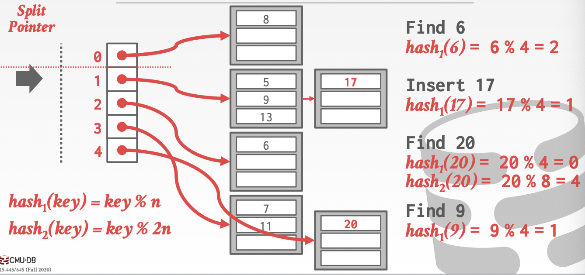

假如删除导致**某个桶变空时，就可以反向进行上述的分裂流程进行合并空桶**，减小`i`并调整split pointer

从上述例子可以看出，原先`8 % 4 = 0, 20 % 4 = 0`，在分裂后`8 % 8 = 0, 20 % 8 = 4 = 0 + 4`而新追加桶的下标即是`4`，即部分元素根据新的`hash_i(key)`恰好会`(key % n) + n`**被“线性”移到新追加的桶**，其他桶的元素没有变化
