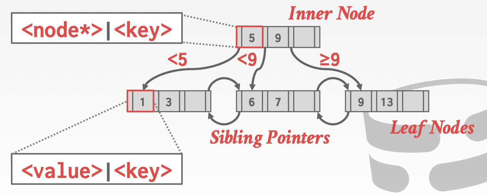
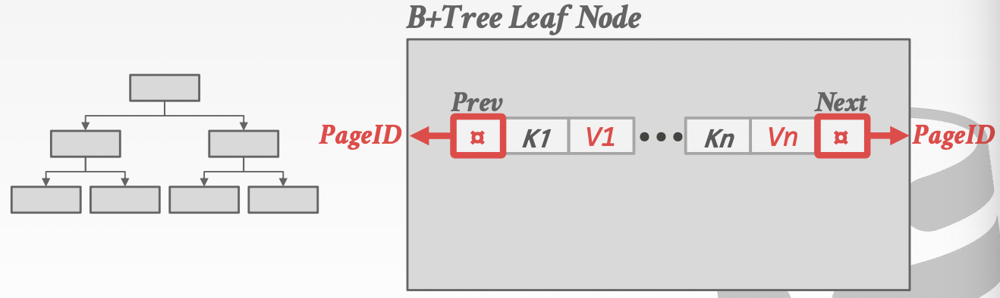
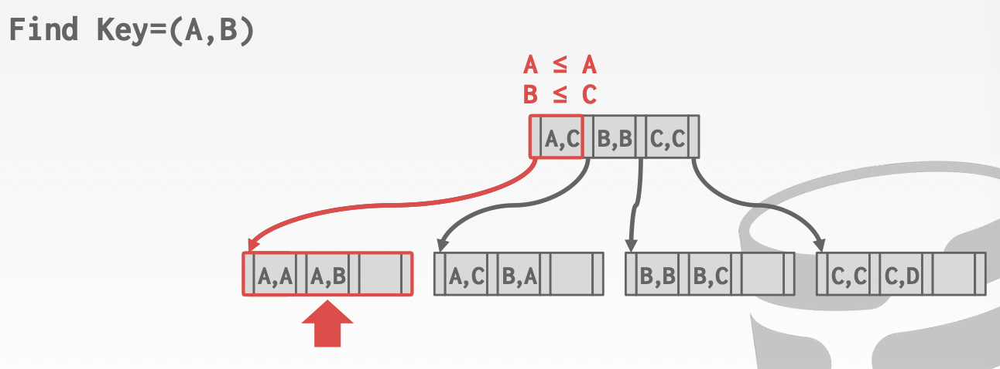
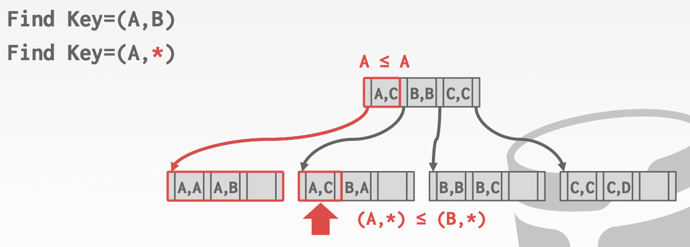
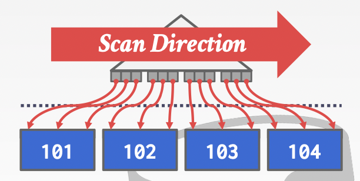

# Lecture 07. Tree Indexes I

## ISAM索引 Indexed Sequential Access Method

放置在heap page中的类似B树的索引，当数据溢出时通过溢出页overflow page来处理，更适用于**静态数据static data**

## B+树索引 B+Tree Overview

B+树是自平衡的数据结构，将数据排序存储，允许在`O(logn)`的复杂度下完成查找、顺序扫描、插入、删除

### 属性

- 完美平衡，每个leaf node都在相同的深度
- 除了root node以外的node都至少是半满的`M/2-1 <= #keys <= M-1`
- 每个inner node都有`k`个keys并且有`k+1`非空子节点

### 节点

B+树中的节点会存储key-value对的数组，**key就是index**，对应于数据tuple的某些属性（创建索引时基于的某些属性），**inner node和leaf node的value不同**，前者的value是子节点的指针，后者的value是**直接存放tuple data**或是**数据所在的磁盘位置即record id**

通常这些key-value对的数组会根据key排序存放

### 搜索和扫描

### 插入

1. 根据搜索的过程先找到对应的leaf node，将元素加入到leaf node中并保证key-value数组有序

2. 如果leaf node已经充满，则将leaf node分裂成两个leaf nodes各拥有原先一半的数据，并将新的leaf node的指针插入到上一层的inner node，**递归分裂**

3. 如果inner node也充满则同理分裂直至root节点，如果root节点也充满则分裂后构造新的root，此时B+树层数+1

在业界的实际实现中，通常不会改变树的深度，固定深度的B+树就会有数据量上限

### 删除

1. 根据搜索的过程先找到对应的leaf node，将元素从leaf node中删除

2. 如果leaf node只有`M/2-1`个元素，则和兄弟leaf node尝试重新分布元素确保每个leaf node都至少半满

3. 如果和兄弟节点一起依然不足以保证半满，则进行leaf node**递归合并**，分裂的逆过程

在业界的实际实现中，通常不会改变树的深度，并且往往采用**懒惰删除lazy deletion**以避免频繁的节点分裂/合并（频繁IO会导致性能劣化与抖动），另一方面的考虑就是通常负载都是`INSERT/UPDATE`会多于`DELETE`

## 使用B+树 Using B+Trees in a DBMS

### 重复keys

- **Append Record ID**：将record ID作为key的一部分，确保了key的唯一性
- **Overflow Leaf Nodes**：允许leaf node溢出到溢出节点来存放重复的key，但是实现较为复杂

### 聚集索引 Clustered Indexes

聚集索引要求DBMS**根据主键primary key的顺序存储表的数据**，因此显然**一个表只能定义一个聚集索引**，除非复制一份相同的表并定义另一个聚集索引，但是维护两份一样的表会引入一致性问题

对于**聚集索引，基于主键顺序扫描就会非常高效**，而对于非聚集索引则可以通过首先分析所有涉及到的tuple，随后**根据page ID聚合并排序后基于顺序访问pages**以提高效率（Index Scan Page Sorting）

在构建聚集索引时，需要先排序所有数据/堆文件，并且在数据之间**预留一定空间**以便在添加新数据时不重排序并且保证有序，通常每个聚集索引堆文件只占用2/3，预留1/3的空间
