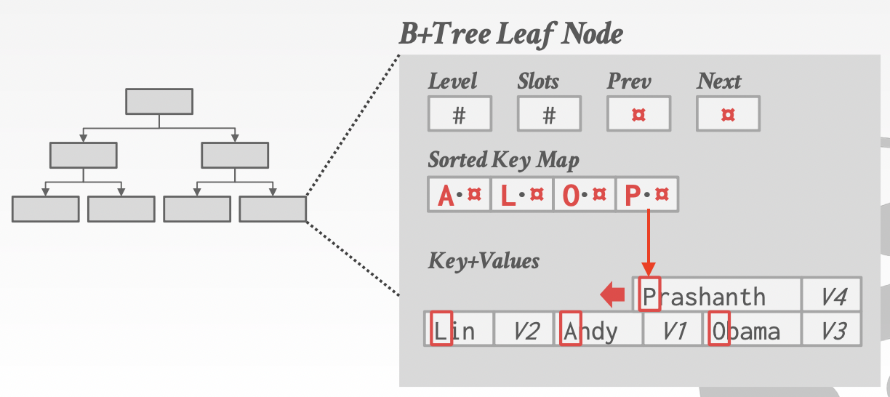
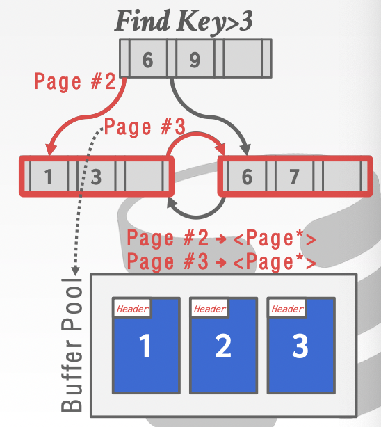
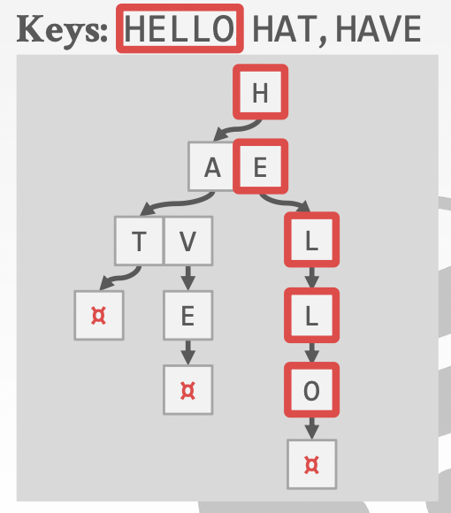
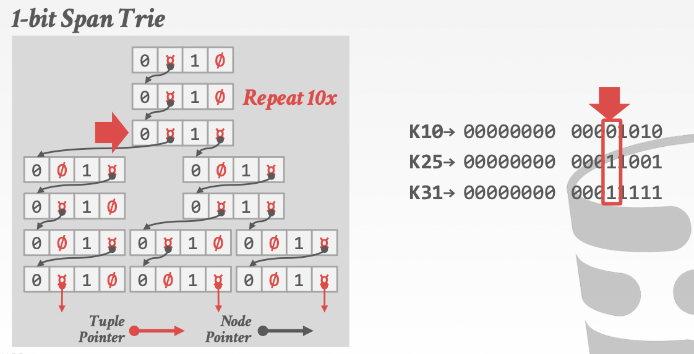
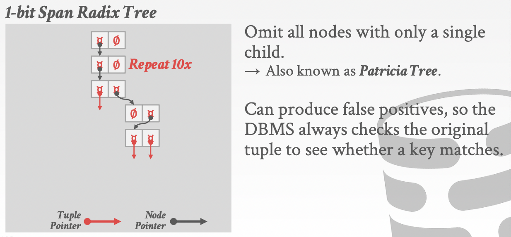

# Lecture 08. Tree Indexes II

## 深入B+树 More B+ Trees

### 设计思考

- **节点大小 Node Size**
  通常**存储设备越慢，对应的最佳B+树节点大小就越大**，为了批量快速访问更多的数据（e.g. HDD ~1MB, SSD ~10KB, In-Memory ~512B）并且不同的工作负载也会有不一样的最佳节点大小
- **合并阈值 Merge Threshold**
  **合并节点会有较大额外开销**（操作多个节点，操作父节点，递归合并等）因此在不足半满即合并并不一定是最佳的选择，通常更好的做法是在半满时也不进行合并而是在数据很少时直接**从现有数据一次性重建B+树**
- **变长键 Variable Length Keys**
  - 方式一：**指针 pointers**
    将keys存储为直接指向tuple属性的指针，指针长度固定，对应的属性可以是variable length
  - 方式二：**可变长度节点 variable length nodes**
    每个节点的长度可变因此可以容纳变长的keys，需要谨慎仔细的内存管理
  - 方式三：**填充 padding**
    限定keys的最大长度，对不足该长度的keys就进行填充
  - 方式四：**映射 key map/indirection**
    嵌入指针数组，每个指针指向对应的key+value
    
- **节点内搜索 Intro-Node Search**
  - 方式一：**顺序 linear**
    从节点初始元素开始扫描整个节点，不必维护所有元素有序，因此`insert/delete`更高效
  - 方式二：**二分 binary**
    由于每个元素是有序排列的，二分搜索整个节点，在`insert/delete`时需要维护有序，代价更高
  - 方式三：**插值 interpolation**
    根据元素的分布，插值计算出节点的位置，应用场景有限

### 额外的索引技巧 Additional Index Magic

- **前缀压缩 Prefix Compression**
  节点元素都是有序的，因此相同前缀的元素会连续存放，对**有相同前缀的元素进行压缩，只保存一份前缀**，这种做法也有很多类似的变种
  
    ```text
    [robbed|robbing|robot]
    ->
    prefix:rob [bed|bing|ot]
    ```

- **去重 Deduplication**
  对于**相同key不同value的情况，只保存一份key**（但是在多版本并发控制MVCC下一个key可以对应多个value，但是需要额外的timestamp/version等进行区分）

    ```text
    [K1:V1|K1:V2|K1:V3|K2:V4]
    ->
    [K1:V1,V2,V3|K2:V4]
    ```

- **后缀截断 Suffix Truncation**
  在中间节点inner nodes上的keys只是用来指向下一层节点，本身只是"路由"direct traffic，因此**并不需要保存完整的key，只需要最小可区分的前缀**，节点内能区分并正确"路由"即可

    ```text
    [abcdefghijk|lmnopqrstuv]
    ->
    [abc|lmn]
    ```

- **批量插入 Bulk Insert**
  从一组数据可以通过批量的方式构建B+树，不需要逐个insert，将**数据全排序后分割成一系列leaf nodes，基于此直接构建上层节点**

  注意在分割时会**保持填充比例**而不是直接填满叶子节点，从而在后续有插入/删除操作时避免产生过多分裂/合并
- **指针变换 Pointer Swizzling**
  通常在索引中使用page id来引用其他节点，DBMS就通过page table来找到page id对应的其他节点，一次间接寻址过程，而如果该page id正好被缓存池缓存**pinned in the buffer pool，则可以直接使用原始指针raw pointer而不是page id来避免间接寻址**
  
  如图，当确认buffer pool中有了对应的节点后，后续直接使用`<Page *>`代替`Page #2`来访问即可，但是要确保每次使用raw pointer时对应的节点都在buffer pool中处于pinned状态
- **隐式索引 Implicit Indexes**
  在创建时指定的主键primary，通常DBMS会在其上构建隐式索引implicit indexes来确保主键的唯一性
- **偏索引 Partial Indexes**
  **只在一部分数据上构建索引**，减少了索引的维护开销，通常用来基于日期进行索引分区（a separate index per month, year）
  
    ```sql
    CREATE INDEX idx_foo ON foo(a, b)
        WHERE c = 'WuTang';

    SELECT b FROM foo 
        WHERE a = 123 AND c = 'WuTang';
    ```

- **覆盖索引 Covering Indexes**
  当一次查询中的所有所需属性都在索引中就可以获得时，DBMS实际上就不再需要去获取真正的tuple也称为**仅索引扫描Index-only Scan**，即**所有所需属性都被索引覆盖了**，如下查询中的`b, a`均在索引`foo(a, b)`中

    ```sql
    CREATE INDEX idx_foo ON foo(a, b);

    SELECT b FROM
        WHERE a = 123;
    ```

- **包含列的索引 Index Include Columns**
  显然覆盖索引可以显著提升查询速度，但是通常索引并不会包含所有字段，通过**在构建索引时额外包含`INCLUDE`一些字段来辅助进行Index-only Scan**

    ```sql
    CREATE INDEX idx_foo ON foo(a, b)
        INCLUDE (c);
    
    SELECT b FROM foo
        WHERE a = 123 AND c = 'WuTang';
    ```
  
  注意：**额外追加的列仅保存在leaf nodes，并不是key的一部分**
- **函数/表达式索引 Functional/Expression Indexes**
  索引不一定是某个字段或是某些字段的直接数据，**也可以是函数或表达式的值**，在查询时通过提供相同的函数或表达式来使用索引

    ```sql
    CREATE INDEX idx_user_login
        ON users (EXTRACT(dow FROM login));

    SELECT * FROM users
        WHERE EXTRACT(dow FROM login) = 2;

    CREATE INDEX idx_user_login
        ON foo(login)
        WHERE EXTRACT(dow FROM login) = 2;
    ```

### 注意点

由于**B+树inner node上的keys仅用来"路由"查询**，并且在删除时并不会删除innder node上的key，因此inner node的keys**无法用来判断某个查询的key是否真的存在**

这个特性使得为了确认某个key是否存在而在B+树从上往下查询时，每一层至少会引起一次buffer pool page miss：第一次进入某一层的某个节点时引起一次miss，**一条搜索路径包含每一层一个节点，并且在leaf node才能确认key是否存在**

## 字典树/基数树 Tries/Radix Trees

- **字典树Tries**
  字典树采用每一个字符作为一个节点，**逐字符比较**来寻找一个完整的key，也称为**前缀树 Prefix Tree**
  
  
  这种设计使得**不依赖于已有的keys和插入顺序**，也不需要在keys过多时进行重平衡rebalancing，并且保证了所有操作都是`O(k)`复杂度，`k`是key的长度

  字典树的**span指的是每个节点能够代表的bits数量**，即类似B+树的扇出fan-out，决定了字典树的扇出度以及树的高度，例如一个`span=1`的字典树，每个节点只保存一个位即0或1：
  
- **基数树Radix Tree**
  在字典树的基础上，**忽略/压缩所有只有单个子节点的节点，就构成了基数树**，也称为Patricia Tree
  

## 倒排索引 Inverted Indexes

目前的所有索引可以很好的支持**点查询point**和**范围查询range**，但是无法很好的支持关键词查询（e.g. 查询内容包含"Pavlo"的所有记录）

**倒排索引保存了`words->records`的映射从而可以根据内容进行搜索**，也称为全文搜索索引full-text search index
