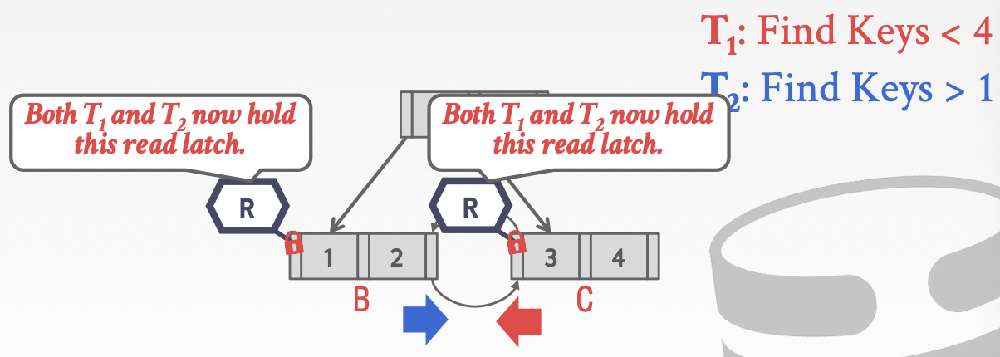
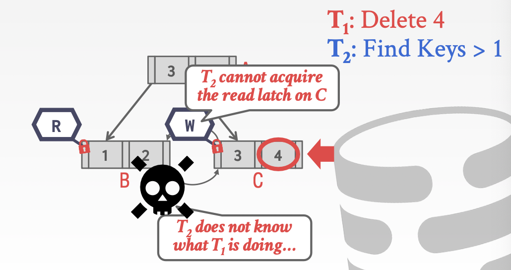
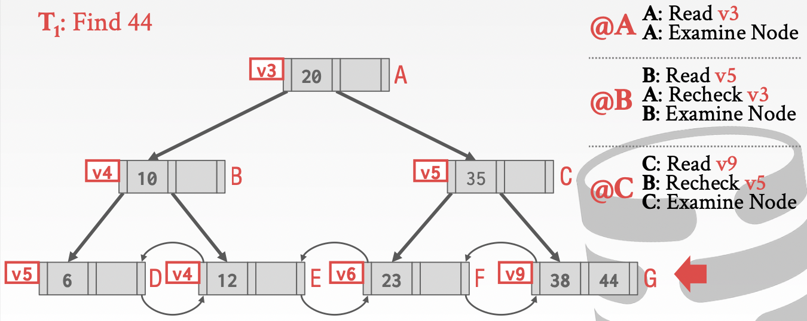

# Lecture 09. Index Concurrency Control

## 锁 Latches Overview

||Locks|Latches|
|-:|:-|:-|
|Separate...|User transactions|Threads|
|Protect...|Database contents|In-memory data structures|
|During...|Entire transactions|Critical sections|
|Modes...|Shared, Exclusive, Update,Intention| Read, Write|
|Deadlock|Dectection & Resolution|Avoidance|
|...by...|Waits-for, Timeout, Aborts|Coding discipline|
|Kept in...|Lock manager|Protected data structure|

- 方式一：**操作系统锁 Blocking OS Mutex**，例如`std::mutex`
  Linux提供的`futex`（fast user-space mutex）由用户空间的spin latch以及操作系统级的mutex构成，首先会尝试获得用户空间的spin latch，失败才会转为持有操作系统级的mutex
  - 优点：编码简单，使用简单
  - 缺点：代价昂贵，多核扩展性差，受OS调度影响（lock/unlock的耗时约为25ns）
- 方式二：**自旋操作 Test-and-Set Spin Latch**，例如`std::atomic<T>`
  在用户空间（此处就是DBMS内）重试CAS操作来完成并发修改数据，更加高效
  - 优点：高效，单条指令完成lock/unlock
  - 缺点：多核扩展性差，缓存不友好（false sharing、cache bouncing），竞争激烈的情况下性能劣化严重
- 方式三：**读写锁 Reader-Writer Locks**，例如`std::shared_mutex`
  支持区分读者和写者（mutex和atomic无法区分这两者），读者之间可以并发，但是需要注意避免出现饥饿starvation
  - 优点：读者可以并发
  - 缺点：需要处理读写请求和调度以避免饥饿，因此比简单的spin latches有更大的调度开销

## 散列表 Hash Table Latching

- 方式一：**页锁 Page Latches**
  每个page都有一个读写锁，线程需要获得读写锁才能进行操作，粒度较粗，并发度限制到page层面

  

- 方式二：**槽锁 Slot Latches**
  每个散列表的slot都有一个锁，采用简单的锁来减少meta-data和计算的开销，但是依然由于每个slot都要有锁会有额外的空间和管理开销

  

## B+树 B+ Tree Latching

B+树需要额外注意在出现**分裂split/合并merge时的并发安全**，基本并发方式如下：

1. 获得父节点的锁
2. 获得子节点的锁
3. 安全情况下释放父节点的锁，往复1-3流程直到抵达所需数据，所谓**安全**情况是：
   - `insert`时节点没有装满
   - `delete`时节点超过半满

- **查找 Find**：从根节点root开始往下，重复1-2过程
  1. 在子节点上获得**读锁R**
  2. 释放持有的父节点的锁
  
  

- **插入/删除 Insert/Delete**：从根节点root开始往下，重复1-2过程
  1. 首先获得**写锁W**，因为子节点变化有可能需要更新父节点
  2. 每次获得子节点的锁时首先检查是否**安全**，若安全则释放所有先前先祖节点ancestors上依然持有的锁
  
  
  
  
  
  

由于分裂和合并的可能，因此每个节点都需要首先获得**根节点root的写锁W**极大的限制了DBMS的处理能力，因此有非常对B+树的修改，使得免去了分裂和合并的操作，进而在insert/delete时大部分场合也只需要**读锁R**

另一方面也有做法是通过**乐观并发optimisitc**机制，在发现真的出现并发split/merge导致数据修改时，才重新执行操作并回退到**悲观并发pessimitic**机制，也可以在大多数场景下提升处理能力

## 叶节点扫描 Leaf Node Scans

叶节点扫描时**通过siblings直接获得相邻叶节点的锁**，这就有死锁deadlock的可能

latches不支持死锁检测或避免，唯一的方法就是在编码时就要确保不出现死锁

## 延迟更新父节点 Delayed Parent Updates

每次出现节点分裂时，至少有3个节点需要被更新：分裂的叶节点本身、新创建的叶节点、父节点，因此开销会非常大，**Blink树**优化通过在分裂时延迟更新父节点来减小分裂的开销

## 版本号形式的锁 Versioned Latch Coupling

通过在每个节点上附加一个**版本号**，使用**乐观并发机制**从而可以确保读写互不阻塞：

- 写入时获得锁并递增版本号
- 读取时如果锁能被获得，则记录版本号并继续执行而不持有锁
- 读取到下一个节点数据时再检查版本号是否出现了改变

当中间的并发写入事务持有了某个节点的锁，使其版本号递增后，数据可能出现修改，此时**读取事务检查版本号不匹配，则回滚**

