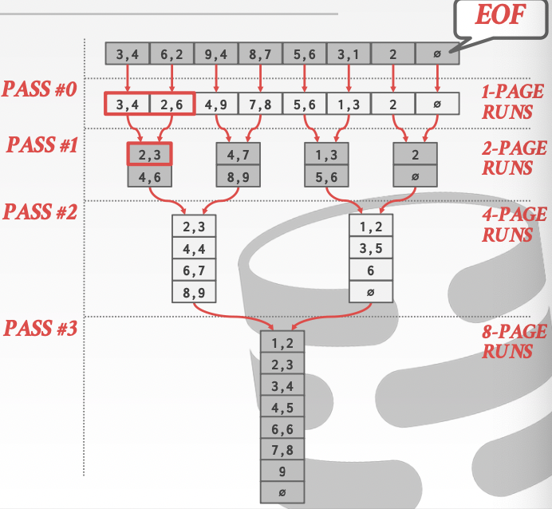
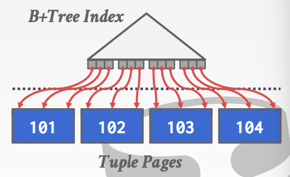
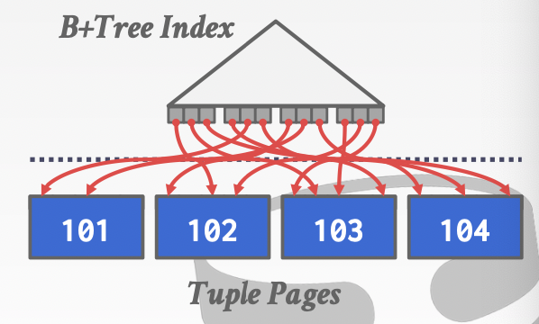
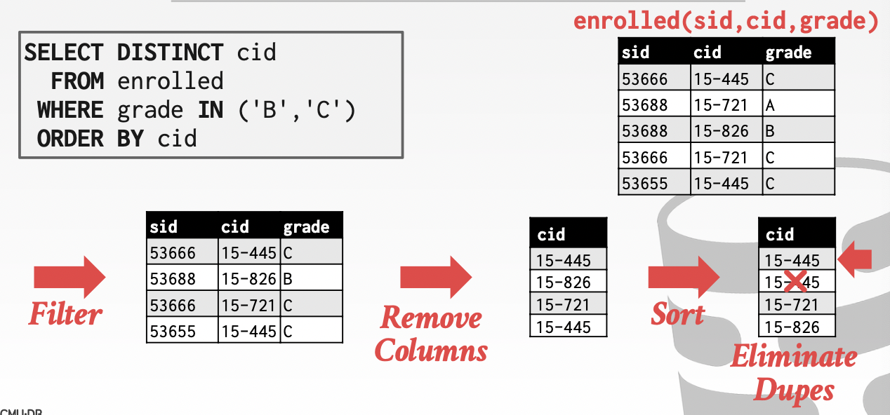
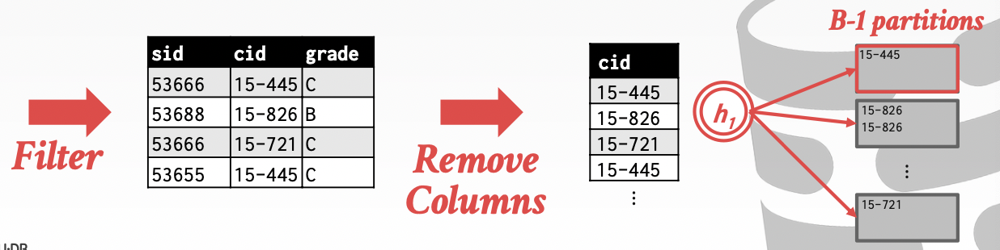
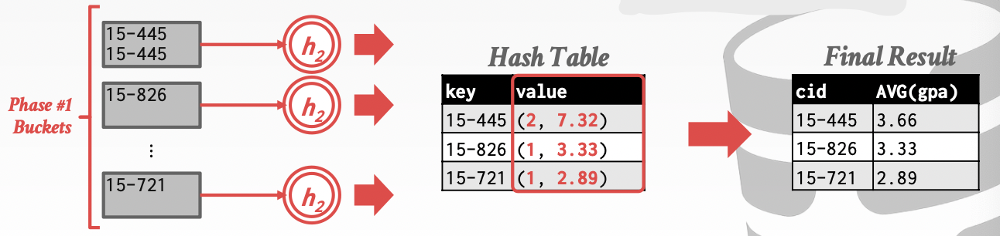

# Lecture 10. Sorting & Aggregations

## 外部归并排序 External Merge Sort

### 需要排序的场合

- 查询中使用了`ORDER BY`显式要求有序
- 更易于在`DISTINCT`时进行去重
- 需要聚合`GROUP BY`时
- 有序数据可以批量构建B+树索引（bulk load）

### 外部归并排序算法

当数据完全可以存储在内存中，可以采用多种排序算法，而当数据较多时通常采用外部多路归并排序，分为两个反复执行的过程：

1. **排序 Sorting**
   将能够放入内存的数据块进行排序，随后将排好序的数据写回到磁盘文件

   排序基于数据的attributes作为key进行，而使用**record id（此时也称为late materialization）**或是**完整数据（此时也成为early materialization）**作为value
2. **归并 Merging**
   将一系列各自有序的文件合并成单个更大的有序文件

### 二路归并

所有待排序数据分割为`N`个pages，而DBMS显然只有有限的缓存，设为`B`个buffer pages

1. Pass #0
   读入`B`个pages到内存中，并完全排序后写出到一个磁盘文件上
2. Pass #1,2,3...
   每一轮合并两个磁盘文件（二路）并产生一个更大的有序文件（需要**2个pages的内存作为读入数据区，1个pages的内存作为写出数据区**），重复直到产生最终的单个结果文件

容易计算得到一共需要的Pass数为`1 + ceil(log2(N))`，而每个Pass都需要读入写出一样多的数据量即`N`个pages，因此一共的I/O代价为`2N * (# of Passes)`

### 多路归并

从二路归并可以看出，仅需3个pages的缓冲区大小就可以完成排序过程，对于有`B`个pages的缓存池来说：

1. Pass #0
   使用`B`个pages作为缓冲，因此**一共需要`ceil(N/B)`轮排序**（sorted runs），每一轮处理`B`个pages的数据
2. Pass #1,2,3...
   **每一Pass合并`B-1`次sorted runs的结果**（因为需要**留1个page作为输出数据区**）

- **一共需要的pass数量**：$ 1+\lceil \log_{B-1}\lceil N/B \rceil \rceil $
- **一共需要的I/O代价**：$ 2N \times (\#\ of\ passes) $

### 实例

例如需要排序108个pages的数据，缓存有5个pages，则`N=108, B=5`：

- Pass #0: `ceil(108/5) = 22`，需要22轮排序，每次排序5个pages的数据（最后一轮只有3个pages）
- Pass #1: `ceil(22/4) = 6`，需要6轮排序，每次排序20个pages的数据（最后一轮只有8个pages）
- Pass #2: `ceil(6/4) = 2`，需要2轮排序，第一轮80个pages，第二轮28个pages
- Pass #3: 完成108个pages数据的排序

采用前述公式可以计算出需要4个Passes

### 采用B+树索引排序

若排序所基于的属性上已经构建了B+树索引，则可以直接扫描B+树的leaf nodes进行获取有序数据，但是需要考虑聚集索引和非聚集索引不同的访问模式：

- **聚集索引 Clustered Index**
  聚集索引下，所有tuple对应的pages也是有序的，因此直接访问即可
  
- **非聚集索引 Unclustered Index**
  非聚集索引下，每个tuple对应的pages可能并不是有序的，直接顺序访问会极大影响性能
  

## 聚合 Aggregations

聚合需要将指定属性相同即key相同的数据结果合并到一起，通常可以用排序或散列完成

### 排序聚合 Sorting Aggregation

### 散列聚合 Hashing Aggregation

当不需要结果有序是，散列是更好的选择，比排序的代价更低，数据多时也需要**外部散列聚合 External Hashing Aggreagte**：

1. **分区 Partition**
   基于key使用散列函数`h1`将数据散列到不同的buckets中即分区，并在每个buckets满时就写入磁盘，这里需要`B-1`个pages作为分区，`1`个page作为读入数据区
   
2. **再散列 ReHash**
   对每个分区，读入内存并使用另一个散列函数`h2`构建内存散列表（假设每个分区都能完全读入内存），计算聚合的结果
   
