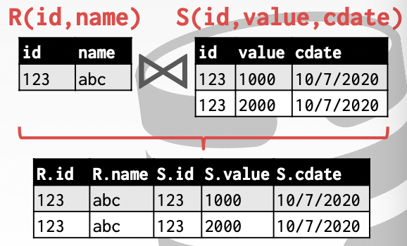
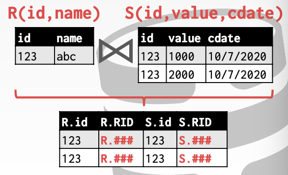
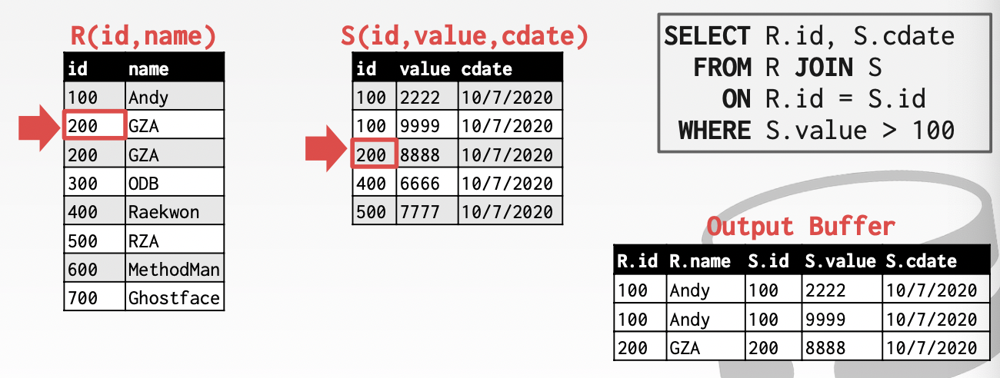
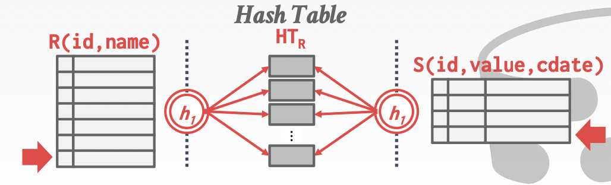
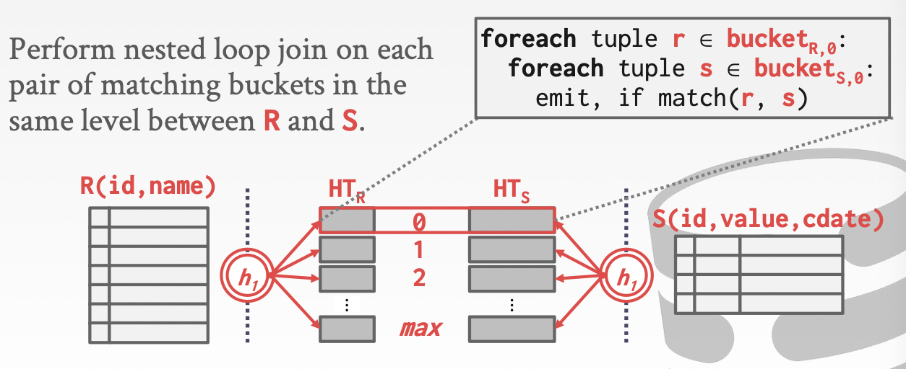
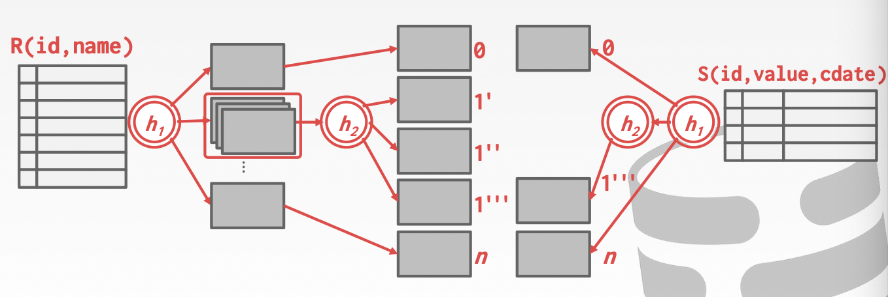

# Lecture 11. Join Algorithms

## 输出 Output

对于每一条R表中的记录r和每一条S表中的记录s，基于join的属性进行匹配，并基于r和s构建新的记录作为输出

- **Early Materialization**：在join的时候直接生成最终结果并传递给上层，上层后续的算子operator无需在访问底层的原始数据表

  

- **Late Materialization**：在join的时候仅生成join的键对应的记录号返回给上层，在最终需要的时候访问底层原始数据表获得具体record；对于**列存储column store**非常友好，列存储的数据通过record ID可以只访问需要的数据

  


## 代价分析标准 Cost Analysis Criteria

假定表`R`有`M`个页，对应`m`个tuples；表`S`有`N`个页，对应`n`个tuples，代价采用join所需的**IO次数**进行衡量

### 嵌套循环连接 Nested Loop Join

1. **简易式 Simple**
    由于对每一条外部表R中的记录r，都需要完全扫描一次内部表S，因此整体IO代价是`M + (m * N)`

    ```text
    foreach tuple r in R (outer table):
        foreach tuple s in S (inner table):
            emit if r and s match
    ```

2. **块式 Block**
    逐块进行连接，对每一块R都扫描一次S（也是逐块的），因此整体IO代价是`M + (M * N)`，此时应该将较小的表（页少）作为外部表，则`M`较小而`M * N`不变，从而整体IO代价可以减少

    ```text
    foreach block BR in R:
        foreach blobk BS in S:
            foreach tuple r in BR:
                foreach tuple s in BS:
                    emit if r and s match
    ```

    假如一共有`B`块缓存可供使用，则可以**使用`B-2`块缓存用于扫描外部表，`1`块缓存用于逐块读取内部表，`1`块缓存用于输出结果**，此时代价就变为`M + (ceil( M/(B-2) ) * N)`，当较小的外部表能完全放入内存时即`B > M+2`，此时代价只需要`M + N`

    ```text
    foreach B-2 blocks BR in R:
        foreach block BS in S:
            foreach tuple r in B-2 blocks:
                foreach tuple s in BS:
                    emit if r and s match
    ```

3. **索引式 Index**
    显然对每一条/块外部表的数据都需要完整扫描一次内部表代价过大，当内部表的连接键join key正好有索引时（现成索引或按需临时构建），可以**通过索引来实现高效的连接**，此时假定每次索引查找的代价是`C`，则连接的IO代价就是`M + (m * C)`

    ```text
    foreach tuple r in R:
        foreach tuple s in Index(ri = sj):
            emit if r and s match
    ```

### 排序归并连接 Sort-Merge Join

- **阶段一：排序 sort**，连接的表`R`和`S`都基于join key进行排序
- **阶段二：归并 merge**，双游标分别对应`R`和`S`中的tuple，执行连接

```text
sort R on join keys
sort S on join keys
cursor_R <- sorted R
cursor_S <- sorted S
while cursor_R and cursor_S valid:
    if cursor_R > cursor_S:
        cursor_S++
    if cursor_R < cursor_S:
        cursor_R++
    elif cursor_R and cursor_S match:
        emit
        cursor_S++
```



基于此前[对排序的代价估计](10.Sorting_Aggregation.md#多路归并)，**排序归并连接的代价可以表达为**：

- 对`R`排序：$ 2M\times(1+\lceil \log_{B-1}\lceil M/B \rceil \rceil) $
- 对`S`排序：$ 2N\times(1+\lceil \log_{B-1}\lceil N/B \rceil \rceil) $
- 归并：$ M+N $（最差情况下每个`R`中的tuple都和`S`中的所有tuples可以连接，此时 $ M \times N $)

显然排序后再进行连接在部分场合下会更有用：

- **部分表已经根据连接键join key排序**了，例如在key上有B+树索引
- **输出必须有序**，例如后续操作有`ORDER BY`等需要输入数据有序的算子

### 散列连接 Hash Join

由于连接需要寻找在连接键join key上相等的`R`中的tuple和`S`中的tuple，那么意味着如果对该join key执行散列，则能够执行匹配的tuples一定会落到相同的分区`ri, si`中

- **阶段一：构建散列表 build**，扫描外部表并基于散列函数`h1`构建一个散列表
- **阶段二：探测并连接 probe**，扫描内部表并对每一条tuple执行`h1`找到散列表中对应的外部表tuples，尝试连接

```text
build hash table HT_R for R:
foreach tuple s in S:
    emit if h1(s) in HT_R
```



对于构建的散列表，显然key就是对应的连接键的散列值`h1(join key)`，而value可以选择多种方式：

1. **完整的数据 full tuple**
   占用的内存空间更多，但是连接的时候不需要再去查询原表数据
2. **记录的标识 tuple identifier**
   对列存储非常友好，当**选择度selectivity**较低时表现更出色，但需要间接获取完整数据

由于散列存在冲突，因此在探测时可能会执行不必要的匹配测试，此时可以在构建散列表的同时也构建**布隆过滤器bloom filter**进行高效的预先测试（也被称为**sideways information passing**），扫描内部表时对每一条tuple计算处散列值后首先进行布隆过滤器匹配，如果命中再去真正检查散列表（依然有可能不存在）

假定阶段一构造散列表时数据均匀分布到`B-1`个分区中，且每个散列分区都不会大于`B`块，能完全存入内存，从而最多能够处理$ B\times (B-1)$大小的表，因此近似来说一个有`N`页的表需要`sqrt(N)`页的缓存

### GRACE散列连接 GRACE Hash Join

当散列表无法完全放入内存时，可以考虑采用GRACE散列算法：

将**表`R`散列进一系列桶中，将表`S`使用相同的散列函数散列进相同的桶中**如下图



从而对每一个桶都可以执行散列连接，并且**GRACE散列算法提出，对于无法完全放入内存的桶，采用不同散列函数递归散列分区的方式直到子分区可以完全放入内存**



假定**内存足够大时**的散列连接，在分区Partitioning Phase时需要各读写一次表`R`和表`S`，因此IO代价为`2(M+N)`，在探测Probing Phase时需要再各读一次表`R`和表`S`，因此IO代价为`M+N`，从而散列连接的**总代价为`3(M+N)`**

对于数据库来说，假如一开始外表表outer table的大小就已知，那么可以采用静态散列表static hash table从而避免了构建散列表、分区、探测的开销，但是如果表的大小未知，就需要采用动态散列表dynamic hash table的方式

## 连接算法

|Algorithm|IO Cost|Example|
|:-|:-|:-|
|SNLJ, Simple Nested Loop Join| `M + (m * N)`|1.3 hours|
|BNLJ, Block Nested Loop Join| `M + (M * N)`|50 seconds|
|INLJ, Index Nested Loop Join| `M + (M * C)`|variable|
|SMJ, Sort-Merge Join| `M + N + (sort cost)`|0.75 seconds|
|HJ, Hash Join|`3 * (M + N)`|0.45 seconds|

- **排序连接的优点**
  - 适用于输入数据已经排序，或是输出数据需要被排序的场合
  - 对数据倾斜不敏感，不需要优秀的散列函数
- **散列连接的优点**
  - 适用于输入数据已经散列，或是输出数据需要散列的场合
  - 采用混合散列hybrid hashing可以显著提高性能，即数据量大的时候采用混合GRACE和Naive算法
  - 散列几乎总是比排序更优，但是依赖数据分布均匀，即需要优秀的散列函数
