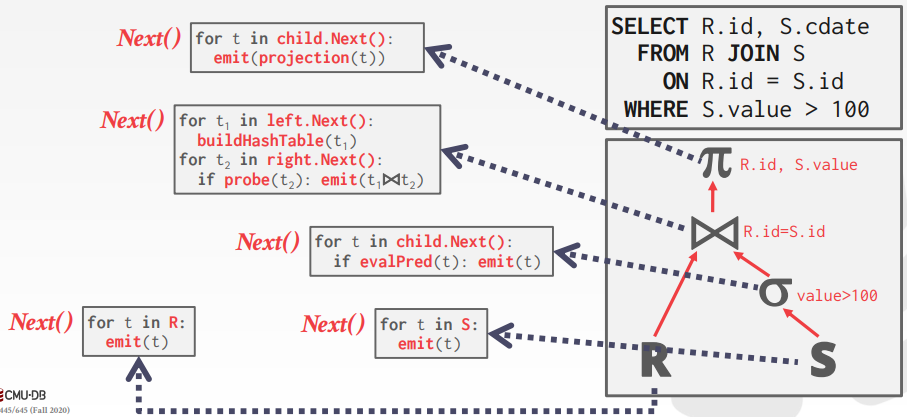
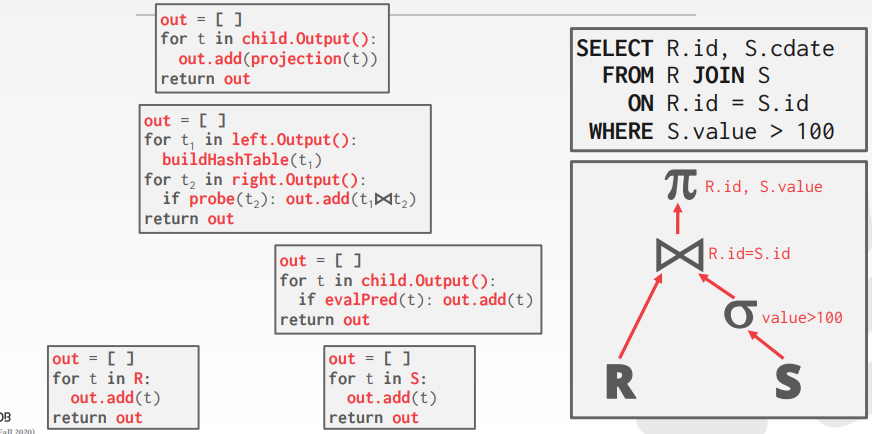
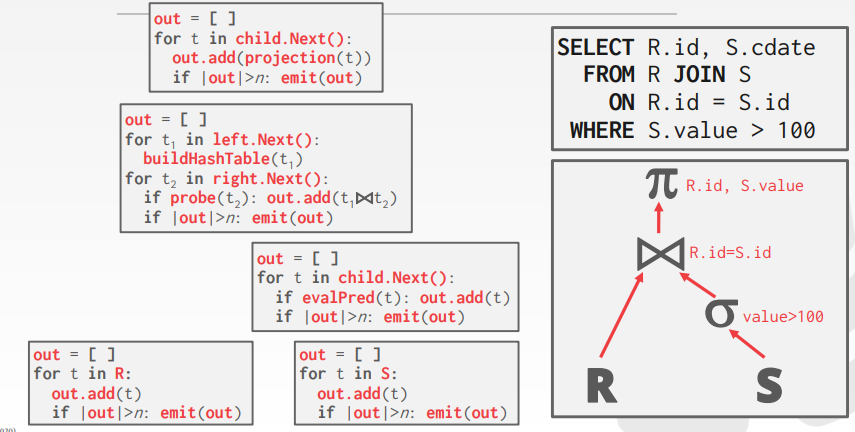
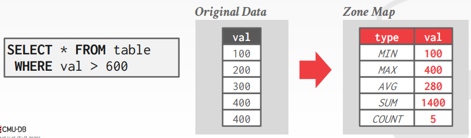
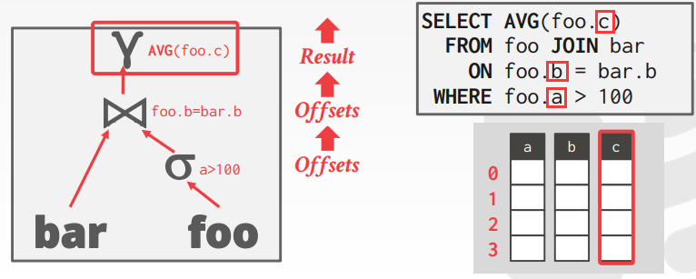
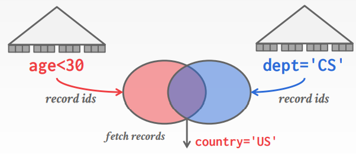
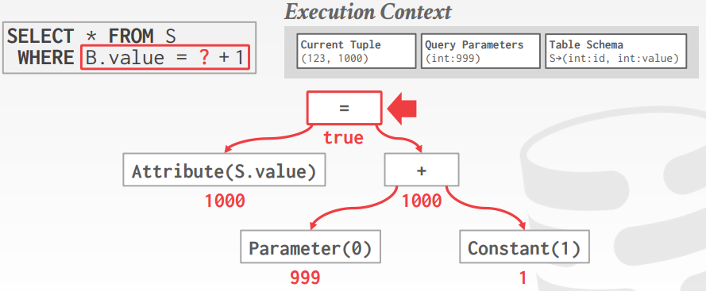

# Lecture 12. Query Execution I

## 处理模型 Processing Models

- **自顶向下模式 Top-to-Bottom**：从根算子开始执行，从子算子获取数据执行计算
- **自底向上模式 Bottom-to-Top**：从叶算子开始执行，产生结果并推送给父算子

### 1. 迭代式 Iterator Model

每个算子都实现了`Next`函数，迭代调用`Next`进行处理来获得最终的结果，也称为**火山Volcano模型**或**流水线Pipeline模型**，几乎在每个DBMS中都有实现，通过流水线的处理形式提升处理效率和吞吐量（`join/order by`等算子可能会中断流水线）



### 2. 物化 Materialization Model

每个算子都单次处理全部输入，并一次性将处理结果全部输出，通常会将**谓词predicate下推**以提前过滤输入数据，避免单次需要处理大量数据（对OLTP负载更为友好，OLTP往往只会指涉少量记录）



### 3. 向量化 Vectorized/Batch Model

类似迭代式的`Next`函数实现，但是每个算子单次输出一批结果，此时还可以额外使用SIMD进行加速计算（对OLAP负载更为友好，显著减少了每个算子的`Next`调用次数）



## 访问方式 Access Methods

### 1. 顺序扫描 Sequential Scan

对表中的每一页按顺序获取到缓存池buffer pool，随后迭代其中的每一条记录，DBMS内部会维护一个**游标cursor**记录访问到的位置

由于这种访问方式非常低效，通常可以从以下角度进行优化：

- **预读取 Prefetching**：由于按顺序扫描已知后续需要读取的位置，提前读取相应的页
- **绕过缓存池 Buffer Pool Bypass**：由于扫描往往是顺序获取页内所有记录，可以直接将页保存在本地待处理完后直接释放，绕过缓存池避免缓存数据波动
- **并行化 Parallelization**：多个线程并发读取多个不同位置的页
- **聚集索引 Heap Clustering**：存储在堆页heap pages中的数据由聚集索引clustering index保证有序
- **区域图 Zone Maps**：将数据的特征聚合保存到Zone Map中，扫描时根据Zone Map进行快速过滤
  
- **懒惰求值 Late Materialization**：在多个算子的过程中，每一层算子仅保留最小的数据量（记录ID、偏移值等）交给上层，最终多个算子对不同字段的偏移值一起"拼接"出记录作为结果（通常**只在列存储column-store中有效**，OLAP往往是列存储）
  

### 2. 索引扫描 Index Scan

基于索引扫描数据，见Lecture 14

### 3. 多索引/位图扫描 Multi-Index/Bitmap Scan

当有多个索引可以使用时，使用每个匹配的索引扫描数据，处理并合并结果（`union`或`intersect`），例如对于`students`表中的`age`和`dept`都有索引：

```sql
SELECT * FROM students
  WHERE age < 30
    AND dept = 'CS'
    AND country = 'US'
```

使用`age`上的索引获得符合条件的记录集合A，使用`dept`上的索引获得符合条件的记录集合B，随后对A和B求交集（可以使用**位图bitmaps**或**散列表hash tables**或**布隆过滤器bloom filter**）再检查后续的谓词`country = 'US'`



## 修改语句 Modification Queries

能够修改数据的语句包括`INSERT, UPDATE, DELETE`，但是修改数据的语句可能引起其他问题，比如Halloween Problem（类似幻读）：当扫描数据的过程中执行了数据的修改，**数据新的位置在未扫描到位置**，结果相当于**扫描到多次同一条记录**（部分字段可能被修改了）

解决方式是每个修改语句自身要保证数据及相应索引的一致性：

- `UPDATE/DELETE`：记录已经被处理过的记录ID，将记录ID传递给下层算子
- `INSERT`：在一个算子内部物化数据materialize tuples或是一个算子会插入从子算子传递上来的所有数据

## 表达式求值 Expression Evaluation

DBMS会将`WHERE`字句表达为一个**表达式树expression tree**，树中每个非叶节点代表一个操作符，叶节点就是基于`WHERE`表达式被求值时的上下文的数据



对每一条数据都要对整个表达式树进行求值非常低效（例如有`WHERE 1=1`这种谓词），通常会采用**Just In Time, JIT编译进行加速**
