# Lecture 13. Query Execution II

## 并行与分布式 Parallel vs. Distributed

无论是并行DBMS还是分布式DBMS，都应该对应用程序表现为如同单一的DBMS一样

- **Parallel DBMSs**：资源的存储在物理上更靠近，相互之间采用高速连接，因此资源之间的通信成本低且可靠（例如都在同一数据中心）
- **Distributed DBMSs**：资源分布较远，采用一般（想对低速）的连接，因此资源之间的通信成本较高且可能出现故障（例如地理上分布的数据库）

## 查询的处理模型 Process Models

一个Worker定义为DBMS内代表client处理查询的组件

### 1. 每个Worker一个进程 Process per DBMS Worker

- 依赖操作系统的调度 OS scheduler
- 使用共享内存进行进程通信，实现跨进程的数据结构
- 单个进程宕机不会影响整个DBMS
- 例如：IBM DB2, Postgres, Oracle

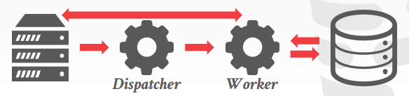

### 2. 进程池 Process Pool

- 同样依赖操作系统调度和共享内存
- Worker绑定到进程池中的任意空闲的的进程
- 对CPU**缓存局部性不友好**
- 例如：IBM DB2

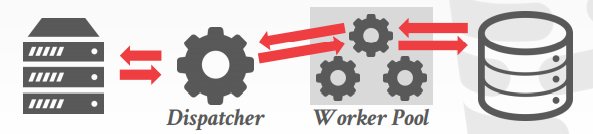

### 3. 每个Worker一个线程 Thread per DMBS Worker

- DBMS自身负责线程任务调度
- 不一定需要dispatcher线程
- 线程宕机会导致整个DBMS宕机
- 例如：IBM DB2, MSSQL, MySQL

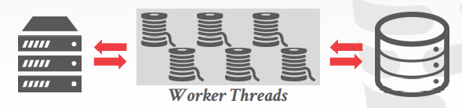

**采用多线程模型已经是现在的主流做法**，上下文切换代价更小、无需管理共享内存、DBMS对任务的调度通常更好（操作系统无法针对数据库任务的负载做特殊处理）

## 执行的并行度 Execution Parallelism

### 1. 多查询并行 Inter-Query Parallelism

通过允许多个查询并行执行，提升DBMS吞吐量，降低总体延迟

### 2. 查询内并行 Intra-Query Parallelism

通过查询内多个算子并行提升单个查询的效率，降低复杂查询long-running的延迟

例如**并行散列连接 Parallel Grace Hash Join**，分区完成后，每个分区可以采用一个Worker，多个分区并行执行join如下图：
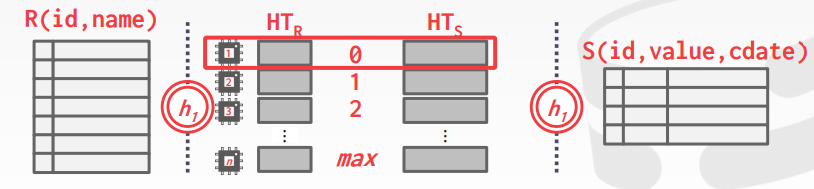

查询内并行往往还可以分为以下三种类型：

- **算子内 Intra-Operator (Horizontal)**
  将一个算子分解成多个可以并行的部分fragments执行，即将一个算子并行的在不同数据部分上执行，随后**DBMS整合exchange结果**
  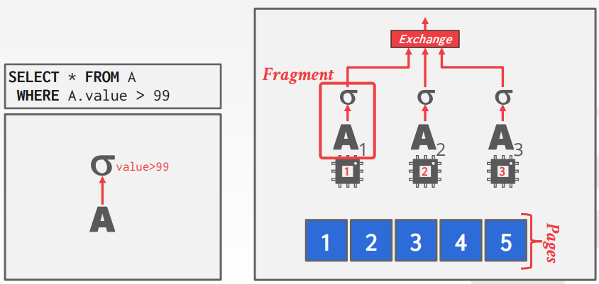
  
  处理结果的exchange通常也可以分成三种类型：**聚合Gather**，**分布Distribute**，**再分区repartition**
  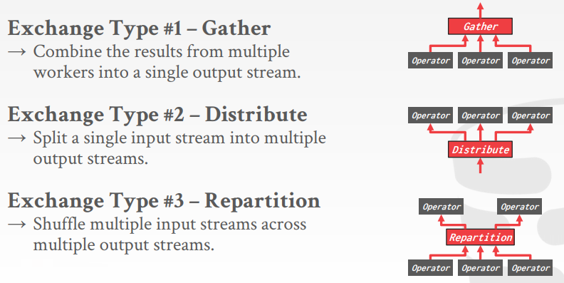

  完整的一个查询进行算子内并行执行的示例如下：
  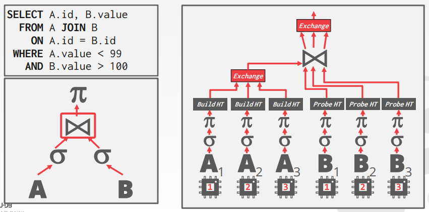

  *图中采用了散列连接hash join，Build HT代表构建散列表，Probe HT代表探查散列表进行匹配*

- **算子间 Inter-Operator (Vertical)**
  也被称为**流水线并行pipelined parallelism**，操作存在重叠从而可以通过流水线的方式并行执行，每个worker并行处理流水线上的不同算子
  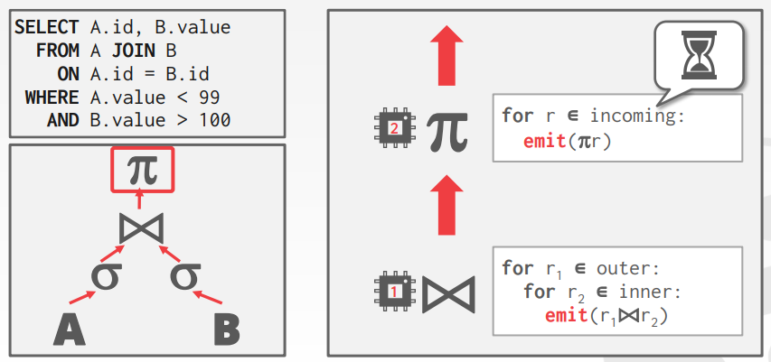
- **Bushy**
  算子间并行的一种拓展方式，多个workers并行执行多个算子，并且在不同的数据段上执行，因此依然需要整合exchange结果，例如`SELECT * FROM A JOIN B JOIN C JOIN D`可以如下执行：
  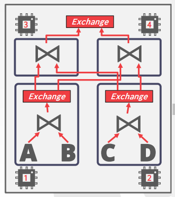

## I/O的并行度 I/O Parallelism

由于数据库总是与磁盘交互，当**并行执行时磁盘I/O很有可能称为瓶颈**（尤其是并发在机械磁盘上随机读取不同位置的数据会显著减少总I/O吞吐量，但现代NVMe固态硬盘几乎不受此影响）

### 1. 多磁盘并行 Multi-Disk Parallelism

磁盘矩阵如RAID 0, RAID 1等方式提升I/O的并行执行性能，而这种方式对DBMS是透明的

### 2. 数据库分区 Database Partitioning

将数据分成多个不重叠的物理段segments分别存储（例如存储在不同的磁盘上）从而提高访问效率，通常这种分区对应用程序是透明的

- **垂直分区 Vertical Partitioning**
  将相同记录的不同属性（列）存储在不同的分区中，类似列式存储
  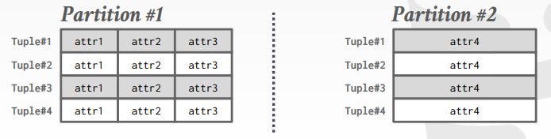
- **水平分区 Horizontal Partitioning**
  基于主键或是某些指定的属性对记录进行分区，可以是**散列hash、范围range、谓词predicate**等分区方式
  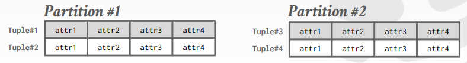
