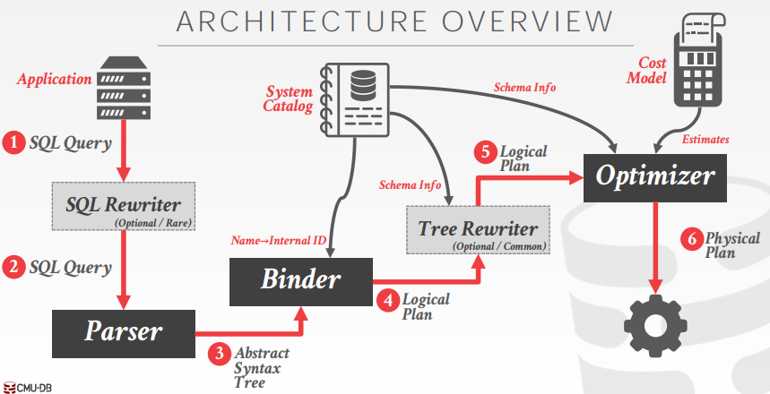
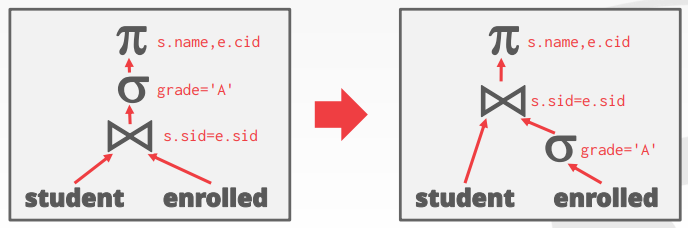
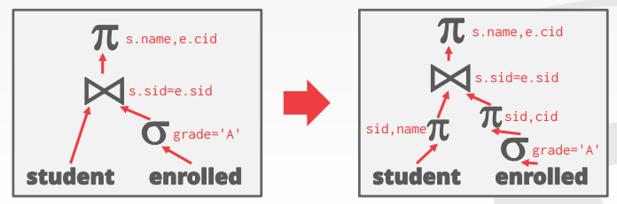

# Lecture 14. Query Planning I

## 查询优化 Query Optimization

- **启发式 Heuristics/Rules**：重写查询来避免低效的操作，通常需要检查系统数据catalog，但不需要检查真实数据data
- **基于代价式 Cost-based Search**：基于统计数据（表的总行数、算子的复杂度等）等衡量一个计划的代价，通过对比多个不同计划的代价来选择一个最优执行方案



优化器optimizer会生成一个逻辑计划logical algebra expression到最优等价物理计划physical algebra expression，而物理算子就会决定数据的实际处理方式（通常与数据存储格式、压缩、排序等有关）

**查询优化是NP-Hard问题**，现在有大量采用机器学习进行优化的方案

## 等价关系代数 Relational Algebra Equivalences

两个关系代数表达式只要产生相同的结果，就可以认为这两个关系代数表达式是等价的，DBMS通过等价关系代数进行**查询重写query rewriting**来优化查询

- **Selections**
  在查询中，谓词等应被尽早执行来减少后续处理的数据量，例如在下列查询中，**谓词下推 Predicate Pushdown**就可以将谓词`WHERE`下推到每个表，从而减少连接时的数据量

    ```SQL
    SELECT s.name, e.cid
      FROM student AS s, enrolled AS e
      WHERE s.sid = e.sid AND e.grade = 'A'
    ```

  
- **Joins**
  利用交换性Commutative和结合性Associative可以对多个连接的顺序进行调整，来最小化数据的处理量
- **Projections**
  尽早执行投影以减少中间结果的空间占用（避免不需要用到的属性占用额外空间），显然对于天然只会用到所需属性的OLAP，这种优化是自动完成的，例如在下列查询种，**投影下推 Projection Pushdown**就可以将`SELECT`下推到每个表，从而中间结果的数据占用空间可以显著减少

    ```SQL
    SELECT s.name, e.cid
      FROM student AS s, enrolled AS e
      WHERE s.sid = e.sid AND e.grade = 'A'
    ```
  
  

## 逻辑查询优化 Logical Query Optimization

- **分离连续谓词 Split Conjunctive Predicates**
  将连续的谓词分割成最小的部分，并且分别尽可能下推从而最大程度上减少后续需要处理的数据量
- **谓词下推 Predicate Pushdown**
  见前例
- **连接代替笛卡尔积 Replace Cartesian Products with Joins**
  采用内连接inner joins来代替所有笛卡尔积，从而显著减少原笛卡尔积会产生的数据量
- **投影下推 Projection Pushdown**
  见前例

## 嵌套查询 Nested Queries

对于`WHERE`处的嵌套查询，DBMS通常视为类似接受参数和输出结果的函数，可以通过两种方式进行优化

- **重写去关联de-correlate及扁平化flatten**

    ```SQL
    SELECT name FROM sailors AS S
      WHERE EXISTS (
        SELECT * FROM reserves AS R
          WHERE S.sid = R.sid AND R.day = '2018-10-15')
    
    -rewritten-

    SELECT name FROM sailors AS S, reserves AS R
      WHERE S.sid = R.sid AND R.day = '2018-10-15'
    ```

- **分解decompose嵌套的查询将结果写入临时表temporary table**
  对于复杂的嵌套查询，DBMS通常会分解成多个块block，每个块的结果写入临时表并在查询完成后被回收

    ```SQL
    SELECT S.sid, MIN(R.day)
      FROM sailors S, reserves R, boats B
        WHERE S.sid = R.sid
          AND R.bid = B.bid
          AND B.color = 'red'
          AND S.rating = (SELECT MAX(S2.rating) FROM sailors S2)
      GROUP BY S.sid
      HAVING COUNT(*) > 1
    
    -decompose-
    
    #inner_block
    SELECT MAX(rating) FROM sailors
    
    #outer_block
    SELECT S.sid, MIN(R.day)
      FROM sailors S, reserves R, boats B
        WHERE S.sid = R.sid
          AND R.bid = B.bid
          AND B.color = 'red'
          AND S.rating = #tmp_table of inner_block
      GROUP BY S.sid
      HAVING COUNT(*) > 1
    ```

## 表达式重写 Expression Rewriting

优化器可以将一个表达式重写成最优/最小的一组表达式，通常通过**模式匹配pattern-matching rule engine**实现

- 冗余谓词抹除 Unnecessary Predicates Elimination
  
    ```SQL
    SELECT * FROM A WHERE 1 = 1;
    ->
    SELECT * FROM A;
    ```

- 冗余连接抹除 Join Elimination

    ```SQL
    SELECT A1.*
      FROM A AS A1 JOIN A AS A2
        ON A1.id = A2.id;
    ->
    SELECT * FROM A;
    ```

- 忽略投影 Ignoring Projections
  
    ```SQL
    SELECT * FROM A AS A1
      WHERE EXISTS(
        SELECT val FROM A AS A2
          WHERE A1.id = A2.id);
    ->
    SELECT * FROM A;
    ```

- 谓词合并 Merging Predicates

    ```SQL
    SELECT * FROM A
      WHERE val BETWEEN 1 AND 100
        OR val BETWEEN 50 AND 150;
    ->
    SELECT * FROM A
      WHERE val BETWEEN 1 AND 150;
    ```
