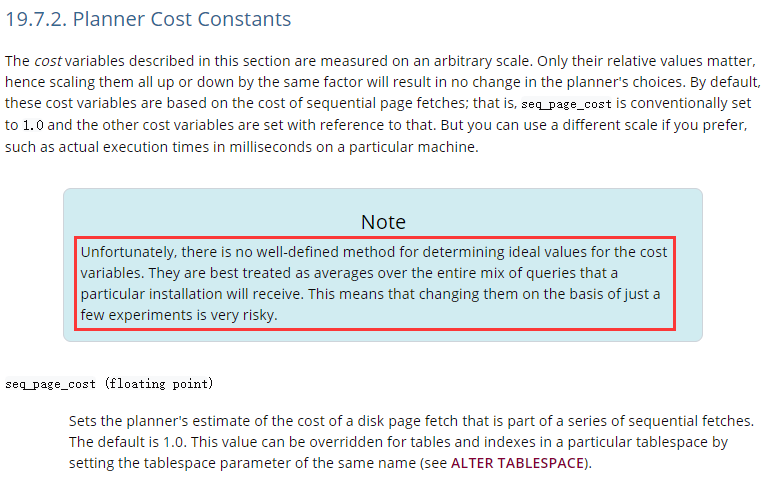
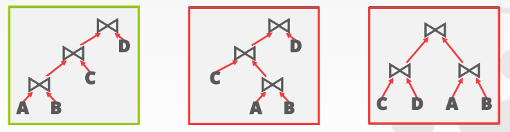
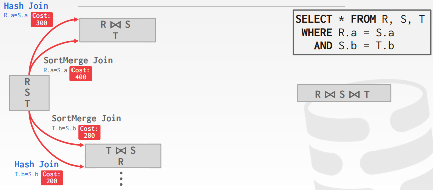
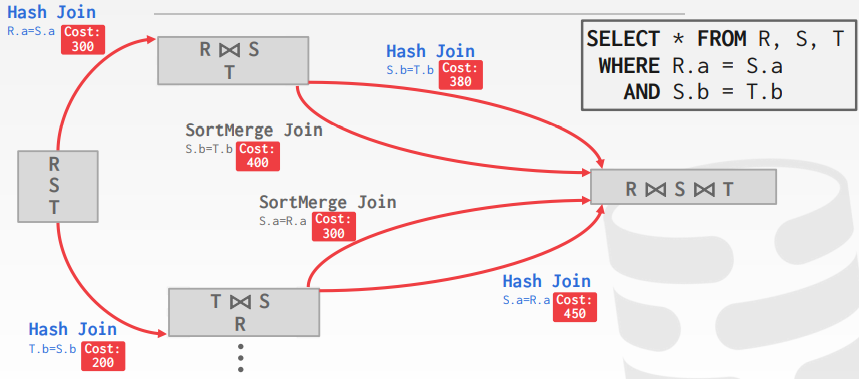
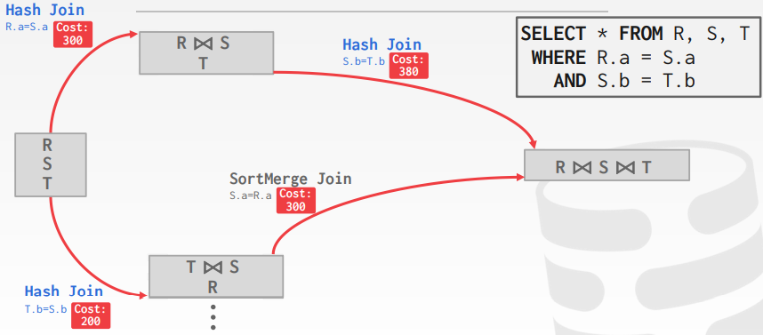
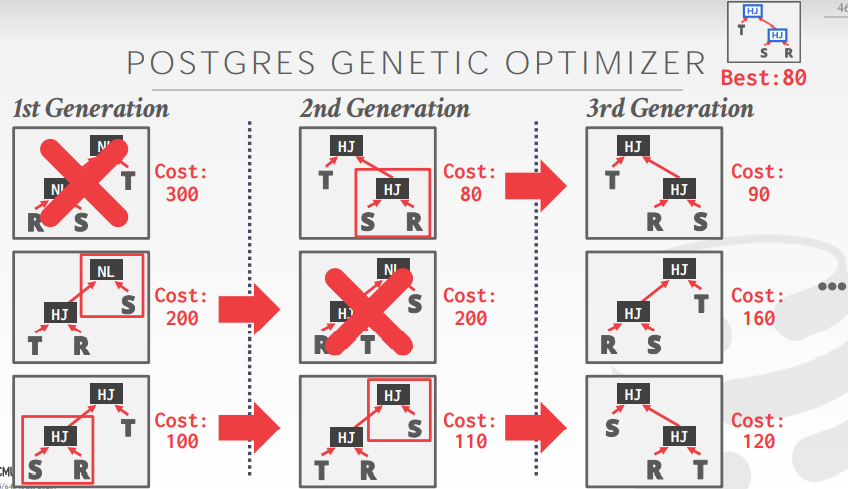

# Lecture 15. Query Planning II

## 基于代价的优化 Cost-Based Query Planning

### 代价模型的组成部分 Cost Model Components

- **物理代价 Physical Costs**：CPU时钟周期、磁盘I/O、预读取、缓存命中率等，重度依赖硬件
- **逻辑代价 Logical Costs**：预测每个算子的结果大小，与算子所执行的具体算法无关
- **算法代价 Algorithmic Costs**：每个算子所采用的算法复杂度

### 基于磁盘的代价模型 Disk-Based DBMS Cost Model

通常一个查询所需要的**磁盘访问次数总是主要开销**，相比之下CPU代价可以忽略不计，并且磁盘访问模式也有很大影响（顺序访问sequential access对比随机访问random access）

**注意：对于传统HDD来说目前依然是如此，但是对于最新的NVMe的SSD来说[CPU已经成为了瓶颈](https://github.com/JasonYuchen/notes/blob/master/linux/io_uring.md#modern-storage-is-plenty-fast-it-is-the-apis-that-are-bad)**

Postgres采用的代价模型同时考虑了CPU和I/O代价（采用一个权重比 "magic" constant factor），显然需要通过大量的性能测试和实验才能更好的确定[这个权重值](https://www.postgresql.org/docs/current/runtime-config-query.html#RUNTIME-CONFIG-QUERY-CONSTANTS)，而ScyllaDB/Seastar则通过[bootstrap脚本自动化测试](https://github.com/scylladb/seastar/tree/master/apps/iotune)的方式找到数据库的各项最优配置，这种方式更为合理高效



IBM DB2采用的代价模型则考虑了更多方面，例如硬件环境、存储设备特征、通信带宽、内存资源、并发环境等

### 统计数据 Statistics

通常DBMS会在内部的系统表catalog中存储一些统计信息（涉及表、属性、索引等），不同的系统会在不同的时刻更新这些信息

DBMS对每个关系R都会维护两个信息：`NR`代表关系R中的记录数，`V(A,R)`代表关系R中属性A下不重复值的数量；而衍生出的**选择基数selection cardinality**表示为`SC(A,R)`指在一个属性A中任意一个值对应的平均记录数量为`NR / V(A,R)`（假设所有数据都是均匀分布的data uniformity）

从而就可以根据选择基数对查询的算子进行估算，例如下式，假如students共有10000人，而college有10所，那么该查询的理论结果数量就是1000条

```SQL
SELECT * FROM students
  WHERE college = "SCS";
```

**选择性selectivity**可以用来衡量一个谓词的效果，即满足该谓词的记录数占总记录数的比例，例如假设`V(age,people)`有5个不同的值，且`NR`为5，那么：

- **相等性谓词 Equality Predicate**：`sel(A=constant) = SC(P) / NR`，例如`WHERE age = 2`就是`sel(age = 2) = 1/5`
- **范围谓词 Range Predicate**：`sel(A>=a) = (max(A)-a+1) / (max(A)-min(A)+1)`，例如`WHERE age >= 2`就是`sel(age>=2) = (4-2+1)/(4-0+1) = 0.6`
- **不等谓词 Negation Query**：`sel(not P) = 1- sel(P)`
- **合取 Conjunction**：`sel(P1 and P2) = sel(P1) * sel(P2)`（两个谓词必须是独立不相关的）
- **析取 Disjunction**：`sel(P1 or P2) = sel(P1) + sel(P2) - sel(P1) * sel(P2)`（两个谓词必须是独立不相关的）

**选择基数Selection Cardinality**通常依赖三个假设：数据均匀分布、谓词相互独立、值域包含原则

## 枚举查询方案 Plan Enumeration

基于等价关系代数等方式对查询进行重写后，DBMS就会进一步枚举可能的查询方案，并评估其代价，从而选择较优的方案执行

### 单关系 Single Relation

- 选择最优访问方式
  - 顺序扫描
  - 聚集索引上的二分搜索
  - 索引扫描
- 谓词求值顺序

注意：这种情况下，通常OLTP的查询非常简单以及易于优化

### 多关系 Multiple Relations

随着查询涉及的关系数量增加，可能的查询计划会迅速增加，因此需要有剪枝的策略，在System R中，只考虑left-deep join trees，从而可能使用**流水线式的连接pipelined join**，但是现代DBMS并不完全遵循这种规则



通常在left-deep join trees的基础上，通过枚举join顺序、枚举每个operator（hash join/sort merge join/etc）、枚举访问模式（index/scan/etc），采用**动态规划**找到最优方案，例如：







显然下侧路径具有最优代价，采取先Hash Join后Sort-merge Join的方式

在Postgres中，优化器有如下设计：

- 检查所有join trees：Left-deep、Right-deep、bushy
- 两种独立的优化算法：动态规划（连接表数少于12时）、**遗传算法优化器Genetic Query Optimizer**（连接表数超过12时）
  
