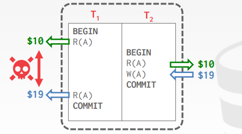
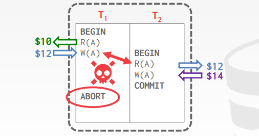
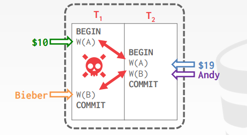

# Lecture 16. Concurrency Control Theory

## ACID

- **原子性 Atomicity**：事务中的操作要么都发生，要么都不发生，*all or nothing*
- **一致性 Consistency**：事务发生前后是数据库的状态都满足一致性，不打破约束（注意：通常数据一致性都是应用层来保证的，也有人认为一致性是为了凑ACID这个单词），*it looks correct to me*
- **隔离性 Isolation**：事务之间相互隔离，互不影响，*as if alone*
- **持久性 Durability**：事务一旦提交，其修改就必须持久有效，*survive failures*

## 原子性 Atomicity

- **方法一：日志 Logging**
  DBMS记录所有的操作，从而一旦需要回滚时只要根据日志回滚已经做的操作即可，在内存和磁盘上都需要维护**undo log**（多数DBMS采用）
- **方法二：影子分页 Shadow Paging**
  DBMS复制一份页，仅在该副本页上执行事务，等需要commit时才真正将该页的数据变为可见（少数DBMS采用）

## 一致性 Consistency

- **数据库一致性 Database Consistency**
  将要执行的事务一定能看到已经提交的事务的结果
- **事务一致性 Transaction Consistency**
  数据库在执行事务前后的数据一致性不变，由应用层保证（假如应用层删库...DBMS毫无办法）

## 隔离性 Isolation

数据库通过并发执行多个事务来提升性能和吞吐量，而事务之间可能有数据竞争，隔离性要求DBMS保证每个事务仿佛只有自己在被执行，因此DBMS的**并发控制concurrency control protocol**保证事务的合理并发执行

- **方法一：悲观事务 Pessimistic**
  假定总是会有数据竞争，因此一开始就会通过锁等方式保证独占自己事务所需数据
- **方法二：乐观事务 Optimistic**
  假定数据竞争是偶见的，因此并不通过锁等方式保证独占，而是记录起始状态，在事务完成时检查状态，若precondition不满足（发生了竞争，别的事务修改了相关数据）就回滚abort，否则就提交commit

### 事务的调度 Schedule

- **串行调度 Serial Schedule**
  所有事务按照某个顺序依次串行执行的调度
- **等价调度 Equivalent Schedules**
  对数据库状态而言，按A调度执行事务与按B调度执行最终的数据库状态相同，则A调度和B调度是等价调度
- **可串行化调度 Serializable Schedule**
  与某个串行调度等价的事务调度

事务的并发控制的正确性——**可串行化/可序列化 Serializability**：当一系列事务并发执行时，其最终结果等同于按**某个顺序**依次串行这些事务的结果

可串行化的程度也有多个，大部分DBMS支持**冲突可串行化 Conflict Serializability**，没有DBMS可以做到**视图可串行化 View Serializability**

### 冲突操作 Conflicting Operations

当两个操作至少有一个是写write，并且分属两个不同的事务而处理同一个对象，则称为这两个操作是冲突操作：

- **读写冲突 Read-Write Conflicts(R-W)**
  例如**不可重复读 Unrepeatable Reads**：一次事务内的多次同对象读取返回不同结果
  
- **写读冲突 Write-Read Conflicts(W-R)**
  例如**脏读 Reading Uncommitted Data/Dirty Reads**：读取到其他事务尚未提交的数据
  
- **写写冲突 Write-Write Conflicts(W-W)**
  例如**脏写 Overwriting Uncommitted Data**：覆盖了其他事务尚未提交的写入
  

### 冲突可串行化 Conflict Serializability

- **冲突等价 Conflict Equivalent**
  当且仅当两个调度**引入了相同事务的相同操作，且每一对冲突操作的顺序都相同**，则称这两个调度是冲突等价
- **冲突可串行化 Conflict Serializable**
  某种调度与某个串行调度冲突等价，则称该调度是冲突可串行化的，这也意味着可以通过**调换连续的非冲突操作**的顺序将该调度转变为一种顺序调度

  例如如下的两个事务，(1)中的调度就是冲突可串行化的，根据这四步就可以转换成等价的串行执行顺序`T1->T2`，其中冲突就是指例如`T1`中的`W(A)`必须先于`T2`中的`R(A)/W(A)`执行，分别是`W-R/W-W`冲突
  
  ```text
  R(A): read A; W(A): write A

  (1) Swap 1:R(B) and 2:W(A)

      T1: R(A) W(A)           R(B) W(B)
                             /
      T2:           R(A) W(A)          R(B) W(B)
  
  (2) Swap 1:R(B) and 2:R(A)

      T1: R(A) W(A)      R(B)     W(B)
                        /
      T2:           R(A)      W(A)      R(B) W(B)

  (3) Swap 1:W(B) and 2:W(A)

      T1: R(A) W(A) R(B)           W(B)
                                  /
      T2:                R(A) W(A)      R(B) W(B)

  (4) Swap 1:W(B) and 2:R(A)

      T1: R(A) W(A) R(B)      W(B)
                             /
      T2:                R(A)      W(A) R(B) W(B)
 
  (5) Equivalent to execute T1 and then T2

      T1: R(A) W(A) R(B) W(B)
                             
      T2:                     R(A) W(A) R(B) W(B)
  ```

  而下面这个例子就是非冲突可串行化的，因为两个事务中的冲突操作有**循环依赖**，`T1`的`R(A)`必须早于`T2`的`W(A)`，而`T2`的`R(A)`也必须早于`T1`的`W(A)`，从而不可能等价于`T1-T2`或`T2-T1`的串行顺序

  ```text
      T1: R(A)           W(A)

      T2:      R(A) W(A)
  ```

### 依赖图 Dependency Graphs

`TODO`
