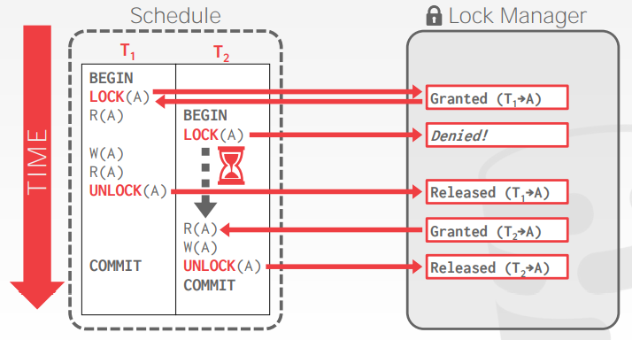
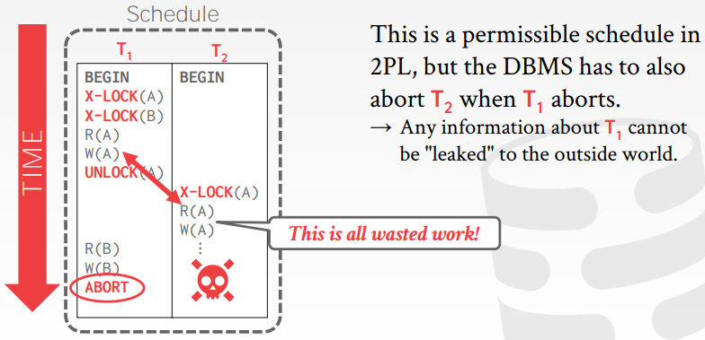
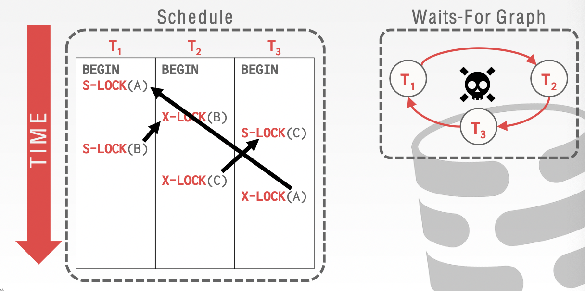
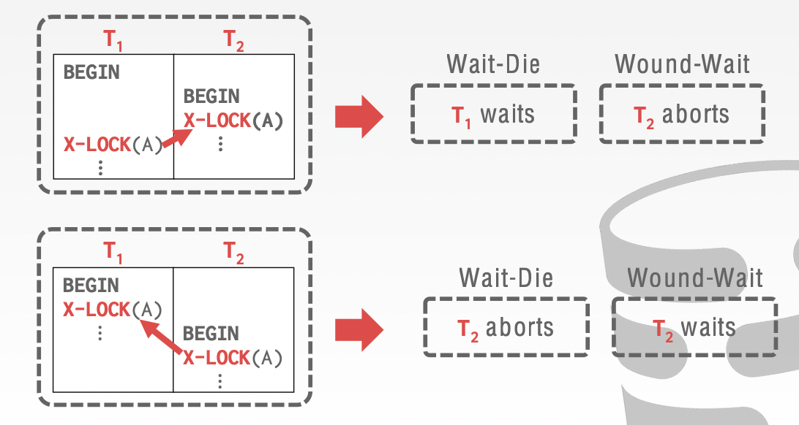
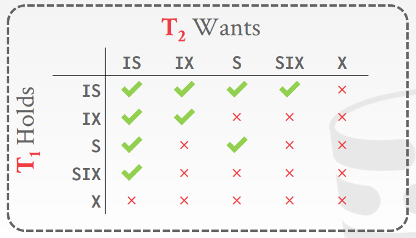
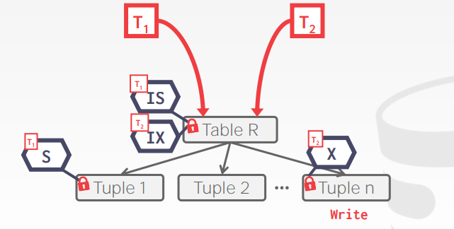
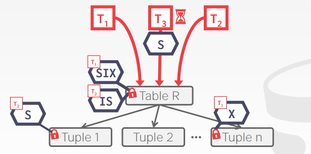

# Lecture 17. Two Phasing Locking

## 锁的类型 Lock Types

- 共享锁 `S-LOCK`：也称为读者锁
- 独占锁 `X-LOCK`：也称为写者锁

|Compatibility|**Shared**|**Exclusive**|
|-:|:-:|:-:|
|**Shared**|✅|❌|
|**Exclusive**|❌|❌|



## 两阶段锁 Two-Phase Locking

- **阶段一：增长 Growing**
  每个事务在执行过程中只能逐渐获取锁而不能释放锁的阶段，每当需要锁时就从DBMS锁管理器中申请
- **阶段二：收缩 Shrinking**
  每个事务在执行过程中一旦开始释放锁就不能再获得的阶段，释放时就向DBMS归还锁


**两阶段锁本身就足以保证冲突可串行性**，因为基于两阶段锁的调度确保了事务优先图是无环的，但是两阶段锁的另一个问题在于**级联回滚 cascading aborts**，例如当事务`T1`对`A`做了修改后释放了`A`的锁，随后事务`T2`获得了`A`的锁并读取了`T1`写入的值，而随后一旦`T1`终止回滚，则依赖`T1`的`T2`也必须回滚，引起级联回滚如下图



显然的解决方法就是直到事务提交/放弃之前都不能"泄露"修改，即**一直持有锁直到事务结束时一次性释放，也被称为严格两阶段锁 Strict-2PL**，从而依赖相同对象值的其他事务必须等到该事务结束，并且该事务若一旦失败也只需恢复对象初始值即可


```TEXT
+--------------------------------------------------+
| All Schedules                                    |
|              +-------------------------------+   |
|              | View Serializable             |   |
|              |    +------------------------+ |   |
|              |    | Conflict Serializable  | |   |
|  +-----------+----+------------------------+-+-+ |
|  | No        |    | Strong Strict 2PL      | | | |
|  | Cascading |    |                        | | | |
|  | Aborts    |    |      +----------+      | | | |
|  |           |    |      |  Serial  |      | | | |
|  |           |    |      +----------+      | | | |
|  +-----------+----+------------------------+-+-+ |
|              |    |                        | |   |
|              |    +------------------------+ |   |
|              +-------------------------------+   |
+--------------------------------------------------+
```

另一方面**2PL协议并不能避免死锁问题**，因此锁管理器需要执行死锁检查（事务优先图判断环）和死锁处理算法

## 死锁检测和避免 Deadlock Detection + Prevention

- **死锁检测 Deadlock Detection**
  DBMS锁管理器会建立一个**等待图waits-for graph**来追踪每个事务正在等待的锁，每个节点都是一个事务`T`，`Ti`指向`Tj`的边代表着事务`Ti`正在等待`Tj`释放锁
  

  当DBMS发现死锁时，就需要采取策略来打断等待图中的环，**选择一个事务牺牲**，进行终止回滚来允许其他事务继续执行，通常的选择策略可以考虑到以下因素：
  - **时间 By age**：最小的时间戳
  - **进度 By progress**：已经执行了最少或最多的查询
  - **资源 By the # of items already locked**：已经持有锁的数量
  - **依赖 By the # of txns that have to rollback**：一旦终止会引起的级联回滚事务数量
  - **饥饿 # of times a txn has been restarted**：是否有事务被反复回滚重试，这可能显著增加前端请求的延迟

  显然死锁检测算法需要在等待图中寻找环，当并发请求数量较多，等待图频繁更新时，寻找环的算法本身也有延迟和代价，因此也需要**权衡死锁频繁被检测的代价以及死锁本身未被及时处理对系统的影响**
- **死锁避免 Deadlock Prevention**
  死锁避免算法可以在分配锁时就执行，而不需要等到真的有死锁产生时再运行检测算法来处理，因此**死锁避免不需要依赖等待图**，通常有以下两种基于优先级的避免策略（**更旧的时间戳older timestamp = 更高的优先级higer priority**）：
  - **Wait-Die**："Old waits for young"
    - 对高优先级事务：请求的锁被低优先级事务持有，则**等待**
    - 对低优先级事务：请求的锁被高优先级事务持有，则**终止**
  - **Wound-Wait**："Young waits for old"
    - 对高优先级事务：请求的锁被低优先级事务持有，则**低优先级事务终止**并释放锁
    - 对低优先级事务：请求的锁被高优先级事务持有，则**等待**

  

## 层级锁 Hierarchical Locking

上述算法都假定了对象锁，即事务涉及的每个对象都有对应的锁，实践中这是代价非常高的，因为如果一个事务涉及到非常多的对象，则有可能频繁等待/终止/回滚，**锁的粒度lock granularity**在实践中非常重要（粒度诸如属性attribute？记录tuple？页page？表table？）

### 意向锁 Intention Lock

意向锁可以在高层面节点加锁，说明在**该节点以下存在事务使用了锁**，意向锁不需要逐个检查所有派生节点是否被加锁了，即例如：

1. 事务A申请并获得了行1的读锁
2. 事务B申请整个表的写锁，通常来说此时事务B需要逐行判断每一行是否被某个事务加锁，显然效率不高，此时可以改用意向锁，事务B发现整个表已经被意向共享锁加锁（因为子节点行1被共享锁加锁）就会直接等待而不是逐行判断

意向锁有以下几类：

- **Intention-Shared, IS**：说明了有事务在低级节点采用了共享锁shared locks
- **Intention-Exclusive, IX**：说明了有事务在低级节点采用了独占锁exclusive locks
- **Shared+Intention-Exclusive, SIX**：说明了以该节点为根节点的子树被共享锁占用，整体采用了共享锁，并且会局部采用独占锁更新一些数据



加锁的算法如下：

- **为了在节点上获得`S`或`IS`，则其必须至少能获得父节点的`IS`**
- **为了在节点上获得`X`,`IX`或`SIX`，则其必须至少能够获得父节点的`IX`**

意向锁可以显著提升并发性能：

- `IS`意味着在更细粒度上会获得`S`
- `IX`意味着在更细粒度上会获得`X`
- `SIX`类似于`S`+`IX`的效果，整体`S`但有更细粒度上的`X`

### 意向锁使用示例

1. 假如事务`T1`需要读取`Tuple 1`，事务`T2`需要修改`Tuple n`，则此时实际`Tuple 1`和`Tuple n`并不冲突，`IS`与`IX`兼容，因此采用意向锁后系统吞吐量能够提升

  

1. 假如事务`T1`需要扫描全表并做少量更新，事务`T2`读取`Tuple 2`，事务`T3`扫描所有记录，此时`T1`占有`SIX`，`T2`占有`IS`并且读取的记录并不是`T1`修改的记录因此可以一起执行，`T3`由于需要扫描全表而`T1`在修改某个记录，`T3`的`IX`不兼容`T1`的`SIX`而需要等待

  

### 锁的提升 Lock Escalation

当一个事务尝试获取了**较多底层细粒度锁时，可以自动升级为更粗粒度的锁**，避免过多细粒度锁导致管理开销过大，减少锁管理器的负载

### 锁的实践 Locking in Practice

通常DBMS的用户并不需要手动对锁仅需操作，DBMS事务管理器和锁管理器会自动处理事务的加锁和解锁，但是对于一些操作也提供了显式指定锁的功能以便DBMS更好的处理

- **表锁 Lock Table**：显式要求锁定整个表，并不是SQL标准，但是大多数DBMS都实现了这一接口，例如在MySQL中使用`LOCK TABLE <table> <mode>`
- **更新锁 Select ... For Update**：某个查询的记录会随后就被更新，因此可以直接加上独占锁（也可以主动指定加上共享锁），例如`SELECT * FROM <table> WHERE <qualification> FOR UPDATE`
