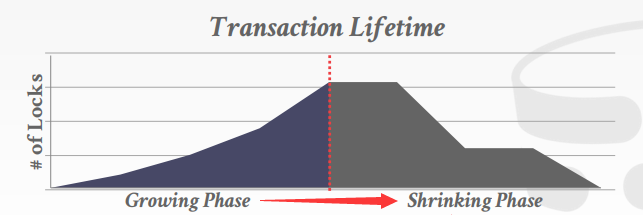

# Lecture 17. Two Phasing Locking

## 锁的类型 Lock Types

- 共享锁 `S-LOCK`：也称为读者锁
- 互斥锁 `X-LOCK`：也称为写者锁

|Compatibility|**Shared**|**Exclusive**|
|-:|:-:|:-:|
|**Shared**|✅|❌|
|**Exclusive**|❌|❌|


## 两阶段锁 Two-Phase Locking

- **阶段一：增长 Growing**
  每个事务在执行过程中只能逐渐获取锁而不能释放锁的阶段，每当需要锁时就从DBMS锁管理器中申请
- **阶段二：收缩 Shrinking**
  每个事务在执行过程中一旦开始释放锁就不能再获得的阶段，释放时就向DBMS归还锁



**两阶段锁本身就足以保证冲突可串行性**，因为基于两阶段锁的调度确保了事务优先图是无环的，但是两阶段锁的另一个问题在于**级联回滚 cascading aborts**，例如当事务`T1`对`A`做了修改后释放了`A`的锁，随后事务`T2`获得了`A`的锁并读取了`T1`写入的值，而随后一旦`T1`终止回滚，则依赖`T1`的`T2`也必须回滚，引起级联回滚如下图


显然的解决方法就是直到事务提交/放弃之前都不能"泄露"修改，即**一直持有锁直到事务结束时一次性释放，也被称为严格两阶段锁 Strict-2PL**，从而依赖相同对象值的其他事务必须等到该事务结束，并且该事务若一旦失败也只需恢复对象初始值即可


```TEXT
+--------------------------------------------------+
| All Schedules                                    |
|              +-------------------------------+   |
|              | View Serializable             |   |
|              |    +------------------------+ |   |
|              |    | Conflict Serializable  | |   |
|  +-----------+----+------------------------+-+-+ |
|  | No        |    | Strong Strict 2PL      | | | |
|  | Cascading |    |                        | | | |
|  | Aborts    |    |      +----------+      | | | |
|  |           |    |      |  Serial  |      | | | |
|  |           |    |      +----------+      | | | |
|  +-----------+----+------------------------+-+-+ |
|              |    |                        | |   |
|              |    +------------------------+ |   |
|              +-------------------------------+   |
+--------------------------------------------------+
```

另一方面**2PL协议并不能避免死锁问题**，因此锁管理器需要执行死锁检查（事务优先图判断环）和死锁处理算法

## 死锁检测和避免 Deadlock Detection + Prevention

- **死锁检测 Deadlock Detection**
  DBMS锁管理器会建立一个**等待图waits-for graph**来追踪每个事务正在等待的锁，每个节点都是一个事务`T`，`Ti`指向`Tj`的边代表着事务`Ti`正在等待`Tj`释放锁
  

  当DBMS发现死锁时，就需要采取策略来打断等待图中的环，**选择一个事务牺牲**，进行终止回滚来允许其他事务继续执行，通常的选择策略可以考虑到以下因素：
  - **时间 By age**：最小的时间戳
  - **进度 By progress**：已经执行了最少或最多的查询
  - **资源 By the # of items already locked**：已经持有锁的数量
  - **依赖 By the # of txns that have to rollback**：一旦终止会引起的级联回滚事务数量
  - **饥饿 # of times a txn has been restarted**：是否有事务被反复回滚重试，这可能显著增加前端请求的延迟

  显然死锁检测算法需要在等待图中寻找环，当并发请求数量较多，等待图频繁更新时，寻找环的算法本身也有延迟和代价，因此也需要**权衡死锁频繁被检测的代价以及死锁本身未被及时处理对系统的影响**
- **死锁避免 Deadlock Prevention**
  死锁避免算法可以在分配锁时就执行，而不需要等到真的有死锁产生时再运行检测算法来处理，因此**死锁避免不需要依赖等待图**，通常有以下两种基于优先级的避免策略（**更旧的时间戳older timestamp = 更高的优先级higer priority**）：
  - **Wait-Die**："Old waits for young"
    - 对高优先级事务：请求的锁被低优先级事务持有，则**等待**
    - 对低优先级事务：请求的锁被高优先级事务持有，则**终止**
  - **Wound-Wait**："Young waits for old"
    - 对高优先级事务：请求的锁被低优先级事务持有，则**低优先级事务终止**并释放锁
    - 对低优先级事务：请求的锁被高优先级事务持有，则**等待**

  

上述算法都假定了对象锁，即事务涉及的每个对象都有对应的锁，实践中这是代价非常高的，因为如果一个事务涉及到非常多的对象，则有可能频繁等待/终止/回滚，**锁的粒度lock granularity**在实践中非常重要（粒度诸如属性attribute？记录tuple？页page？表table？）

## 层级锁 Hierarchical Locking

## 隔离级别 Isolation Levels
