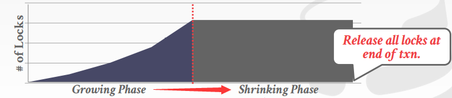

# Lecture 17. Two Phasing Locking

## 锁的类型 Lock Types

- 共享锁 `S-LOCK`：也称为读者锁
- 互斥锁 `X-LOCK`：也称为写者锁

|Compatibility|**Shared**|**Exclusive**|
|-:|:-:|:-:|
|**Shared**|✅|❌|
|**Exclusive**|❌|❌|


## 两阶段锁 Two-Phase Locking

- **阶段一：增长 Growing**
  每个事务在执行过程中只能逐渐获取锁而不能释放锁的阶段，每当需要锁时就从DBMS锁管理器中申请
- **阶段二：收缩 Shrinking**
  每个事务在执行过程中一旦开始释放锁就不能再获得的阶段，释放时就向DBMS归还锁


**两阶段锁本身就足以保证冲突可串行性**，因为基于两阶段锁的调度确保了事务优先图是无环的，但是两阶段锁的另一个问题在于**级联回滚 cascading aborts**，例如当事务`T1`对`A`做了修改后释放了`A`的锁，随后事务`T2`获得了`A`的锁并读取了`T1`写入的值，而随后一旦`T1`终止回滚，则依赖`T1`的`T2`也必须回滚，引起级联回滚如下图


显然的解决方法就是直到事务提交/放弃之前都不能"泄露"修改，即**一直持有锁直到事务结束时一次性释放，也被称为严格两阶段锁 Strict-2PL**，从而依赖相同对象值的其他事务必须等到该事务结束，并且该事务若一旦失败也只需恢复对象初始值即可



```TEXT
+--------------------------------------------------+
| All Schedules                                    |
|              +-------------------------------+   |
|              | View Serializable             |   |
|              |    +------------------------+ |   |
|              |    | Conflict Serializable  | |   |
|  +-----------+----+------------------------+-+-+ |
|  | No        |    | Strong Strict 2PL      | | | |
|  | Cascading |    |                        | | | |
|  | Aborts    |    |      +----------+      | | | |
|  |           |    |      |  Serial  |      | | | |
|  |           |    |      +----------+      | | | |
|  +-----------+----+------------------------+-+-+ |
|              |    |                        | |   |
|              |    +------------------------+ |   |
|              +-------------------------------+   |
+--------------------------------------------------+
```

另一方面**2PL协议并不能避免死锁问题**，因此锁管理器需要执行死锁检查（事务优先图判断环）和死锁处理算法

## 死锁检测和避免 Deadlock Detection + Prevention

- **死锁检测 Deadlock Detection**
- **死锁避免 Deadlock Prevention**

## 层级锁 Hierarchical Locking

## 隔离级别 Isolation Levels
