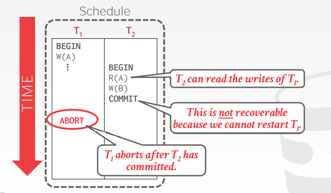
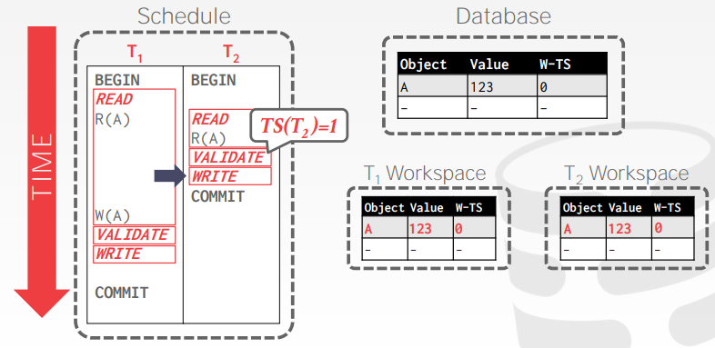
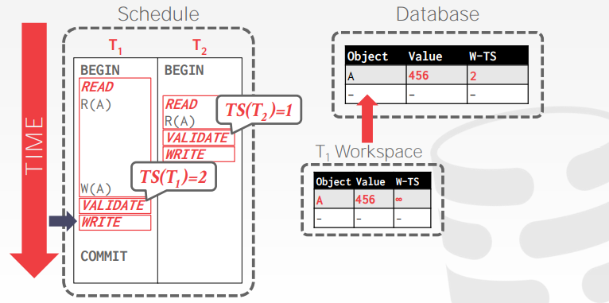
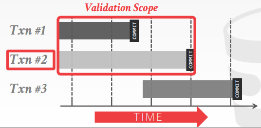
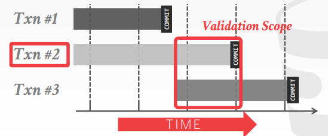
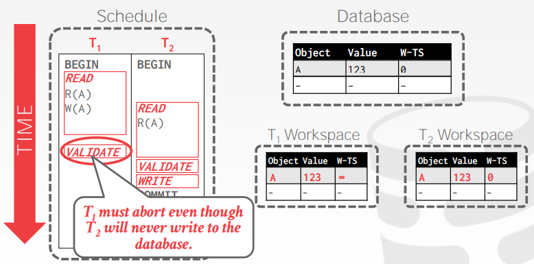
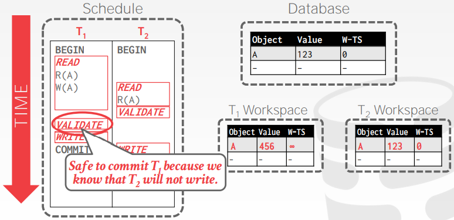
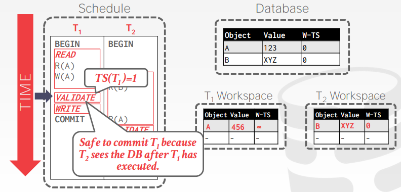
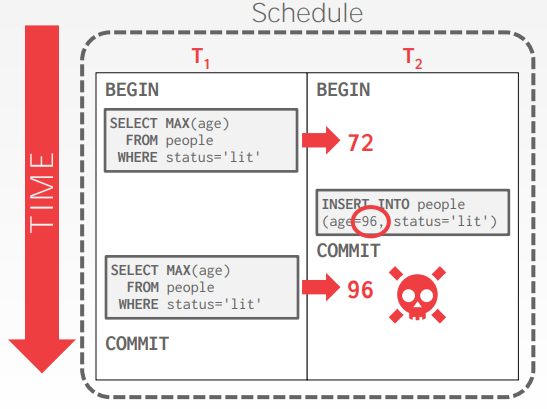
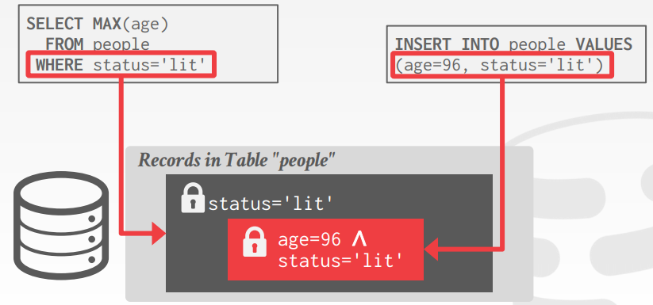

# Lecture 18. Timestamp Ordering Concurrency Control

## 2PL vs. T/O

- **两阶段锁 Two-Phase Locking, 2PL：悲观pessimistic协议**，在事务实际运行时，由冲突操作决定了事务的串行顺序
- **时间戳顺序 Timestamp Ordering, T/O：乐观optimistic协议**，在事务执行前就根据时间戳来决定事务的串行顺序

## 基本的时间戳协议 Basic Timestamp Ordering Protocol

事务运行时对数据对象的读写不需要加锁，**每个对象`X`都会记录最后一次写入/读取成功的时间戳，对每个操作都会首先检查对象的时间戳**，若对象有比事务更新的时间戳（事务尝试修改"未来"的数据）则该事务就终止会重新开始

- **读取 reads**，记为`R-TS(X)`
  - 若事务`TS(Ti) < W-TS(X)`，则对象`X`的数据比事务`Ti`要新，此时`Ti`终止并重试，携带更新的时间戳`TS`
  - 若事务`TS(Ti) >= W-TS(X)`，则允许事务`Ti`读取对象`X`，并更新读取时间戳`R-TS(X) = max(R-TS(X), TS(Ti))`，此时也需要复制一份`X`作为局部拷贝，从而后续`Ti`都会**读取这份局部拷贝实现可重复读repeatable reads**，因为原`X`可能又被其他事务写入
- **写入 writes**，记为`W-TS(X)`
  - 若事务`TS(Ti) < R-TS(X) || TS(Ti) < W-TS(X)`，则对象`X`的数据比事务`Ti`要新，此时`Ti`终止并重试，携带更新的时间戳`TS`
  - 否则就允许`Ti`写入数据，并更新写入时间戳`W-TS(X) = TS(Ti)`，同样一份`X`作为局部拷贝实现可重复读
  - **Thomas Write Rule**规定假如出现`TS(Ti) < W-TS(X)`则忽略丢弃该次写入并继续执行事务（可以理解为事务的写入被其他事务更新的写入操作直接覆盖）但是会违背时间戳顺序并且无法保证冲突可序列化

**不采用Thomas Write Rule的时间戳协议是可以产生冲突可串行化调度的**，没有死锁但有潜在的饥饿可能（某个事物一直因时间戳较旧而持续终止并重试，运行时间较长的事务有更大饥饿的可能，因为事务时间戳定义为事务开始的时间点）

显然时间戳协议作为乐观协议，在**事务时间较短short-lived、数据冲突较少rare conflicts时性能会更优越**

### 可恢复调度 Recoverable Schedules

可恢复调度指某个事务**仅在其读取（依赖）过数据的其他事务都提交时才进行提交**，即所有上游修改过该事务读取对象的事务提交后，该事务才提交

可恢复调度允许DBMS保证事务读取的数据在**崩溃恢复**后也会被恢复到读取时的样子

## 乐观并发控制 Optimistic Concurrency Control

DBMS会为**每个事务都创建私有的工作空间workspac**e，将所有读取到的数据和修改都暂时保存到工作空间中，待提交时才对比原始数据和工作空间数据，没有冲突才会将这些修改真正生效

- **阶段一：读取 Read**
  追踪事务所有的读写对象集合，并将写入数据暂存到工作空间
- **阶段二：验证 Validation**
  在事务提交时，对比工作空间的数据和其他事务数据是否有冲突（对比`ReadSet/WriteSet`）
- **阶段三：写入 Write**
  没有冲突验证通过的情况下，将修改应用到全局，否则就终止并重启事务

例如下图示例，事务`T1`和`T2`分别开始并读取了对象`A`，随后`T2`在时间戳`TS(T2)=1`优先提交但没有修改`A`的值

等到事务`T1`在时间戳`TS(T1)=2`需要提交时，验证对象`A`的数据，通过验证则提交，并修改对象`A`在全局的值且更新写入的时间戳

当事务处理的数据相互较为独立，冲突少且多为只读事务时，乐观并发控制的性能很高，但是由于每个数据都要来回拷贝私有工作空间，代价会较大，验证和写入阶段很容易成为系统瓶颈

### 1. 读取阶段 Read Phase

需要追踪事务所有的读写集合，并将自身的写入/修改保存到私有的工作空间，同时**也会将所有读取到的数据也复制**一份保存到工作空间以确保可重复读repeatable read

### 2. 验证阶段 Validation Phase

在事务提交时，DBMS需要确保可串行化调度serializable schedules，因此需要检查私有工作空间里数据对象的原始时间戳，**确保RW/WW冲突操作的顺序是单向的**（从older事务到younger事务），每个事务在**验证阶段会被赋予一个时间戳，验证可以有两种方式**

- **反向验证 Backward Validation**
  检查读写的数据对象是否与其他**已提交事务**的数据对象有交集
  
- **前向验证 Forward Validation**
  检查读写的数据对象是否与其他**未提交事务**的数据对象有交集
  
  
  若两个事务`TS(Ti) < TS(Tj)`，则前向验证要求以下**三种条件之一**必须满足：
  - **`Ti`必须在`Tj`开始前就已经完成三个阶段**（读取、验证、写入）
  - **`Ti`在`Tj`开始写入阶段前就结束，并且`Ti`没有写入任何`Tj`当前记录的会读取的对象**，即`WriteSet(Ti) intersect ReadSet(Tj) = null`
    下图中`T1`的验证阶段先于`T2`因此`TS(T1) < TS(T2)`但是`T1`写入了`T2`会读的数据，则`T1`必须回滚，否则`T2`就是读取了过期的数据
    
    下图中`T2`的验证阶段先于`T1`因此`TS(T2) < TS(T1)`此时`T2`并没有写入`T1`会读的数据，因此两者都可以正常提交，显然在此例中**事务实际提交顺序是`T1->T2`，但是逻辑执行顺序基于验证的时间戳是`T2->T1`，不一致但是正确**
    
  - **`Ti`的读取阶段在`Tj`结束读取阶段前就先结束，并且`Ti`没有写入任何`Tj`当前记录的会读写的对象**，即`WriteSet(Ti) intersect (ReadSet(Tj) union WriteSet(Tj)) = null`
    下图中`T1`的读取阶段在`T2`结束读取阶段前就结束，并且`T1`验证时确定没有写入任何当前`T2`会读写的对象（`T2`的`R(A)`晚于`T1`的提交，因此`T2`可以读到`T1`提交后的新数据）
    

补充：在**Database: The Complete Book**(P.945)中提到了**另一种验证方式（属于反向验证），包含两种必须同时满足的规则**：

- 若事务`T`已经开始且此时存在已经验证完但尚未结束的任意事务`U`，即`FIN(U) > START(T)`，则必须验证每个`U`确保`ReadSet(T) intersect WriteSet(U) = null`
  - 对于上述第一例，就是`T1`先通过验证，而`T2`的`R(A)`与已经验证完的`T1`有冲突，`T2`需要回滚
  - 对于上述第二例，就是`T2`先通过验证，而`T1`的`R(A)`与没有任何写入的`T2`不冲突，因此`T1`也可以提交
  - 对于上述第三例，就是`T1`先通过验证，而`T2`的`R(A)`与`T1`的`W(A)`冲突，**因此`T2`不能提交，与前一种规则的结果不同**，但是假如**进一步优化会发现可能`R(A)`的时间戳已经是`W(A)`的时间戳**，说明读到了`T1`提交的最新的数据，可以认为通过了验证
- 若事务`T`已经开始验证且此时存在已经验证完但尚未结束的任意事务`U`，即`FIN(U) > VAL(T)`，则必须验证每个`U`确保`WriteSet(T) intersect WriteSet(U) = null`
  - 对于上述第一例，未给出`T1`的结束时间，但是即使需要验证`WriteSet`也显然不冲突此条件
  - 对于上述第二例，`FIN(T2) > VAL(T1)`则需要验证，显然两者没有`WriteSet`交集，满足此条件
  - 对于上述第三例，由于`FIN(T1) < VAL(T2)`因此不需要验证此条件

### 3. 写入阶段 Write Phase

DBMS负责将通过了验证的事务对数据的修改应用到数据库中，并对其他事务可见，假定单次只会有一个提交的事务在修改同一个对象（通过read/write latch实现）

## 隔离级别 Isolation Levels

### 幻读 The Phantom Problem

此前讨论的情况都基于已有的数据记录，而当数据记录可以插入、删除时，又会有更多问题出现，例如**幻读**

例如下图中，事务`T1`只加锁了现有的数据，而事务`T2`插入了一条新的数据，从而导致`T1`的前后两次读取不一致，出现了幻读

冲突可串行化只保证**对象固定的情况下**的多个独立对象的读写是可串行的，解决幻读通常有以下方法：

- **方法一：重新执行扫描 Re-Execute Scans**
  DBMS记录一次事务中所有`WHERE`从句指涉的记录，在**事务需要提交时重新执行扫描语句**专门检查事务中`WHERE`从句的数据集是否改变
- **方法二：谓词锁 Predicate Locking**
  对`SELECT`查询的`WHERE`从句加上共享锁，对`UPDATE/INSERT/DELETE`查询的`WHERE`从句加上独占锁（从未在HyPer以外的DBMS上实现过）
  
- **方法三：索引锁 Index Locking**
  当所处理的属性上有索引时，就将**对应的索引节点加上锁**（假如没有对应的记录，就在该记录如果存在时会在的索引节点上加锁）

  当没有索引时，DBMS就必须**对每一个数据记录都加锁**以防止被修改成查询范围内的数据，也必须**对表加锁table lock**以防止插入/删除查询范围内的数据

### 弱化的隔离级别

可串行化的隔离级别能够让上层应用忽略并发问题，但是会带来额外的性能开销，有时候可以通过支持一些弱的隔离级别提升并发能力（只要应用程序允许）

||脏读Dirty Read|不可重复读Unrepeatable Read|幻读Phantom|
|-:|:-:|:-:|:-:|
|**可串行化 SERIALIZABLE**|**No**|**No**|**No**|
|**可重复读 REPEATABLE READ**|**No**|**No**|Maybe|
|**读已提交 READ COMMITTED**|**No**|Maybe|Maybe|
|**读未提交 READ UNCOMMITTED**|Maybe|Maybe|Maybe|

- **SERIALIZABLE**：首先获取所有锁，包括索引锁、严格两阶段锁
- **REPEATABLE READS**：与上相同但不获取索引锁
- **READ COMMITTED**：与上相同，但是对于共享锁在使用完后会立即释放
- **READ UNCOMMITTED**：与上相同但是不会获取共享锁（从而可能脏读）
- **CURSOR STABILITY**：介于REPEATABLE READS和READ COMMITTED之间，能够避免**更新丢失lost update**问题
- **SNAPSHOT ISOLATION**：确保一个事务中的所有读都仿佛在读整个数据库一个完整的快照（快照时间点就是事务开始的时刻），并且事务提交时必须没有和其他事务冲突的修改，但可能出现**写偏差write skew**问题

关于弱化的隔离级别各种问题的具体解释和解决策略也可以参考[DDIA此章节](https://github.com/JasonYuchen/notes/blob/master/ddia/07.Transactions.md#%E5%BC%B1%E7%9A%84%E9%9A%94%E7%A6%BB%E7%BA%A7%E5%88%AB-weak-isolation-levels)

大部分数据库的默认级别都是READ COMMITTED，最大级别都是SERIALIZABLE
