# Lecture 19. Multi-Version Concurrency Control

## 基本原理

DBMS维护**单个逻辑对象logical object的多个物理版本physical versions**，当事务需要写入一个对象时，DBMS就创造一个新的版本，当事务需要读取一个对象时，就读取事务开始时对应的对象最新版本

多版本并发控制的设计使得**读写互不阻塞**，只读的事务可以读到一致的快照并且不需要获取锁，采用**时间戳**来定义不同物理版本的可见性

读写互不阻塞的示例：

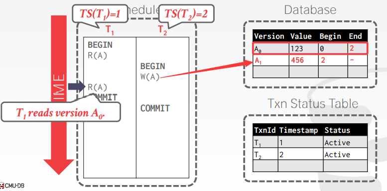

多写会阻塞的示例：

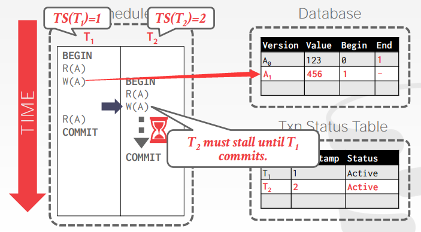

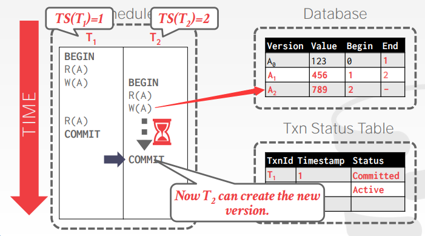

## 版本存储 Version Storage

采用数据记录的指针域tuple's pointer field来构造一个**版本链version chain**，从而DBMS可以在运行时决定不同事务的可见版本范围，数据库索引总是指向版本链的头节点

对不同的底层存储模式，版本也会实际存储在不同的位置

### 只追加存储 Append-Only Storage

新版本直接追加到同一个表内（在顺序上不保证逻辑对象的物理版本连续，不同记录的不同版本可能混合在内）

每次有数据更新时，直接追加一条记录到表内，通常可以是以下两种方式：

1. **追加到版本链末尾 Oldest-to-Newest, O2N**：此时往往需要遍历版本链来找到合适的新版本数据
2. **追加到版本链头部 Newest-to-Oldest, N2O**：此时每次追加版本都必须更新索引，因为索引总是指向版本头部

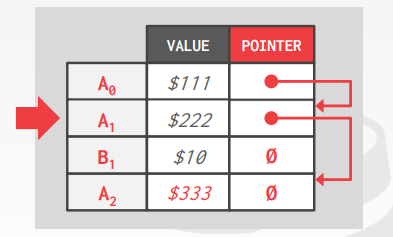

### 时间旅行存储 Time-Travel Storage

旧版本会被拷贝到分离的表空间separate table space

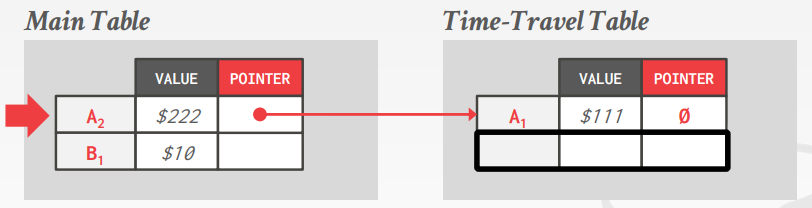
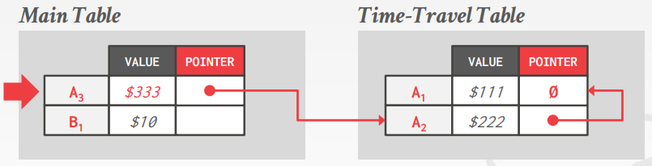

### 变化存储 Delta Storage

一条记录被修改的属性其旧值被拷贝存储到分离的记录空间separate delta record space，即记录变化历史，当需要时事务可以根据变化历史迭代找到旧版本的值

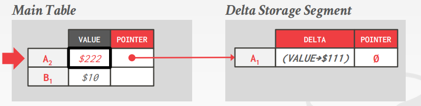
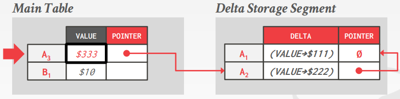

## 垃圾回收 Garbage Collection

显然随着版本数量的越来越多，很多**过于旧的版本不会再被新事务访问到，或是被一个已经终止的事务创造的版本也不会被访问**，因此需要及时垃圾回收旧版本释放存储空间和减轻维护版本的代价

### 数据记录级别的回收 Tuple-level GC

通过直接检查每个记录的版本链，对比当前活跃的事务来进行垃圾回收，也可以分为后台服务回收和合作式清理

1. **后台服务回收 Background Vacuuming**
   后台回收线程会周期性**触发并扫描整个表**进行回收检查，可以用于任何存储模式

   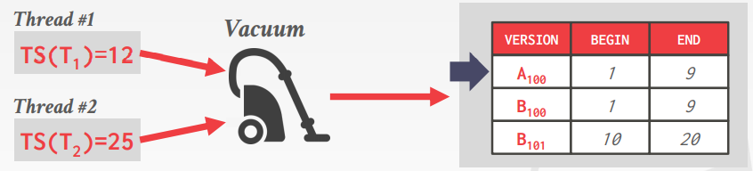
   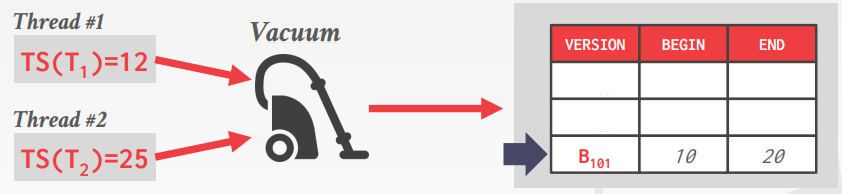
   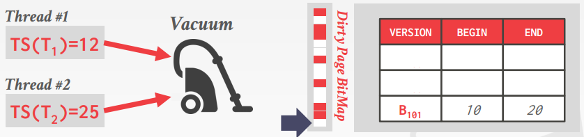

2. **合作式清理 Cooperative Cleaning**
   合作式清理要求事务的工作线程在**遍历版本链时"顺带"清理**旧版本的数据，显然**只能与新版本会追加到链末尾的O2N适配**使用

   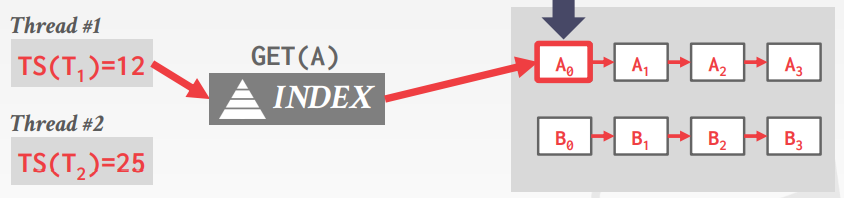
   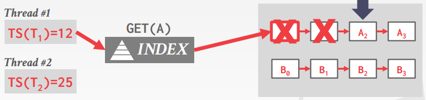
   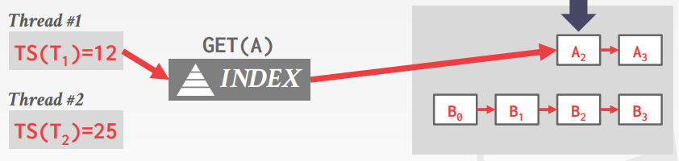

### 事务级别的回收 Transaction-level GC

由事务自身来追踪旧版本的数据，每个事务会追踪自己的`ReadSet/WriteSet`，从而DBMS不需要直接检查每个数据记录，而是决定某个结束事务创造的所有版本什么时候不再可见

## 索引管理 Index Management

**主键索引**会指向版本链的头部，因此当系统创建主键数据的新版本时，如果做了版本链的清理就需要更新索引，`UPDATE`会被处理成`DELETE + INSERT`，而**次级索引/二级索引 Secondary Indexes的处理更加复杂**，通常次级索引的值可以以下两种：

1. **逻辑指针 Logical Pointers**：每条记录采用一个固定不变的识别符identifier（Primary Key或Tuple ID），这样就需要额外一层跳转
2. **物理指针 Physical Pointers**：：直接采用版本链头部的物理地址

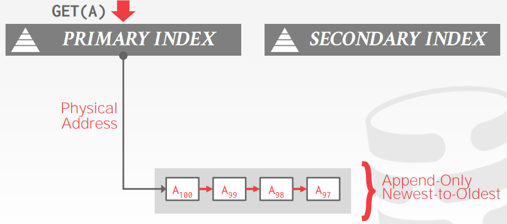
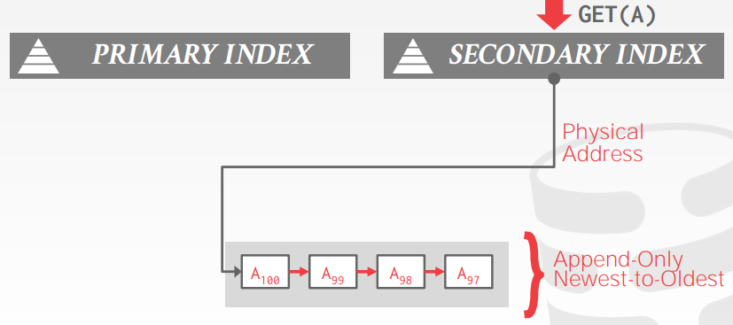
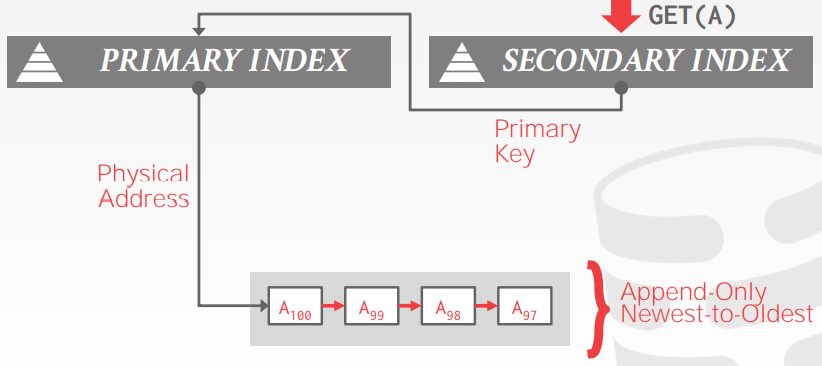
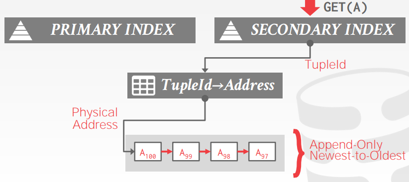

通常索引并不会包含MVCC中的版本信息，但是由于**MVCC可能会临时出现相同的key**，因此底层的索引数据结构必须能够支持多个重复key，例如下图中`T1`正在读取`A1`，而随后`T2`更新并删除了`A2`，当`T3`又来插入数据时版本变回了`A1`，此时索引中**相同的key可以能需要指向不同快照中的不同逻辑记录**

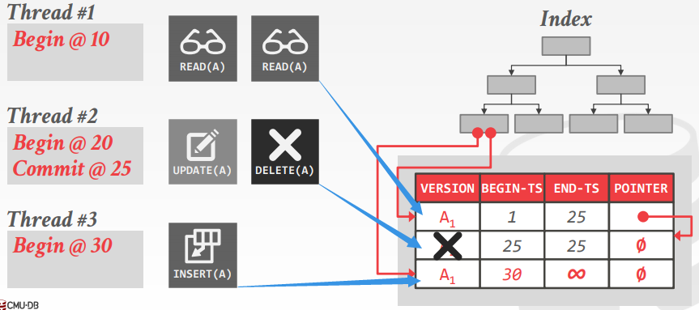

## 删除数据 MVCC Deletes

当一个已经被**逻辑删除logically deleted**的记录其所有版本都已经不可见时，说明没有事务会再用到该记录，此时DBMS会进行**物理删除physically deletes**

被逻辑删除的记录就不会再出现更新的版本，通常有以下两种方式来进行逻辑删除：

1. **删除标记 Deleted Flag**：在记录中采用标志位来记录该记录已被删除
2. **墓碑记录 Tombstone Tuple**：构造一个空的物理版本来表明对应的逻辑记录被删除

## Combined Concurrency Control Scheme: MVCC + 2PL

- **Reads**
  - 采用**MVCC来应对只读事务**，从而永远不会被一个写事务阻塞
  - 只读事务会被分配一个全局时间戳，事务中的**读操作只会读取到该事务开始前最新的数据**
- **Writes**
  - 采用Strict 2PL来应对写入事务，此时只读事务实际上会被直接忽略
  - 每个写入操作只会创建对象副本而不删除，新创建的副本会被**分配无限大的时间戳**，从而提交前不会被其他事务读取
  - 当事务**提交时就会设定每个写入对象的正确时间戳**
  - 一次只能提交一条事务，**避免时间戳冲突**

这种组合设计的缺点在于依然有2PL可能有的锁竞争问题，以及依赖大量时间戳分配（可能成为瓶颈）

*Lab4中仅采用Strict 2PL来“实现”读未提交、读已提交、可重复读，实际上Strict 2PL无法实现有写入且不阻塞的可重复读，因为另一个事务假如正在写入，则读取S锁会被X锁阻塞，**因此不存在可重复读***
