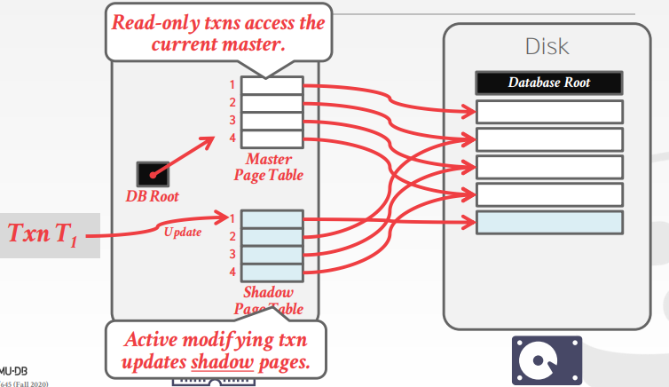
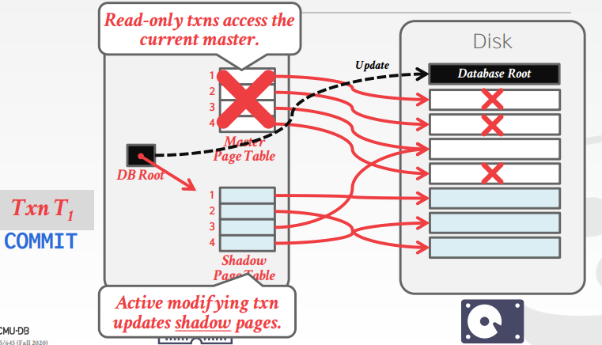
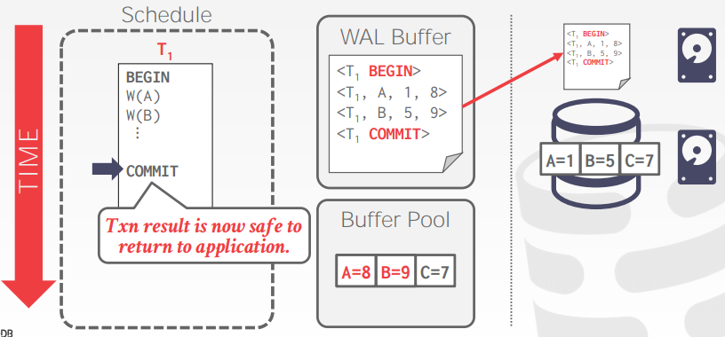
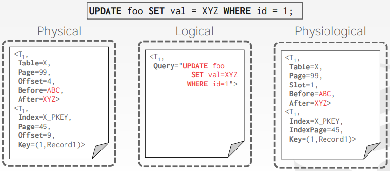

# Lecture 20. Database Logging

## 错误分类 Failure Classification

1. **事务错误 Transaction Failures**
   - 逻辑错误：事务由于一些内部状态异常导致无法完成，例如违反了一致性约束
   - 内部状态错误：事务由于死锁等原因必须被主动终止
2. **系统错误 System Failures**
   - 软件错误：OS或DBMS实现的问题，例如除零异常
   - 硬件错误：运行DBMS的硬件设施故障，例如掉电；**故障停机Fail-Stop**假设认为非易失性存储non-volatile在系统停机后数据不会被破坏
3. **存储媒介错误 Storage Media Failures**
   - 不可修复硬件故障：磁盘故障、比特位跳变等不可修复的问题，通常系统会通过校验和等方式来检测（但不能修复）此类故障，没有数据库能从这种错误中恢复而只能在良好硬件上从归档数据恢复

由于易失性存储如内存的速度显著快于非易失性存储如磁盘，因此大多DBMS都会采用缓存策略，在内存中修改数据，随后写回磁盘，此时DBMS必须保证**已提交事务的修改一定持久化**而不会因为宕机等原因丢失，并且**终止事务的修改不会出现部分修改已经被持久化**

DBMS通过**回滚日志UNDO**和**重做日志REDO**来保证这两点，UNDO用于撤回终止日志的部分修改，REDO用于保证提交事务的所有修改

## 缓存池策略 Buffer Pool Policies

1. **STEAL**
   **DBMS是否允许未提交的事务覆盖磁盘中已提交事务的值**？STEAL代表允许，NO-STEAL代表不允许
2. **FORCE**
   **DBMS是否要求必须在事务提交前就将所有修改写入到非易失存储上**？FORCE代表要求，NO-FORCE代表不要求

很显然NO-STEAL组合FORCE的方式实现最为简单，此时不需要UNDO来回滚被覆盖的值也不需要REDO来重做提交但未写入的值，但这种方式性能非常差并且受制于内存的限制；而**STEAL组合NO-FORCE的方式**可以达到性能的最大化但需要UNDO和REDO配合，几乎所有DBMS都按此实现

## 影子分页 Shadow Paging

影子分页技术通过维护数据库数据的两份独立拷贝来实现上述要求：

- 主拷贝 Master：只保存所有已提交事务的数据
- 副拷贝 Shadow：包含各种未提交事务的修改

所有事务都只修改副拷贝，等到事务提交时，原子的将副拷贝变为主拷贝，此时缓存池的策略就是**NO-STEAL + FORCE**

采用影子分页技术：

- **日志的需求**：
  - UNDO：只需要做移除Shadow pages的任务，只保留master和DB root pointer
  - REDO：不需要
- **缺点**：
  - 需要拷贝整个页表，开销非常大，可以通过使用类似B+树的页表目录结果来优化，此时不需要拷贝整个树，只需要拷贝更新叶节点的路径对应的页表即可
  - 提交的开销非常大，需要刷新每一个脏页、页表、根节点，数据碎片化因此额外需要垃圾回收
  - 写入磁盘时DBMS需要做很多随机写入（不同页表分散在磁盘上）性能代价很大

## 预写式日志 Write-Ahead Log

DBMS在数据文件外再额外维护日志文件，日志文件中包含了事务对数据的修改记录（包含足以重建/回滚事务所有修改的**REDO/UNDO日志**），日志文件也需要保存到稳定的存储中，此时缓存池的策略就是**STEAL + NO-FORCE**

WAL日志中包含了对一些页的更新记录，并且**WAL会先于对应的页的更新本身被写入持久化存储**，当事务的所有**修改都在WAL上并已经被写入持久化存储时事务就可以提交**

对一个具体的事务来说，事务开始时，WAL会记录一条`<BEGIN>`，当事务结束时就会记录一条`<COMMIT>`并确保截至该记录都必须持久化到磁盘上，对应的事务才可以提交，显然多个事务的多个WAL记录可以通过**批量提交group commit**的方式提高吞吐量

图中示例WAL日志记录log entry包含以下信息：

- **事务号 Transaction ID**
- **对象号 Object ID**
- **旧值 Before Value (UNDO)**
- **新值 After Value (REDO)**

通常WAL可以在内存日志缓存满、事务提交、达到一个周期时间的时机进行刷写到磁盘上，而对应的真实数据修改就可以不需要同步写入磁盘，从而显著提高DBMS的性能和吞吐量

## 日志模式 Logging Schemes

日志通常可以分为以下模式：

1. **物理日志 Physical Logging**：记录具体某个位置的修改，类似`git diff`
2. **逻辑日志 Logical Logging**：记录事务的操作，不一定只涉及某个具体位置，例如`UPDATE/DELETE/INSERT`等，因此日志本身数据量少于物理日志的量，但是如果有并发的其他事务就很难从日志上来区分数据库具体数据的修改，且恢复所需要的时间更长
3. **混合日志 Physiological Logging**：日志记录单个页的修改，但是不会指定页的组成（从而允许DBMS重新组织页），通过slot号来识别tuple

## 检查点 Checkpoints

为了避免WAL日志永远增长占据过多空间以及从故障中恢复时重放replay整个WAL耗时过长，且考虑到过旧的WAL日志项实际上已经在数据库中生效从而可以被移除，DBMS通常会周期性的生成WAL日志的快照作为检查点

在生成检查点时将内存中的所有WAL日志项、修改的数据都持久化到可靠存储中，并在WAL中写入一条`<CHECKPOINT>`记录，此后：

- 所有在该`<CHECKPOINT>`前提交的事务修改记录都会被忽略
- 所有在该`<CHECKPOINT>`后提交的事务需要**REDO**确保宕机恢复后事务依然是提交的
- 所有在该`<CHECKPOINT>`后未提交的事务需要**UNDO**确保部分修改partial modification被回滚

显然检查点是一个非常费时的操作，同时为了确保生成一致的快照，DBMS必须暂停所有进行中的事务，因此**检查点的频率是需要考虑的**，周期过长会导致快照过大且恢复时replay耗时过久，周期过短会导致DBMS频繁写入磁盘大大减少事务处理能力
