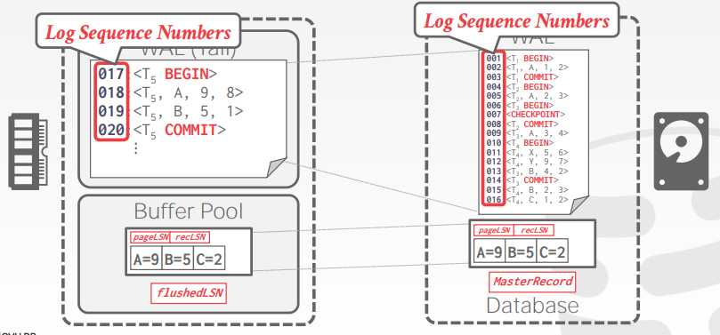

# Lecture 21. Database Recovery

## 日志顺序号 Log Sequence Numbers

每一条日志记录都必须包含一个**全局唯一的日志序列号 Log Sequence Number, LSN**

|Name|Where|Definition|
|:-|:-|:-|
|`flushedLSN`|Memory|Last LSN in log on disk|
|`pageLSN`|page_x|Newest update to page_x|
|`recLSN`|page_x|Oldest update to page_x since it was flushed|
|`lastLSN`|Ti|Latest record of txn Ti|
|`MasterRecord`|Disk|LSN of the latest checkpoint|
|`prevLSN`|log entry|The previous LSN of this txn|

每一个数据页都会包含一个`pageLSN`用来记录最近一次更新对应的日志中的log entry，系统会追踪`flushedLSN`用来记录当前已经持久化的最大的log entry

因此**任意一个数据页page x的数据要真正修改到磁盘上，就必须确保对应的日志log entry已经被持久化**到磁盘上，即`pageLSN_x <= flushedLSN`，从而确保宕机重启时能够通过日志来重建数据页（而不是数据页中有部分修改但是日志中没有）

在事务执行过程中，每当需要修改一个数据页中的记录时，就会有对应WAL log entry生成，同时更新`pageLSN`为最新的log entry对应的LSN，并且每当将内存中的WAL缓冲写入到磁盘时，就更新全局的`flushedLSN`，此后**在`flushedLSN`前的内存中的WAL log entry都可以安全移除**

## 提交和终止 Normal Commit & Abort Operations

当事务需要提交时，写入`COMMIT`到WAL中，此时**在此`COMMIT`及之前的WAL log entry都必须被同步（`fsync()`）持久化到磁盘中**，当持久化成功时说明事务提交成功，此时**额外写一条`TXN-END`到WAL中并且不需要立即持久化**这一条记录

log entry中需要**记录额外一个字段`prevLSN`即该log entry所属的事务的上一条log entry LSN**，对于一个事务来说形成类似反向的链表结构，可以通过最新的log entry反向回溯所有修改对应的log entry，从而当事务需要回滚时，可以通过`prevLSN`来回滚所有操作

**补偿日志 Compensation Log Records, CLR**是描述了如何进行数据回滚的一类log record，包含了所有update log record会有的字段，额外再**加上`undoNext`指针，即下一个被回滚的日志的LSN（the next-to-be-undone LSN）**，DBMS在事务终止后并**不会等待CLRs被持久化进磁盘**而是直接通知应用程序相应的事务终止

当事务需要终止时，**首先写入一条`ABORT`到WAL中，随后根据`prevLSN`进行回溯，对每一条修改的日志都追加一条相应的CLR到WAL中**，最终额外写一条`TXN-END`到WAL中，**注意CLR自身永远不需要被UNDONE**

## 模糊快照 Fuzzy Checkpointing

通常当DBMS需要快照保存状态时，为了保证快照的一致性，需要暂停开始任何新事务并等待当前事务全部运行结束，此时将脏页刷写到磁盘上，才可以开始进行快照，可见代价极大

### 一种略微更佳的策略

通过**暂停修改数据的事务**（禁止查询获得写锁write latch）可以优化，不需要等待所有事务结束，但是此时也需要额外的记录内部状态：

- **活跃事务表 Active Transaction Table, ATT**
  每个entry都代表一个当前活跃的事务，包含对应的事务号`txnId`、事务的运行状态`status (R=Running, C=Committing, U=Candidate for Undo)`、由此事务创建的最近的WAL日志号`lastLSN`，当事务提交或终止后就会从ATT中移除
- **脏页表 Dirty Page Table, DPT**
  记录缓存池中**包含有未提交事务数据的脏页**，每个entry代表一个脏页，包含**第一个使该页变为脏页**的WAL日志号`recLSN`

但是在快照期间，DBMS仍然需要暂停所有事务的执行

### 更优的策略：模糊快照

**模糊快照期间DBMS可以继续执行所有事务**并且将脏页刷写进磁盘，新的日志需要记录快照的边界，包含：

- **快照开始时写入`CHECKPOINT-BEGIN`：代表快照开始**，当快照完成时，该日志的LSN就会作为MasterRecord记录到磁盘上，在**快照开始后开始的事务都不会被包含在ATT中**
- **快照结束时写入`CHECKPOINT-END`：包含ATT+DPT**

## 恢复算法：ARIES Recovery Algorithm

ARIES算法恢复过程分为三个阶段：

1. **Analysis**
   从最近的快照点（MasterRecord）开始**正向扫描WAL，重建ATT+DPT**，分析出最近的快照点之后提交或终止的事务
   - 当发现`TXN-END`时将对应的事务移除出ATT
   - 当发现`COMMIT`时，将事务标记`status=COMMIT`
   - 当发现`UPDATE`时，如果相关的页P还未在DPT中，则加入DPT并标记`recLSN=LSN`
   - 当发现其他日志时，将事务添加到ATT，并标记`status=UNDO`

   

2. **Redo**
   目的是重建宕机时的所有事务状态，在Analysis结束后，**从DPT中最小的`recLSN`对应的日志项开始正向扫描WAL重新执行每一条update log record对应的操作**（无论该事务是提交还是终止）以及重新执行CLRs，除非满足以下任一条件则可以不重新执行该记录
   - 该记录影响的数据页不在DPT中
   - 该记录影响的数据页在DPT中但是该记录的LSN小于该页的`recLSN`
   - 该记录影响的数据页其磁盘记录的`pageLSN`大于等于LSN

   重新执行/REDO操作时，还需要设置相应修改数据页的`pageLSN`到该日志项的LSN，但是此过程本身不需要日志记录，也不需要刷新磁盘，在**REDO阶段结束后，对每一条`status=COMMIT`的事务都写入`TXN-END`并将其移除出ATT**
3. **Undo**
   REDO结束后再**反向扫描WAL（使用`lastLSN`直接定位）执行UNDO操作，用于将ATT中`status=UNDO`的活跃事务的修改回滚**，对每一步UNDO操作都写入一条CLR日志

   当最后一条事务也被成功终止后，DBMS刷写日志到磁盘上，并且此时可以开始运行新事务

   

4. **ARIES算法总结**
   - WAL with STEAL/NO-FORCE
   - Fuzzy Checkpoints, snapshot of dirty page ids
   - Redo everything since the earliest dirty page
   - Undo txns that never commit
   - Write CLRs when undoing to survive failures during restarts/recovery

- **若在Analysis过程中DBMS再次宕机？**
  没有任何影响，重启后重新开始Analysis
- **若在Redo过程中DBMS再次宕机？**
  没有任何影响，重启后重新开始Analysis+Redo
- **如何提升Redo过程的性能？**
  假定不会连续发生crash，异步将Redo的修改刷写进磁盘
- **如何提升Undo过程的性能？**
  限制应用程序使用过长耗时的事务（例如Apple的FoundationDB的事务限制5秒时间，超过就终止），以及可以懒惰回滚修改直到有新的事务访问相应的页
