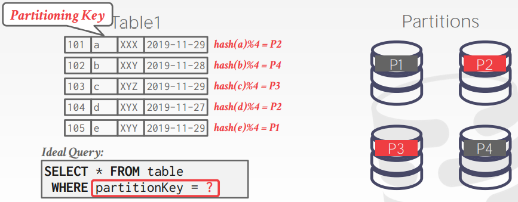
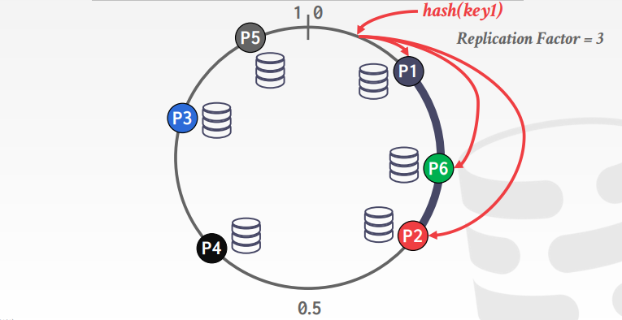
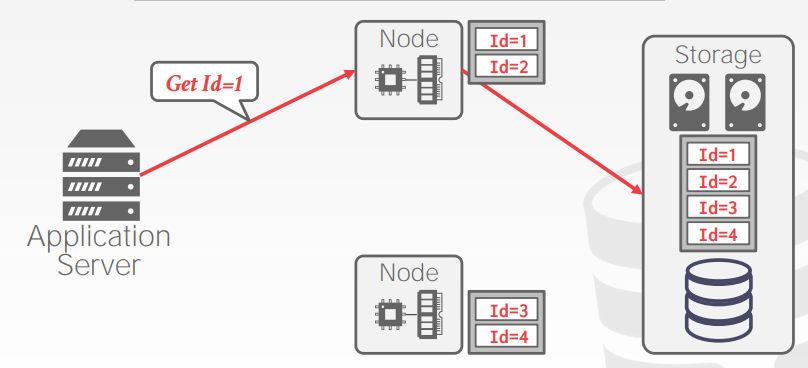
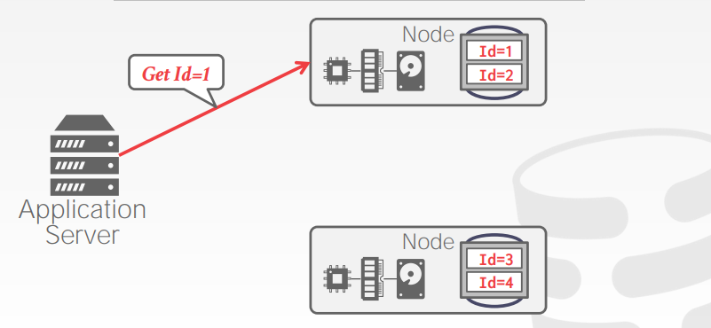
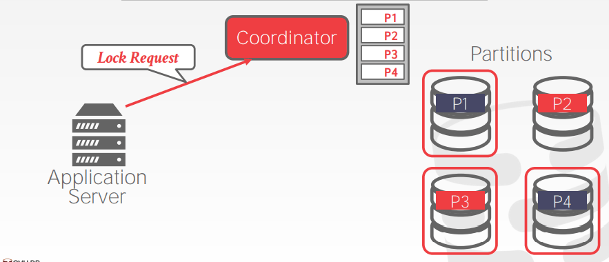
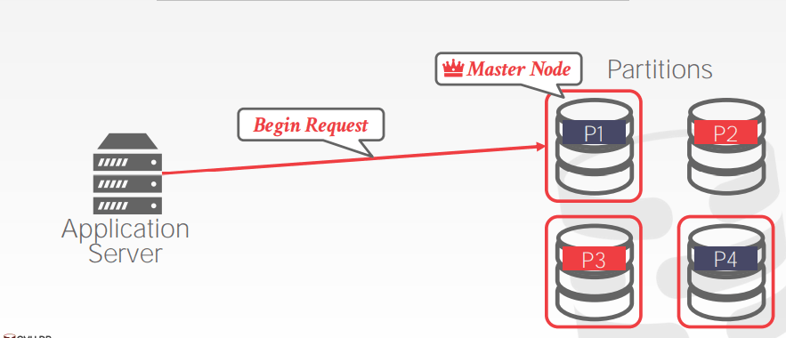
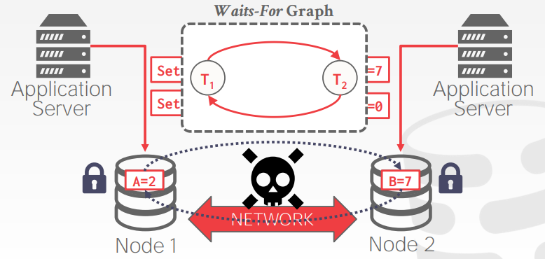

# Lecture 22. Introduction to Distributed Databases

## 并行与分布式 Parallel vs. Distributed

- **并行DBMSs**
  - 节点在物理上都非常接近，例如一个数据中心
  - 节点间采用高速网络连接
  - 节点间通信代价相对较低
- **分布式DBMSs**
  - 节点在物理上可以相距较远，例如地理上分布 geographically distributed
  - 节点间采用公共网络
  - 节点间通信代价足够高不能忽略

## 系统架构 System Architectures

- **共享所有资源 Shared Everything**
  类似小型机
- **共享内存 Shared Memory**
  多个CPU通过网络访问共同的内存和磁盘，每个CPU上的DBMS实例都有全局的内存视图，并且感知其他CPU上的DBMS实例
- **共享磁盘 Shared Disk**
  多个CPU，每个CPU有独立的内存，通过网络访问共享的磁盘，这种设计可以将执行层剥离存储层，实现计算与存储的分离，被广泛使用在各类分布式数据库中（例如[Google Spanner](https://github.com/JasonYuchen/notes/blob/master/mit6.824/13.Spanner.md)、[Amazon Aurora](https://github.com/JasonYuchen/notes/blob/master/mit6.824/10.Aurora.md)、YugaByte等）
  
  

- **无共享 Shared Nothing**
  通过网络实现多个独立节点的交互，更好的性能和效率，但是难以扩容和难以保证一致性（例如cassandra、Greenplum）

  

## 设计考量 Design Issues

- **同构节点 Homogenous Nodes**
  每个节点都能做相同的事，从而当启动、故障容错等机制上较为简单
- **异构节点 Heterogenous Nodes**
  每个节点做不同的事，一个物理节点可以实际运行多个虚拟节点来做不同的事，类似Actor并发模型

数据应当是透明的**Data Transparency**，用户不需要直到数据的**分区情况partitioned**或是**副本情况replicated**，一个在单节点DBMS上能运行的查询，也可以在分布式DBMS上运行

## 分区模式 Partitioning Schemes

在NoSQL系统中也称为**sharding**，分布式DBMS将查询分割后在每个相关节点上执行，最后在汇总结果

- **水平分区 Horizontal Partitioning**
  基于某些列的值，将表的数据分割成不相交的子集，可以细分为**散列分区Hash Partitioning**、**范围分区Range Partitioning**，显然对于shared-nothing架构可以将表物理分区，不同分区存储在不同节点上，而对于shared-disk架构可以将表逻辑分区，由存储层来实现具体的物理存储但是对执行层表现为分区

  

- **一致性散列 Consistent Hashing**
  
  

- **逻辑分区 Logical Partitioning**

  

- **物理分区 Physical Partitioning**

  

## 分布式并发控制 Distributed Concurrency Control

- **中心化 Centralized**
  
  

- **去中心化 Decentralized**
  
  

分布式并发控制由于**副本复制replication、网络开销network、节点宕机failure、时钟偏移clock skew**的存在，非常困难，例如经典的**两阶段提交two-phase-commit, 2PC**模式就可能发生如下的死锁：

