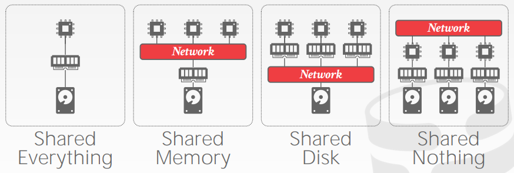
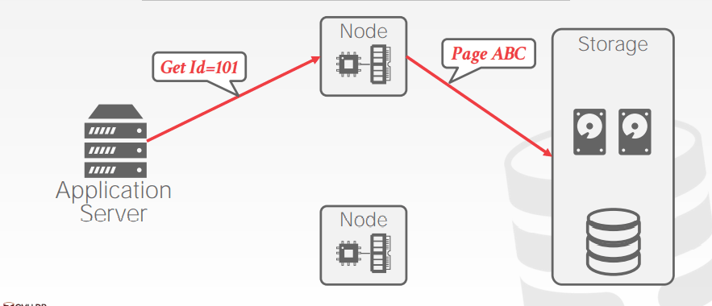
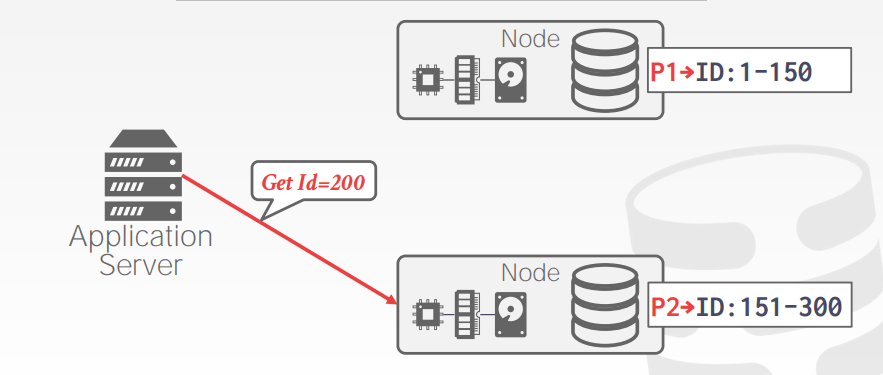

# Lecture 22. Introduction to Distributed Databases

## 并行与分布式 Parallel vs. Distributed

- **并行DBMSs**
  - 节点在物理上都非常接近，例如一个数据中心
  - 节点间采用高速网络连接
  - 节点间通信代价相对较低
- **分布式DBMSs**
  - 节点在物理上可以相距较远，例如地理上分布 geographically distributed
  - 节点间采用公共网络
  - 节点间通信代价足够高不能忽略

## 系统架构 System Architectures

- **共享所有资源 Shared Everything**
  类似小型机
- **共享内存 Shared Memory**
  多个CPU通过网络访问共同的内存和磁盘，每个CPU上的DBMS实例都有全局的内存视图，并且感知其他CPU上的DBMS实例
- **共享磁盘 Shared Disk**
  多个CPU，每个CPU有独立的内存，通过网络访问共享的磁盘，这种设计可以将执行层剥离存储层，实现计算与存储的分离，被广泛使用在各类分布式数据库中（例如[Google Spanner](https://github.com/JasonYuchen/notes/blob/master/mit6.824/13.Spanner.md)、[Amazon Aurora](https://github.com/JasonYuchen/notes/blob/master/mit6.824/10.Aurora.md)、YugaByte等）
  
  

- **无共享 Shared Nothing**
  通过网络实现多个独立节点的交互，更好的性能和效率，但是难以扩容和难以保证一致性（例如cassandra、Greenplum）

  

## 设计考量 Design Issues

## 分区模式 Partitioning Schemes

## 分布式并发控制 Distributed Concurrency Control
