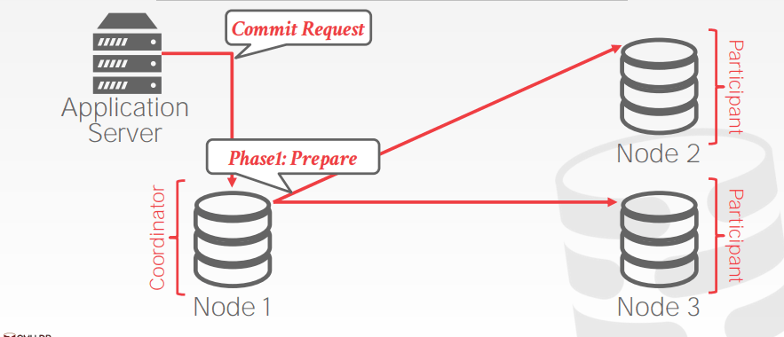
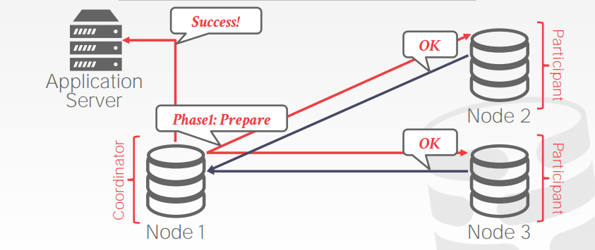
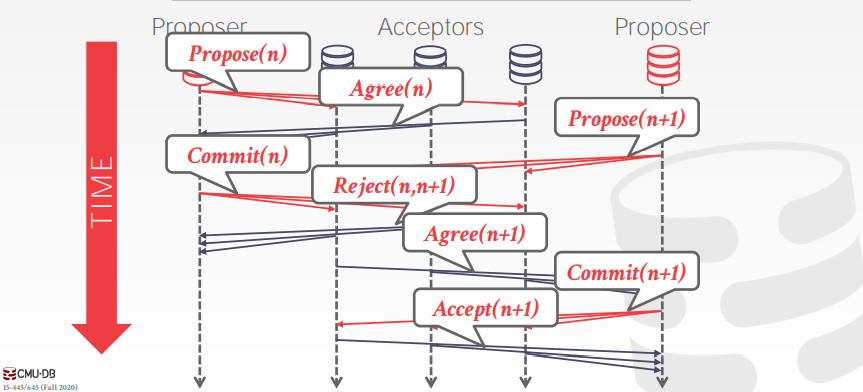
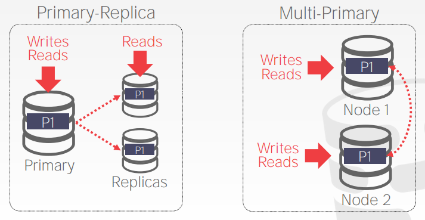
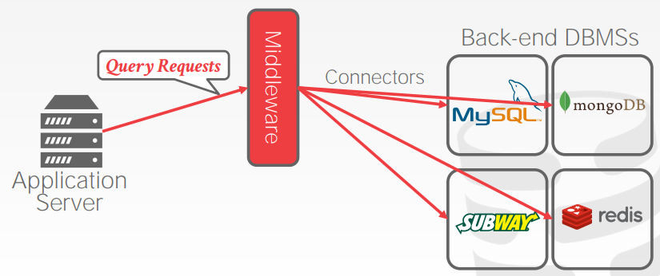

# Lecture 23. Distributed OLTP Databases

## 原子提交协议 Atomic Commit Protocols

当涉及到多个节点的事务需要提交时，DBMS需要确保每个相关节点都能达成一致，实现原子提交，常见的原子提交协议有以下几种

注意：所有分布式节点通常都被认为是可信的（即不存在**恶意节点adversarial nodes**）

### 两阶段提交 Two-Phase Commit, 2PC

- 成功的两阶段提交流程

  

- 失败的两阶段提交流程

  

- 两阶段提交的优化
  - **Early Prepare Voting**
    `TODO`
  - **Early Ack After Prepare**
    当所有节点都对Prepare返回OK时，此时可以直接对客户端返回ACK确认提交，随后再异步Commit

    

每个节点都需要对2PC过程中的每一个结果持久化到日志上

### 三阶段提交 Three-Phase Commit, 3PC

扩展的两阶段提交，但多一次网络RTT，实际应用非常少

### Paxos

- **Single Paxos**

  

- **Multi Paxos**
  若系统选择一个单领导节点leader来管理某一段时间内的所有propose，则可以跳过`Propose`阶段，但是当领导节点宕机时，就回退到full Paxos

  系统会周期性的采用一次Paxos来决定领导节点leader，期间所有节点需要交换日志来确保每个节点都拥有最新的日志

显然与2PC相比，**Paxos只需要系统的简单多数存活就可以持续提供服务**，而2PC不允许任何节点宕机

### Raft

[Raft](https://github.com/JasonYuchen/notes/blob/master/raft/03.Basic_Raft_Algorithm.md)

### ZAB

[Zookeeper Atomic Broadcast, ZAB](https://github.com/JasonYuchen/notes/blob/master/mit6.824/ZooKeeper.md#2-%E5%8E%9F%E5%AD%90%E5%B9%BF%E6%92%AD-atomic-broadcast)

### Viewstamped Replication, VR

`TODO`

## 复制 Replication

DBMS通过复制数据来提升可用性，通常需要考虑以下方面

### 复制的配置 Replica Configurations

- **主从备份 Primary-Replica**
  每个修改都会发生在主节点上，主节点再将修改扩散给备份节点（扩散过程是**单向且不需要原子提交协议**的），通常备份节点也可以提供一些只读事务服务，一旦主节点宕机，从节点中必须选出新的主节点
- **多主备份 Multi-Primary**
  任意节点都是主节点，可以实现数据修改，而每次修改都必须同步扩散到所有节点（扩散过程是**双向且需要原子提交协议**保证一致性）

对于DBMS的replication，**K-safety**代表至少需要K个副本存活整个DBMS才可以保证可用性，一旦存活副本少于K
个时DBMS就不再保证可用性

### 复制模式 Propagation Scheme

- **同步 Synchronous**
  强一致性 Strong Consistency，同步复制要求接受修改的从节点向主节点返回ACK确认后才认为复制成功，从而一次修改必然再所有节点上生效，保证了强一致性
- **异步 Asynchronous**
  最终一致性 Eventual Consistency，异步复制不要求从节点返回ACK确认从而有可能主从上的数据不完全一致，但是随着时间流逝最终对任意一次修改一定会在所有节点上呈现

### 复制时机 Propagation Timing

- **连续 Continuous**
  DBMS每当生成日志时都立即复制给其他节点，则对于提交和终止也需要都复制
- **提交时 On Commit**
  DBMS仅当在某个事务确认提交时才生成日志复制给其他节点，对于终止的日志就不需要再复制给其他节点，优点在于失败的事务不必再复制，缺点在于需要有足够的内存容纳所有事务直到知道结果

### 更新方法 Update Method

- **主动-主动 Active-Active**
  每个事务都在每个备份节点上独立运行获得结果，此时需要有机制来检测每个节点上运行的事务是否最终结果相同
- **主动-被动 Active-Passive**
  事务只在一个节点上执行，而将结果和修改复制到其他节点上（physical or logical replication）
  
  **注意与主从和多主备份区分**，更新方法指事务的复制方式，例如多主备份+主动-被动就是每个节点上都可以运行不同的事务，但一个事务只在某个节点上执行并将结果扩散复制给其他节点，而多主备份+主动-主动，就是每个节点都可以执行事务且任一事务都在所有节点上执行

## 一致性问题 Consistency Issue (CAP)

Eric Brewer提出**分布式系统中一致性Consistency、可用性Always Available、分区容错性Network Partition Tolerant不可能同时达到，至多只能三选二**，于2002年得到证明

对于OLTP DBMS来说，通常有以下两类方式：

- **Traditional/NewSQL DBMSs**
  当出现网络分区时，停止接收更新请求直到大多数节点恢复连接，即牺牲可用性A，保证一致性C和分区容错性P
- **NoSQL DBMSs**
  提供一种能够解决冲突的机制，当出现网络分区时继续接收修改请求并在网络恢复后解决冲突数据，即牺牲一致性C，保证可用性A和分区容错性P

由于分布式系统中网络是不可考的，**网络分区总是会发生而不是一种选择，因此通常CAP理论下的系统设计总是CP或AP**

## 联合数据库 Federated Databases

联合数据库通过**数据库中间件DBMS Middleware**充当中介，底层采用多种不同类型的数据库，由中间件负责SQL的解析和下发到底层数据库执行，并汇总和返回结果

