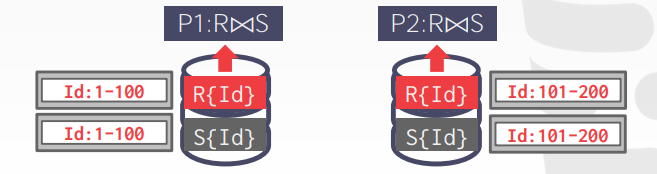

# Lecture 23. Distributed OLTP Databases

## 执行模型 Execution Models

### Push vs. Pull

- **将查询推送给数据 Push Query to Data**
  将查询或是查询的一部分推送给拥有数据的节点，由该节点具体执行并返回结果，尽可能的采用过滤filtering和预处理preprocessing的方式来减少跨网络的数据传输

  

- **由查询拉取数据 Pull Data to Query**
  将原始数据通过网络拉取到执行查询的节点，通常数据还会保存在节点的缓存池中，利用局部性原理来减少网络传输重复的数据

  

### 查询容错 Query Fault Tolerance

大多数无共享shared-nothing架构的OLAP DBMS在设计时认为节点不会宕机，或是宕机后只需要简单重启并重试查询即可

通常DBMS也可以考虑对中间结果intermediate results进行快照，从而在**节点宕机时可以从快照中恢复查询**，从而避免应用层的查询重试

## 查询计划 Query Planning

先前讨论的查询优化措施[I](14.Query_Planning_I.md)&[II](15.Query_Planning_II.md)在分布式查询中依然可用，但是由于分布式查询需要考虑到数据的真实物理位置，在应用优化策略时限制更多

- **物理算子 Physical Operators**
  大多数DBMS采用这种方式，首先生成单个查询计划，随后**根据数据分区后的物理存储位置将查询计划分割成针对不同分区的子查询**
- **SQL**
  将查询重写成在不同分区节点上执行的多个查询，由每个分区节点再针对进行本地优化

## 分布式连接 Distributed Join Algorithm

分布式情况下的连接，DBMS首先需要将能连接的记录都汇总在同一个节点上，随后再执行常规的连接算法，可以分为以下多种连接场景：

1. `S`表在**每个节点上都有副本**，则`R`表的每个分区节点都在本地完成连接，最后一起将结果发送给协调节点汇总

   

2. `R`表和`S`表均**依据连接的属性进行了分区**，则能连接的记录已经被分区到相同的节点，每个分区节点本地完成节点，最后一起将结果发送给协调节点汇总

   

3. `R`表和`S`表**按照不同的属性进行了分区**，则此时较小的表可以选择广播broadcast自己的数据到所有节点（类似复制到每个节点上）

   

4. `R`表和`S`表**按照不同的属性进行了分区且都不是连接的属性**，则DBMS需要在所有节点上**shuffle**所有数据，类似MapReduce的过程，随后完成连接

   

## 云 Cloud Systems

现在越来越多的DBMS厂商直接提供云上数据库database-as-a-service, DBaaS，例如[ScyllaDB](https://www.scylladb.com/)，并且随着云计算的应用，无共享shared-nothing和贡献磁盘shared-disk的界限逐渐模糊（例如AWS S3服务提供数据直接过滤后再拷贝到计算节点）

- **托管数据库 Managed DBMS**：由厂商托管，对数据库来说与运行在本地相比并没有明显区别
- **云原生数据库 Cloud-Native DBMS**：DBMS在设计之初就为云环境优化，通常是基于共享磁盘的架构，例如Amazon Redshift、Snowflake等
- **无服务器数据库 Serverless DBMS**：相比于一直维护DBMS集群，当业务压力低，DBMS不繁忙时，动态缩减服务集群规模，当请求增多时动态扩容服务器集群规模，弹性化服务从而降低运营成本（通常数据都是存储在共享磁盘上的，只有DBMS的计算服务节点会弹性化）

另一方面，越来越多新的系统提供模块化的服务，例如：

- System Catalogs：HCatalog、Google Data Catalog、Amazon Glue Data Catalog
- Node Management：Kubernetes、Apache YARN、Cloud Vendor Tools
- Query Optimizers：Greenplum Orca、Apache Calcite
- Universal Format：Apache Parquet、Apache ORC、Apache Iceberg、HDF5、Apache Arrow
