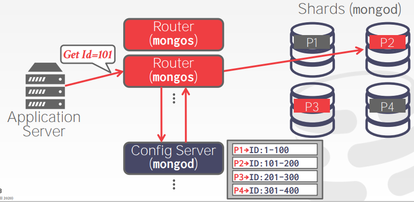

# Final Review & Systems Potpourri

## DynamoDB

[Dynamo: Amazon's Highly Available Key-value Store](https://www.allthingsdistributed.com/files/amazon-dynamo-sosp2007.pdf)

- 最终一致性K-V存储
- 无共享架构
- Non-SQL接口，不支持连接，不支持事务（后支持"single-shot"事务）
- 基于一致性散列分区
- 关系模型的子集：不支持指定约束（外键等），只支持以下两种主键primary keys：
  - 单分区键 Single Partition Key
  - 分区+排序键 Composite Partition Key + Sort Key
- 支持两种二级索引secondary indexes：
  - 本地二级索引 Local Secondary Index：每个节点采用B+树索引该节点上的数据
  - 全局二级索引 Global Secondary Index：采用分区+排序键索引全局数据，不保证和实际数据的一致性
- 2018年引入single-shot事务，需要调用者自己维护读写数据集r/w set

    ```text
    BEGIN
    A = A - 100
    B = B + 100
    COMMIT

    A = Get(person:"Andy")
    B = Get(person:"Bookie")
    TransactionWriteItems(
        Check(person:"Andy", balance:A),
        Check(person:"Bookie", balance:B),
        Put(person:"Andy", balance:A-100),
        Put(person:"Bookie", balance:B+100)
    )
    ```

## cassandra

Dynamo论文公布后，大量参考其设计的实现

- 最终一致性（可调一致性）
- 无共享架构
- 基于一致性散列分区
- 列族数据模型 Column-Family Data Model (Google BigTable)
- 单节点采用[LSM树存储引擎](http://cmudb.io/lectures2015-rocksdb)
- CQL

## mongoDB

分布式文档存储


- 异构，无共享架构以及中心化查询路由 centralized query router
- 主从复制 master-slave replication
- 自动分区 auto-sharding，需要定义分区属性，当数据过多时将自动分区和重平衡
- 只支持JSON访问
- 没有基于代价的查询优化器，只会启发式优化 heuristic-based+"random walk"
- 多文档事务 multi-document transactions
- 支持JavaScript写自定义函数
- 早期采用`mmap`存储数据，现支持可插拔底层存储引擎（WiredTiger，RocksDB）



## Remarks

**Avoid premature optimizations.**
