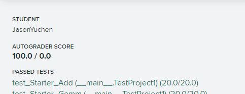
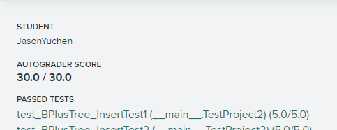
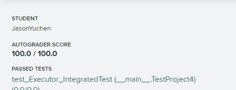

# Project (2020)

做Project的一些踩坑记录，该项目的源代码不开放

## 1. **C++ Primer**

- Matrix ✅
- Matrix Operation ✅



C++入门项目，略过

## 2. **Buffer Pool Manager**

- LRU Replacement Policy ✅
- Buffer Pool Manager ✅


一个LRU的置换算法+缓存池管理，在脏页判断时犯了一个错误，一个页一旦变为脏页，就一直是脏页直到写入磁盘，因此在设置脏页位`is_dirty_`时必须用`|=`而不能用`=`

```cpp
bool BufferPoolManager::UnpinPageImpl(page_id_t page_id, bool is_dirty) {
  std::lock_guard<std::mutex> guard(latch_);
  if (auto p = page_table_.find(page_id); p != page_table_.end()) {
    auto fid = p->second;
    // once true, always true, cannot just assign
    // WRONG: pages_[fid].is_dirty_ = is_dirty;
    pages_[fid].is_dirty_ |= is_dirty;
    // return false if already <= 0
    if (pages_[fid].pin_count_ <= 0) {
      return false;
    }
    if (pages_[fid].pin_count_-- == 1) {
      replacer_->Unpin(fid);
    }
  }
  // just return true if not found
  return true;
}
```

## 3. **B+ Tree Index**

- B+ Tree Pages ✅
- B+ Tree Data Structure ✅



- Index Iterator ✅
- Concurrent Index ✅


实现B+树索引，分为搜索、插入、删除、迭代器、并发支持五步实现，难度显著比前两个project要大，尤其是并发支持需要考虑的非常细致，尤其是：

- `buffer_pool_manager->FetchPage`和`buffer_pool_manager->UnpinPage`必须配对
  类似`new/delete`配对，写的过程中有一处少了一次`UnpinPage`导致资源泄露，导致其他测试都能正常通过，而在**ScaleTest中因为资源泄露**达到`buffer_pool_manager`的上限，随后`FetchPage`都会返回空指针（缓存池已满）随后触发内存错误
- 加锁与解锁也要配对，并且必须先解锁再调用`buffer_pool_manager->UnpinPage`
- 额外的根节点ID即`root_page_id_`也必须被锁保护，通过额外一个`ReaderWriterLatch`保护，由于对此锁也需要配对加锁和解锁操作，每个线程采用线程本地变量TLS来记录加解锁次数，防止死锁
- 全部正确实现依然有可能无法通过gradescope中的`test_memory_safety`，这是由于valgrind运行极其缓慢，非常有可能超时，可以参考的优化是
  - 节点中查找元素可以使用二分搜索
  - 尽可能减少不必要的加锁（大粒度加锁导致并发性能下降）
  - **个人在过程中使用了大量的`assert`，尤其是每次插入元素都会`assert(std::is_sorted)`导致性能非常差**，确认正确实现后，去掉所有`assert`就解决了超时问题
  - 从论坛discord来看，大量使用`LOG`也会导致超时

## 4. **Query Execution**

- System Catalog ✅
- Executors ✅


实现系统元数据表以及流水线式的查询执行器，具体包括：

- 顺序扫描算子 Sequential Scan
- 索引扫描算子 Index Scans
- 插入算子 Insert
- 更新算子 Update
- 删除算子 Delete
- 嵌套循环连接算子 Nested Loop Join
- 索引嵌套循环连接算子 Index Nested Loop Join
- 聚合算子 Aggregation
- 限制算子 Limit

一些注意点如下：

- 在`Catalog`中应抛出的是`std::out_of_range`而不是`Exception(ExceptionType::OUT_OF_RANGE)`
- `INSERT/UPDATE/DELETE`不应该有返回的结果，在对应的`executor`执行后不应该将无效的`Tuple`加入到`result_set`，因此这三个操作的`Next`总是返回`false`
- `UPDATE`如果更新的数据列上有索引，则应该同时更新索引，先删除旧值，再插入新值
- 嵌套循环连接算子注意需要保存当前内外表的处理位置，因为`Next`需要从上次的位置开始继续查找下一个能连接的`Tuple`

    ```cpp
    while (true) {
      Tuple tmp_inner_tuple;
      RID tmp_inner_rid;
      if (next_left_) {
        next_left_ = false;
        if (!left_executor_->Next(&tmp_outer_tuple_, &tmp_outer_rid_)) {
          done_ = true;
          return false;
        }
      }
      while (right_executor_->Next(&tmp_inner_tuple, &tmp_inner_rid)) {
        // iterate inner table to find a match
        return true;
      }
      // don't forget to re-init the inner table executor for the next re-iteration
      right_executor_->Init();
      next_left_ = true;
    }
    ```

- 所有会输出结果的执行器都应该根据`OutputSchema`重新组织将输出的`Tuple`，根据每一列的`Expression`进行`Evaluate*`来获取对应的数据：

    ```cpp
    std::vector<Value> values;
    for (const auto &column : output_schema->GetColumns()) {
      values.emplace_back(column.GetExpr()->Evaluate(&origin, origin_schema));
      // For join
      values.emplace_back(column.GetExpr()->EvaluateJoin(&left, left_schema, &right, right_schema));
      // For aggregation
      values.emplace_back(column.GetExpr()->EvaluateAggregate(group_bys, aggregates));
    }
    return Tuple(std::move(values), output_schema);
    ```

- 聚合算子的核心是在`Init`时就完成结果的计算，`Next`只是使用`SimpleAggregationHashTable::Iterator`逐个输出：

    ```cpp
    void AggregationExecutor::Init() {
      aht_ = std::make_unique<SimpleAggregationHashTable>(plan_->GetAggregates(), plan_->GetAggregateTypes());
      Tuple tmp_tuple;
      RID tmp_rid;
      while (child_->Next(&tmp_tuple, &tmp_rid)) {
        aht_->InsertCombine(MakeKey(&tmp_tuple), MakeVal(&tmp_tuple));
      }
      aht_iterator_ = aht_->Begin();
    }
    ```

## 5. **Concurrency Control**

- Lock Manager ✅
- Deadlock Detection ✅
- Concurrent Query Execution ✅



实现两阶段锁2PL与死锁检测与避免，多个隔离级别（读已提交、读未提交、可重复读）下的查询并发执行

一些注意点如下：

- 代码中**注释的要求不准确**（`lock_manager.h:[LOCK_NOTE]....`不准确），根据2020Fall的指示，所有`LockShared/LockExclusive/LockUpgrade/Unlock`在失败时都应抛出`TransactionAbortException`以及对应的`AbortReason`，例如：

    ```cpp
    // READ_UNCOMMITED级别下事务不应该获取任何S锁，因此LockShared应检查隔离级别
    if (txn->GetIsolationLevel() == IsolationLevel::READ_UNCOMMITTED) {
      txn->SetState(TransactionState::ABORTED);
      throw TransactionAbortException(txn->GetTransactionId(), AbortReason::LOCKSHARED_ON_READ_UNCOMMITTED);
    }
    ```

- 对于解锁操作，由于2PL要求一旦进入解锁期间`SHRINKING`就不能再获得锁，而在`READ_COMMITTED`级别下获取的S锁应立即释放，因此需要在非`READ_COMMITTED`下才会修改`GROWING->SHRINKING`

    ```cpp
    if (txn->GetState() == TransactionState::GROWING &&
        // do not set shrinking for READ_COMMITTED
        !(txn->IsSharedLocked(rid) && txn->GetIsolationLevel() == IsolationLevel::READ_COMMITTED)) {
      txn->SetState(TransactionState::SHRINKING);
    }
    ```

- 判断死锁本质上就是事务优先图寻找环，深度优先搜索即可，需要注意要求每次找环是确定性的，所以必须**从事务号小到大搜索**，而发现死锁后需要**主动打断txn_id最大（最年轻的事务）的事务**，通过如下实现：

    ```cpp
    auto txn = TransactionManager::GetTransaction(txn_id);
    txn->SetState(TransactionState::ABORTED);
    for (auto &r : lock_table_) {
      std::lock_guard<std::mutex> tuple_guard(r.second->tuple_latch_);
      for (auto &q : r.second->request_queue_) {
        if (q.txn_id_ == txn_id) {
          q.Abort(); // LockRequest::Abort()
        }
      }
    }

    // 每个LockRequest额外加了mutex和condition_variable而没有用LockRequestQueue内的cv_
    // 这样可以精细控制每次唤醒的对象
    class LockRequest {
     public:
      void Wait() {
        std::unique_lock<std::mutex> g(mtx_);
        cv_.wait(g, [this] { return granted_ || aborted_; });
      }
      void Grant() {
        std::lock_guard<std::mutex> g(mtx_);
        granted_ = true;
        cv_.notify_one();
      }
      void Abort() {
        std::lock_guard<std::mutex> g(mtx_);
        aborted_ = true;
        cv_.notify_one();
      }
      std::mutex mtx_;
      std::condition_variable cv_;
      // ...
    };
    ```

- 锁升级的操作有多种方式，这里采用了将升级锁的请求包装成一个`LockRequest mode=Exclusive`作为占位符放置在`LockRequestQueue`中，由于申请升级的操作一定有一个`LockRequest mode=Shared`在队列前部，等到`Unlock`检查到**可以升级时就会将S锁改成X锁，并删除占的请求**，如下：

    ```cpp
    void LockRequestQueue::Unlock(Transaction *txn, const RID &rid) {
      // ...
      if (upgrading_) {
        auto scount = 0;
        auto s = request_queue_.end();
        auto up = request_queue_.end();
        for (auto it = request_queue_.begin(); it != request_queue_.end(); ++it) {
          if (it->granted_ && it->lock_mode_ == LockMode::SHARED) {
            s = it;
            scount++;
          }
          if (!it->granted_ && it->lock_mode_ == LockMode::EXCLUSIVE && it->txn_id_ == upgrading_txn_) {
            up = it;
          }
        }
        // at least 1 (held by the upgrading transaction)
        if (scount == 1) {
          // grant update request
          // the placeholder Exclusive LockRequest will be removed by LockRequestQueue::BlockingUpgrade
          up->Grant();
          return;
        }
      }
      // ...
    }
    ```

- 需要改的`executor`并没有要求中说的那么多，实际上主要是以下几个文件
  - `delete_executor.cpp`：删除前需要加X锁，注意`MarkDelete`中会将写入添加到事务的`WriteSet`，因此这里只需要将索引的修改添加到事务的`IndexWriteSet`中
  - `insert_executor.cpp`：同上
  - `update_executor.cpp`：额外需要注意的是这里的索引是先删除再插入来模拟更新，而`IndexWriteRecord`可以直接使用`WType::UPDATE`，但是需要手动额外赋值`record.old_tuple_ = origin_key`；或者也可以通过两个`WType::INSERT + WType::DELETE`来做（参考事务的`Abort()`，两者是等价）
  - `seq_scan_executor.cpp`：需要根据隔离级别分别加锁，简单来说读未提交不需要加锁，读已提交和可重复读都要加S锁（注意**一个事务应该保证不对已经持有的锁再加锁**，同时事务可能涉及多个查询，不能用`empty()`来判断是否已经持有当前要加的锁），同时读已提交的S锁应在使用后立即释放

      ```cpp
      if (lm_ != nullptr && exec_ctx_->GetTransaction()->GetIsolationLevel() == IsolationLevel::READ_COMMITTED) {
        // for read committed, release the lock immediately
        if (exec_ctx_->GetTransaction()->IsSharedLocked(r)) {
          lm_->Unlock(exec_ctx_->GetTransaction(), r);
        }
      }
      ```
