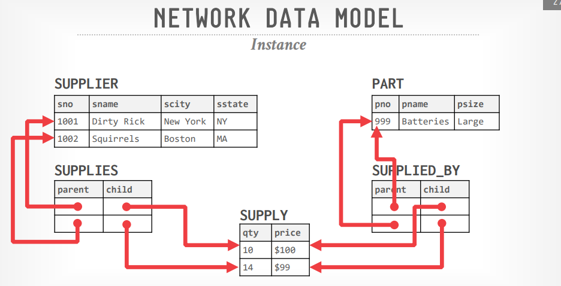
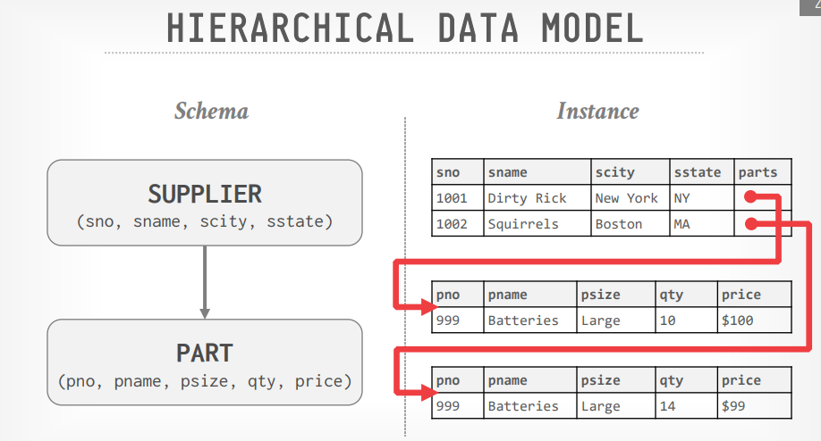
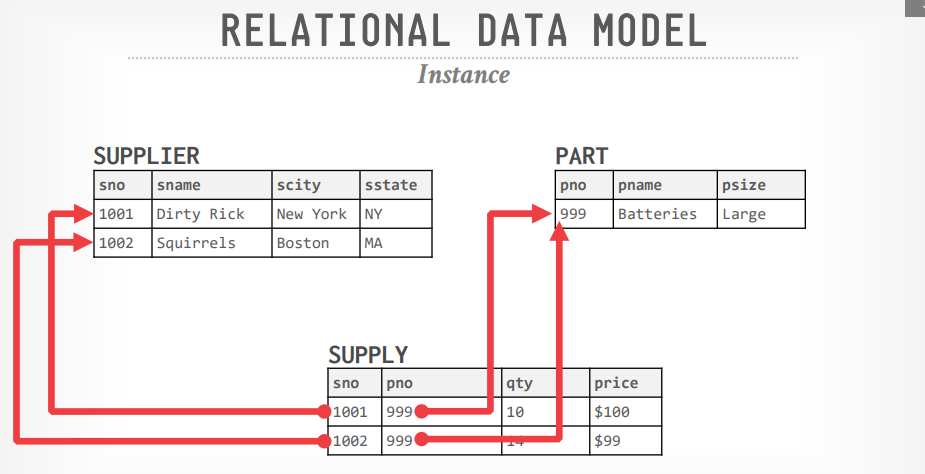
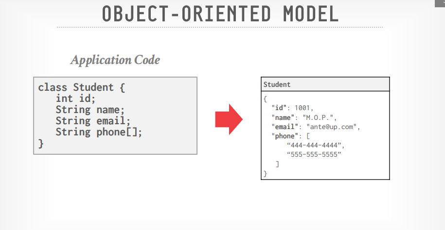

# Lecture 01 - History of Databases

[material note](History.md)

- **1960s - IDS**
  Itegrated Data Store, 最早期的DBMS之一，采用网络数据模型 **Network Data Model**

  

- **1960s - CODASYL**
- **1960s - IBM IMS**
  Information Management System，采用层次数据模型 **Hierarchical Data Model**，程序员定义物理存储格式

  

- **1970s - Relational Model**
  关系型数据库，采用高级语言来访问数据，物理存储由实现决定

  

- **1980s - Object-Oriented Databases**
  面向对象的数据库，现存DBMS采用这种模式较少，核心的一些技术特点以其他形式留存（JSON、XML等）

  

- 1990s - *No Major Advancements*
- **2000s - Data Warehouses**
  由于互联网的保障性增长，非常多的公司开始实现一些数据库中间件以拓展单节点DBMS，来支持海量数据的存储和处理，此时也出现了用于分析的OLAP系统，特点：
  - Distributed / Shared-Nothing
  - Relational / SQL
  - Closed-source
  - **Columnar data storage**
- **2000s - MapReduce Systems**
  分布式的编程/执行模型用于处理海量数据，[Google首先提出了MapReduce](https://github.com/JasonYuchen/notes/blob/master/mit6.824/MapReduce.md)，随后Yahoo!开源了一种实现Hadoop

  > People (eventually) realized this was a bad idea and grafted SQL on top of MR. That was a bad idea too.
  
- **2000s - NoSQL Systems**
  主要目标在于**高可用high-availability**和**高可扩展high-scalability**，为此通常由的特点（牺牲的点）是：
  - Schemaless
  - Non-relational data models (document, KV, column-family)
  - No ACID transactions
  - Custom APIs instead of SQL
  - Open-source
- **2010s - NewSQL Systems**
  提供与NoSQL系统一样的出色性能（性能、可用性、可扩展性）表现，但**不放弃ACID！**，但最早期的第一批涉水者几乎都淹死了，第二批做得更好
- **2010s - Cloud Systems**
  云数据库系统，通常以DBaaS的形式出现，第一批做法通常就是现有DBMS采用容器运行，而第二批实践者则是充分考虑了云的特点重新设计了整个架构，即**云原生 cloud native**
- **2010s - Shared-Disk Engines**
  通常被认知为**data lake**，充分利用独立的存储层（通常是S3等distributed storage），单独扩展执行层来扩容，往往偏爱log-structured的做法
- **2010s - Graph Systems**
  针对图类型的数据做优化的DBMS（有点类似采用Network Data Model的系统），但最新的[研究(TODO)](https://www.cidrdb.org/cidr2023/papers/p66-wolde.pdf)表明关系型DBMS比最尖端的图DBMS表现更好（*Andy打赌2030年前GraphDB的市场份额不会超过RelationalDB*）
- **2010s - Timeseries Systems**
  针对时序类型的数据做优化的DBMS，此类系统对于数据的分布（根据时间）以及通常的查询手段（与时间强相关）做了很强的假设，从而高度优化了符合这种数据分布和查询的工作场景
- **2010s - Blockchain Databases**
  完全去中心化的日志型系统，基于[Merkle Trees](https://github.com/JasonYuchen/notes/blob/master/mit6.824/18.Fork_Consistency.md#certficate-transparency-ct)

  *但真正的实用场景是个迷？Andy从未见过一个只能用BlockchainDB解决的场景*
- **2010s - Specialized Systems**
  - Embedded DBMSs
  - Multi-Model DBMSs
  - Hardware Acceleration
  - Array/Matrix/Vector DBMSs
    *这类特殊目的的DB似乎市场还不足够大？否则AWS、GCP、Azure早就应该提供了对应的服务？*