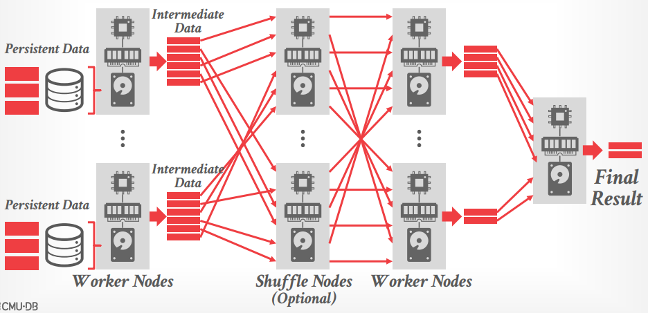

# Lecture 02 - Modern Analytical Database Systems

[material note](Query_Engine_on_Disaggregated_Storage.md)

## Distributed Query Execution

在分布式系统下的OLAP查询请求和单节点查询请求基本一致，首先查询被处理成物理算子的DAG，对每个算子（scan、join、aggr、sorting等）再考虑数据的输入、输出节点

通常在查询的执行过程中，数据可以分为两类：

- **持久化数据 Persistent Data**
  即数据库的表数据，原始数据通常假定是不可变的，而更新操作可以通过重写数据来实现
- **中间数据 Intermediate Data**
  各类算子执行过程中产生的数据，通常用于服务当前查询的下一个算子，因此查询结束后这类数据就可以被释放，并且中间数据的量往往与查询有关，而与所读取的持久化数据的量关系很小

## Distributed System Architectures

对于分布式系统架构，不同节点之间如何协调交换数据主要有两种方式（可以混合使用）：

- 将查询推送到数据节点 **Push Query** to Data，能够在数据所在的节点尽可能执行更多的计算、过滤等，利用局部性原理尽可能减少需要通过网络交互的数据
- 将所需数据取回查询节点 **Pull Data** to Query，在存储数据的节点无法计算时必须要做的，导致通过网络传输的数据量较大，但在现在的云服务提供商上，内部网络似乎不再是瓶颈

常见的一些架构选择：

- **Shared Nothing**  
  每个数据库实例节点都有自己独立的CPU、RAM、Disk，不同节点之间仅通过网络交互数据，通常**数据会按行分区后分配到不同的数据库节点上**，从而在引入新节点时需要迁移部分数据分区

  这种架构弹性**扩容/缩容时需要迁移数据**，有一定代价，但优势在于本地过滤数据后再进行节点间交互，**性能效率更高**
- **Shared Disk**
  每个数据库实例节点都有自己独立的CPU、RAM、本地Disk用于处理中间数据，并且每个节点通过网络访问存储持久化数据的存储层（**一个共享的逻辑磁盘**），不同节点之间需要通过网络交互状态信息

  这种架构可以**独立扩容/缩容计算节点**而不需要迁移持久化数据，但由于数据所在的持久化存储层没有计算能力，通常在**获取数据时无法提前过滤**，需要较大的网络带宽
- **Object Stores**
  早期shared-disk架构往往通过独立的NAS实现，但在云时代，AWS S3、Azure Blob等对象存储替代了NAS，数据库表数据通过分区成多个较大的不可变数据文件存储到对象存储服务上，一行记录的**所有属性/列值会以列存储的布局存储在一个数据文件中**（PAX），而**数据文件头就包含了该文件列数据的偏移、压缩、索引等元信息**

  *AWS S3支持谓词下推predicate pushdown，可以在支持的文件格式上执行类似`SELECT`的语句*，从而减轻了读取数据时无法过滤的问题

  

Snowflake作为一个单体monolithic数据库系统，包含了所有组件，而几乎所有商业的分布式DB都有类似的架构

## OLAP Commoditization

近几年的趋势之一就是系统中不同的OLAP引擎子系统单独作为一个组件开源，例如：

- **System Catalogs**
  用于记录数据库的schema，库表列信息、数据文件的子系统
  - HCatalog
  - Google Data Catalog
  - Amazon Glue Data Catalog
- **Query Optimizers**
  可扩展的优化引擎，启发式/基于成本的查询优化器，数据库本身提供变换规则和成本估计，由优化器提供逻辑/物理查询计划，*往往是所有数据库系统中最困难的部分*
  - Greenplum Orca
  - Apache Calcite
- **File Format / Access Libraries**
  很多数据库系统采用专有的二进制文件格式，导致数据交互/导入/导出时需要转换，有一些开源的文件格式并提供一个迭代式批量获取数据的接口
  - Apache Iceberg: 2017, flexible, supports schema evolution
  - Apache Arrow: 2016, in-memory compressed columnar storage
  - Apache Parquet: 2013, compressed columnar storage
  - Apache ORC: 2013, compressed columnar storage
  - Apache CarbonData: 2013, compressed columnar storage with indexes
  - HDF5: 1998, multi-dimensional arrays for scientific workloads
- **Execution Engines**
  在列存储数据上执行向量化查询算子的引擎，通常输入的是物理算子的DAG，并且需要外部的调度和驱动，*往往是数据库系统中最有意思的部分，并且对性能会有至关重要的影响*
  - Velox
  - DataFusion
  - Intel OAP

总体来说现在**新的OLAP分布式数据库系统与以前的系统没有特别本质上的差别**，主要还是云服务商的崛起、新硬件/对象存储的广泛使用，从而影响了shared-disk架构
