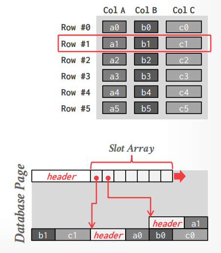
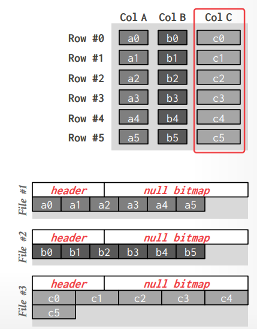
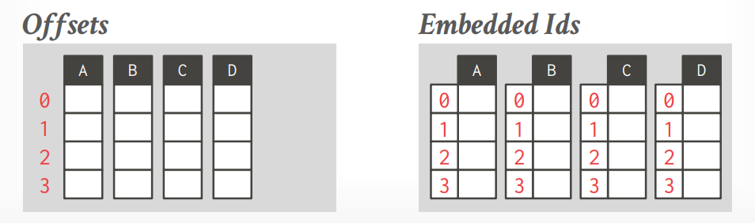
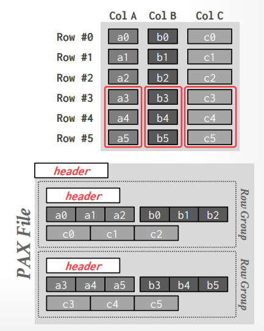
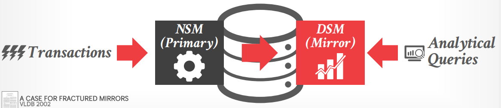
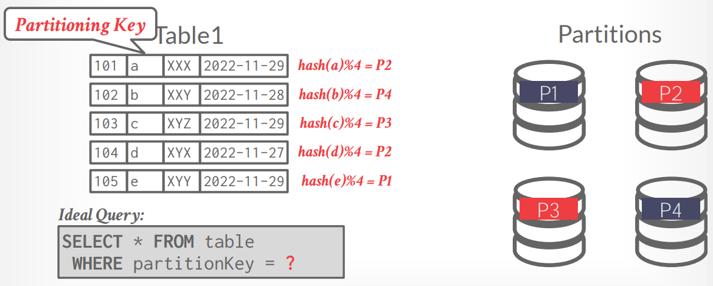
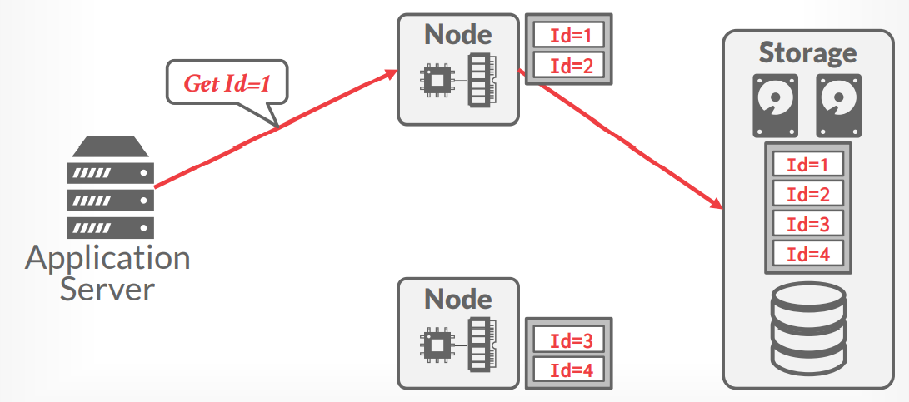
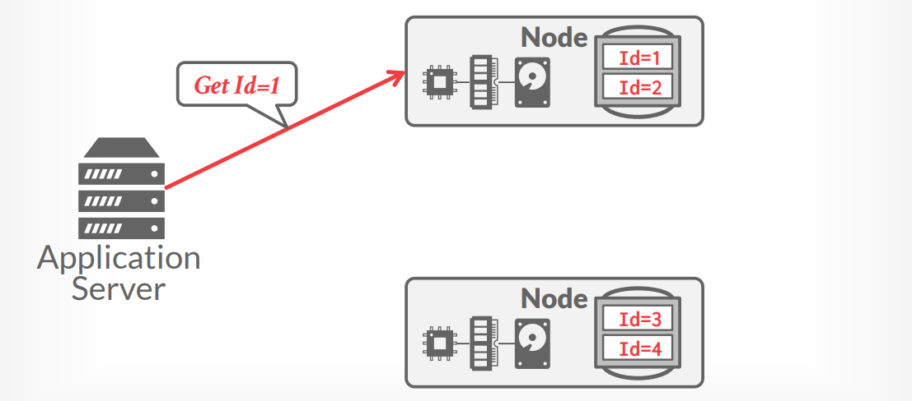

# Lecture 03 - Storage Models & Data Layout

[material note](Column_Stores_Row_Stores.md)

## Storage Models

### N-ary Storage Model, NSM

存储引擎将**单条记录的几乎所有属性都连续存储在单个页**中，从而实际上对OLTP类的负载非常友好，因为OLTP类的事务通常操作单个实体并且有较多的插入型操作，单个页的大小往往是磁盘页（4KB）的倍数，例如Oracle 4KB，Postgres 8KB，MySQL 16KB



通常一条记录的record id就是`(page#, slot#)`可以用来定位磁盘上的位置，所有属性的值在页中连续存储，其特点有：

- 高效insert、update、delete，对需要整行数据的**OLTP负载友好**
- 可以采用index-oriented物理存储来做聚集clustering
- 对需要扫描大量数据、或是只依赖部分属性的**OLAP负载不友好**
- 访问时往往有很差的内存数据局部性
- 由于页中有各种不同类型和长度的数据，不利于压缩处理

### Decomposition Stroage Model, DSM

存储引擎将**所有记录的单个列连续存储为单个块**中，从而实际上对OLAP类的负载非常友好，因为OLAP类的事务通常只读少数几个列但需要大量记录，从而这种存储格式有利于**batched vectorized processing model**



文件头部单独存储元信息（例如空值表等），后跟着存储列值向量，通常可以采用两种方式来具体访问某一条记录的列数据：

- **固定长度偏移值 Fixed-length Offsets**: 此时列的元素类型必须固定长度的，例如均是`uint64_t`，**实际系统均采用这种方式**
- **内置标识号 Embedded Tuple Ids**: 每个列元素会内置一个id用于索引，但实际系统没有采用这种方法的

对于变长字段来说，若扩展到固定长度则过于浪费空间，通常可以采用**字典压缩dictionary compression**的方式将重复数据转换成固定长度的值（通常是32位整数）来处理



- 由于每个列都单独存储，且元素往往可以直接偏移值读取，因此最大程度**减少了不必要的数据读取**（即读放大read amplification很小）
- 极好的**数据局部性**，对缓存友好，加速查询处理
- 更有效的**数据压缩**
- 不利于点查询，insert、update、delete等支持不佳，涉及到一批记录的重新组织

从实际中来说，通常不会有一个查询只访问一个属性，因此依然需要在某个阶段将所需的多个属性重建成记录，但在这个过程中依然可以获得列存储的巨大好处，且**越迟进行元组重建整体性能越好 late materialization**

### Hybrid Storage Model, PAX

Partition Attributes Across, PAX存储是一种将属性垂直切分后以列存储的形式存储一组记录、多组记录构成一个数据文件的**混合行列存储格式**，首先将记录**水平分区成多组数据**，下图中前三条记录为一组，后三条记录为一组，文件头中记录每一组的偏移值；随后再**垂直切分列属性、每个列的数据连续存储**，并且在数据头中记录每个列的偏移值来快速访问



*Parquet等现代列存储系统都采用PAX格式*，通常工业界中提到“列存储”往往指PAX模型，而学术界正式定义的列存储指DSM模型，但由于PAX格式在10年代广泛开始使用，而当时的磁盘、网络等硬件性能与现在20年代已远不同，PAX格式依然有非常多值得仔细调整的参数，例如Parquet

### Page

传统的内存页大小通常是4KB，例如数据库的buffer pool manager也是以4KB为大小分配数据页，而实际上Linux也支持**大页 transparent huge pages THP**，从2MB到1GB，可以显著减少TLB的表项数，但是操作系统会在后台不停重新组织页（合并小页、拆分大页）可能会导致数据库访问内存时会有停顿

近期研究表明采用THP（尤其是OLAP系统中往往倾向于读取大量文件数据到内存中，且是连续的数据）可以显著提高性能，Spanner的吞吐量在开启THP后提升了6.5%（ScyllaDB要求使用大页）

## Data Representation

- `INTEGER / BIGINT / SMALLINT / TINYINT`
  C/C++数据类型
- `FLOAT / READ` vs. `NUMERIC / DECIMAL`
  IEEE-754 vs. Fixed-point Decimals，通常内置类型采用IEEE-754标准有更高性能的表现，但缺点在于不精确，假如采用定点数则需要具体实现来支持，例如Postgres中的实现

  ```cpp
  typedef unsigned char NumericDigit;
  typedef struct {
    int ndigits;           // # of digits
    int weight;            // weight of 1st digit
    int scale;             // scale factor
    int sign;              // positive/negative/NaN
    NumericDigit *digits;  // digit storage
  } numeric;
  ```

- `TIME / DATE / TIMESTAMP`
  32/64位整数来代表micro/milli seconds精度的Unix epoch时间戳
- `VARCHAR / VARBINARY / TEXT / BLOB`
  短于64bit的可以直接内联，其他可以采用指针指向实际数据位置、字典压缩等方式
- **Null Data Types**
  - **特殊值 Special Values**: 例如采用`INT32_MIN`来代表空值，非常常见的做法
  - **空值位图 Null Column Bitmap Header**: 头部存储一个空值的位置，指定哪些位置的数据为空
  - **特殊标记 Per Attribute Null Flag**: 每个数据都有一个额外的标记位表示是否为空，由于需要数据对齐，因此无法采用单个二进制位来表示，通常是最差的选择

## Hybrid Storage Model

在实际生产中可以观察发现，数据在刚系统中生成时（**热数据**）往往有更大的概率在短期内就会被访问修改，并且随着时间的流逝，一条数据被修改的概率就变得极低，往往只会有一些只读的请求（**冷数据**）

基于上述假设，冷热数据分离处理的执行引擎采用了以下做法：

- **热数据会以NSM的形式存储**，有利于高效OLTP负载
- 随着时间流逝，将**冷数据迁移到DSM的形式存储**，有利于高效OLAP负载
- 查询时分别针对NSM和DSM的数据查询，并合并结果，从而对前端而言是一个统一的处理引擎

### Fractured Mirrors

将所有数据存储在一个采用DSM模型的镜像中，从而所有进入主库（NSM模型）的修改都会自动拷贝到DSM/PAX镜像用于OLAP的查询，常见的例子有Oracle、IBM DB2 Blu、Microsoft SQL Server



### Delta Store

将修改首先写入数据库的NSM表，并且有后台进程负责将修改迁移到DSM/PAX表中，查询会同时作用于DSM表和NSM表，合并结果返回给前端（是否需要合并NSM表的结果，以及NSM存储多少数据，取决于整个系统对**OLAP性能、结果及时性freshness、OLTP性能、成本**的综合权衡），常见的例子有SAP HANA、Vertica、SingleStore、Databricks、Google Napa


### Fractured Mirrors vs. Delta Store ?

***lecure中并没有提到这一点，个人思考：***

- Mirrors实际上维护了两份数据副本，保持副本之间的同步和一致性是一个问题（TiDB/TiFlash通过Raft learner来实现）
- Mirrors的两份副本将OLTP和OLAP分开，会有更好的isolation？
- Delta的做法如何在迁移/复制NSM数据到DSM时不影响到OLTP/OLAP各自的响应？
- Delta的做法如何决定何时迁移什么数据？rule-based
- Delta只有一份数据，空间成本更低

Hybrid Storage Model包括Fractured Mirros和Delta Store都是一种实现**HTAP**的做法，另外可以参考这篇[HTAP Databases Tutorial](https://github.com/JasonYuchen/notes/blob/master/papers/2022_SIGMOD_HTAP_Tutorial.md)

## Database Partitioning

数据库分区主要指将磁盘、节点、处理器等资源分割成多份从而能够各自处理全数据的一部分，在NoSQL中也称为sharding，随后查询时每个分区上都会执行查询，并将所有分区的查询结果合并为一个结果返回给前端

通常分区可以是**物理分区**（即shared nothing架构）或者是**逻辑分区**（即shared disk架构）

### Horizontal Partitioning

水平分区就是将数据库全表数据根据给定的key和规则切分成互不重叠的子集，常见的分区规则包括**散列分区 Hashing**、**范围分区 Ranges**、**谓词分区 Predicates**



### Logical Partitioning

逻辑分区下每个节点处理属于自己的数据，但实际上全部数据都存储在共享的存储中，而每个节点可以拥有本地的缓存用于快速响应前端请求，不同节点之间也可以交互缓存的数据而避免每次都要访问较慢的共享存储



### Physical Partitioning

物理分区下每个节点独自持有数据，即shared-nothing架构



## Thoughts

- 通常现代的OLAP系统都采用**PAX-like的存储格式**，因为数据一定都是、或被转换为固定长度的 fixed-length
- 真实世界中的数据表往往含有大量的数值类型，但是存储系统中占用更多空间的往往是字符串数据
- 现代列存储系统处理速度极快，且不同列之间很大程度上互不干扰，因此用户**通常不会对数仓的库表进行denormalize处理**（参考各种数据库范式），因为投入资源用于denormalize的性能收益已经低于了投入资源给数据库系统硬件
