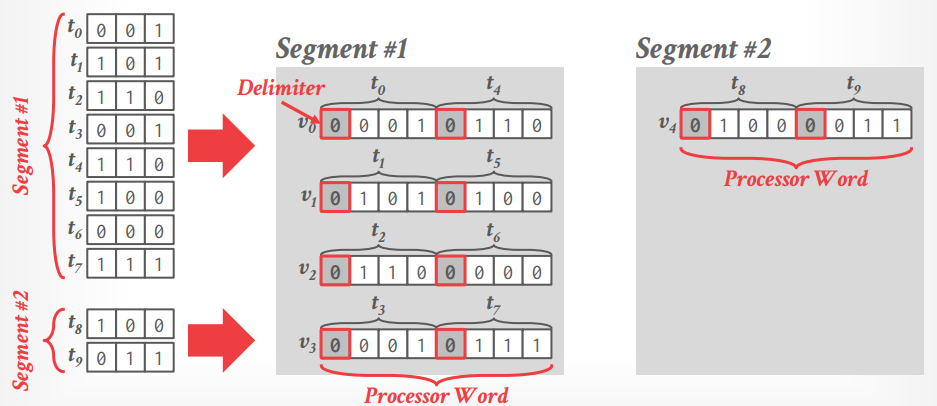

# Lecture 04 - OLAP Indexes

[material note](Column_Sketches.md)

## Observation

- 基于树的索引，例如B+树，往往更适用于低选择度的查询
- OLAP的查询通常不会只查询很少的几条数据，即选择度较高不需要的记录较少，且绝大多数时候数据文件不会频繁更新

基于这两点观察，可以考虑的优化有：

- Data Prefetching
- Task Parallelization / Multi-threading
- Clustering / Sorting
- Late Materialization
- Materialized Views / Result Caching
- **Data Skipping** (本节重点)
  - **Approximate Queries, Lossy**
  在全表采样后的数据上执行查询，显然结果是不精确的近似值，采用这种做法的包括Redshift、XDB、Google BigQuery、DataBricks等
  - **Data Pruning, Loseless**
  采用额外的数据结构来辅助谓词判断，加速批量筛选真正需要的数据，并且尽可能避免对每一条数据都检验是否满足，显然结果是准确的，但是数据库系统需要权衡性能，考虑**scope vs. filter efficacy**，**manual vs. automatic**
- Data Parallelization / Vectorization
- Code Specialization / Compilation

## Data Considerations

- **Predicate Selectivity**
- **Skewness**
- **Clustering / Sorting**

## Zone Maps

对**每一块数据预先计算出一部分统计特征称为Zone Map**（也称为Small Materialized Aggregates SMA），从而后续查询时也首先检验每一块的Zone Map，在Parquet文件中也有存储类似row-group元信息的部分

这种方式的权衡在于*scope*和*filter efficacy*，若Zone Map涵盖的数据块过大，则统计信息的作用非常有限，大部分时候都无法被查询使用，而若Zone Map涵盖的数据块过小，则需要访问大量的Zone Maps额外开销极高

## Bitmap Indexes

在一列中，**每一个独特的属性值都对应一个位图，位图的长度就是列的行数，用1代表该位置的值就是该位图所代表的值，从而存储多个位图来表达实际的列值**，但显然当可能的值较多时就会出现**巨大的空间浪费**，每个位图绝大多数值都是0

Bitmap实际上在行存储系统中非常常见，例如想要找到`WHERE zip_code IN (15216, 15217, 15218)`记录，只需要检查这三个值对应的Bitmap中1的行即可，但是显然需要维护的Bitmap所占空间非常大，假如有10000000记录，而zip_code共有43000可能性，则需要`10000000bit X 43000 ~ 53.75 GB`空间存储Bitmap，而实际存储真实数据仅需要`10000000 X 32bit ~ 40 MB`

位图索引的编码有四种方式，来优化位图的数据表达：

- **Equality Encoding**: 最基本的形式，每个值代表一张位图
- **Range Encoding**: 每个位图代表一个范围值，从而大大减少所需的位图数量，例如PostgreSQL BRIN
- **Hierarchical Encoding**: 采用层级关系的树来确认空的key范围，每个节点的位都代表了所有子节点中是否有至少一个`1`位，例如下图`1010`代表着第1和第3个节点有`1`的位，而第2和第4个节点均为`0`，从而当搜索满足条件的记录时可以**剪枝加速early pruning**，但事实上由于有**大量的指针跳转indirection，对现代超标量CPU并不友好**因此这个方法并没有在实际系统中大量使用
  
  

- **Bit-sliced Encoding**: 所有值放在一起考虑，每个位采用一个位图，从而所需要的额外空间非常有限

  

  采用这种编码的位图还能够加速一些聚合计算，例如采用**Hamming Weight算法求和**`SUM(attr)`，则从高位到低位扫描每个位的位图，例如最高位第17列的位图有5个1，则`sum += 5 * 2^17`，随后第16列的位图有3个1，则`sum += 3 * 2^16`以此类推，另外还有`POPCNT`的SIMD指令用于计算1的数量

## Bit-Weaving

### Horizontal Storage

Horizontal的方式需要多行数据配合Delimiter凑出SIMD需要的处理长度

获得了`t0...t7`这样的**选择向量selection vector**后，可以逐行迭代iteration，或者根据预先计算好的位置表pre-computed positions table来获得所有符合条件的数据行，*没有实际的系统采用了这种方式*

### Vertical Storage

Vertical的方式仅在最后记录数不够的segment中需要额外填充padding来凑出SIMD需要的处理长度，在比较时直接根据谓词值的二进制位，逐个位构造谓词比较向量并迭代与所有值向量比较，且可以利用剪枝来跳过不可能计算出所需结果的segment

1. 第一位`0`，构造出谓词向量`[00000000]`并与`v0 [01101101]`比较，得到符合条件的结果`[10010010]`
2. 第二位`1`，此时由于已经完成了第一位的筛选`[10010010]`，**将结果纳入第二轮比较**，另构造出谓词向量`[11111111]`并与`v1 [00101001]`比较，得到三者共同作用的结果`[00000000]`
3. **剪枝**跳过后续所有轮次，因为前两轮已经筛选掉了该segment内的所有数据

**Vertical形式比Horizontal形式优越得多**，因为Horizontal的形式总是需要对每一条记录都走完整个流程，而**Vertical形式可以实现剪枝**，极大提升了性能

## Column Imprints

相当于是bitmap的压缩位图，从而不需要存储大量的`0`，但同样`1`就不在精确，**只能给出肯定不存在和可能存在两种回答，参考bloom filter**

## Column Sketches

有损的索引，**相当于放弃索引的精度来提高大部分场景下的谓词判断速度**，属于range-encoded bitmap的变种，是**distribution和compactness的权衡**，对频繁出现的值做特殊优化；当需要判断谓词是否满足时，可以首先扫描sketched column，然后根据情况判断是否需要访问原始数据

## Thoughts

- Zone Maps是最广泛使用的加速方法
- Bitmap indexes往往在NSM的row-based存储系统中更加常见
