# Lecture 05 - Database Compression

[material note](Integrating_Compression_and_Execution.md)

## Background

- 数据往往不是均匀分布的，会有**数据倾斜 data skewness**
- 同一条记录的不同属性之间往往会有**相关 correlation**，例如Zip Code to City, Order Date to Ship Date
- IO依然是主要的瓶颈，因此最核心的权衡点就在于**speed vs compression ratio**

## Database Compression

压缩数据库的数据物理占用空间，从而提高每一次IO可以处理的值的数量

- 必须产生固定长度的值
- 必须是**无损模式 lossless**，没有用户愿意丢失原始数据，所有有损处理都必须只在应用层使用，数据库层是无法确定可以丢弃哪些数据的
- 尽可能延迟解压缩的时机
- 压缩的粒度
  - **块级别 Block-level**: 数据页、row group等
  - **记录级别 Tuple-level**: 压缩整条记录，只能用在行存NSM中
  - **属性级别 Attribute-level**: 压缩一条记录中的一个属性值
  - **列级别 Column-level**: 压缩多条记录的一个或多个列的值，只能用在列存DSM中

## Naive Compression

采用一些通用的压缩算法，只需要提供数据就可以完成压缩，例如LZO(1996), LZ4(2011), Snappy(2011), Brotli(2013), Oracle OZIP(2014), Zstd(2015)，主要考虑的点就在于计算效率和压缩、解压缩速度，因为这些**通用算法并不会考虑数据本身的意义**，数据库也必须解压缩后才能理解/使用这些数据

例如MySQL InnoDB的压缩模式：

- `mod log`作为每个压缩页的元数据，含有一些额外信息，当不需要解压缩时可以仅访问`mod log`就完成操作

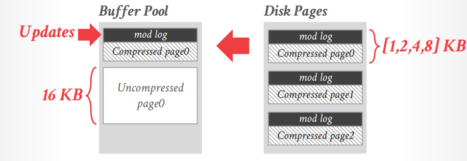

## Native Columnar Compression

### Run-Length Encoding

采用`(value, start_pos, run_length)`来压缩连续出现的重复数值，通常会要求列排序后再使用RLE来达到最高压缩率（仅用于压缩Null值时也被称为Null Suppression）

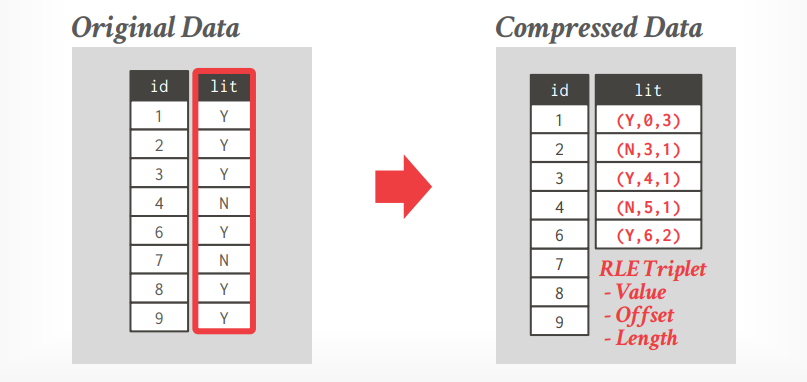

### Dictionary Encoding

将频繁出现的值用较短且定长的编码代替，并且存储这个映射关系即字典，属于DBMS中使用最为广泛的压缩手段

- **Construction**
  - **All-At-Once**: 给定的时间点完成所有数据的编码，随后新出现的数据就使用另一个字典或是整体数据重新编码，显然不可变的数据文件适合这种形式
  - **Incremental**: 每当有新的数据出现时就融入当前的字典，有可能会触发部分已有数据的重新编码
- **Scope**
  - **Block-level**: 表的每一块数据用一个字典，当需要合并不同块的数据（例如join）时必须都解压缩数据，因为跨越块可能同一个编码值对应不同的真实值
  - **Table-level**: 对整个表只采用一个字典，通常有最好的压缩率，但是一旦有新数据可能会导致较大的维护代价
  - **Multi-Table**: 多个表共用，对join/set等操作友好，但新数据维护代价更大，实际系统中似乎没有使用这种方式的
- **Encoding / Decoding**
  给定原始值，转换成压缩后的值；给定压缩后的值，转换回原始值

  假如编码保留了顺序（Order-Preserving Encoding），例如数字编码代替字符串，编码的顺序能够反映字符串的字典序，从而**有一些查询可以完全依靠字典就完成**，例如下图的`DISTINCT name`只需要在字典中根据`'And%'`的上下界找到所有元素即可，不需要访问原始数据

  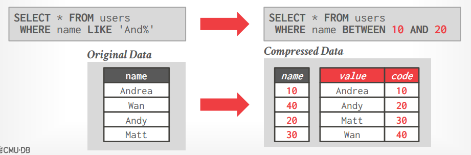

  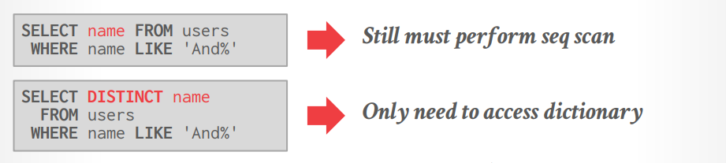

- **Data Structures**
  - **Array**: 一个数组用于存储字符串长度及字符串，压缩后的数据变为一个指针数组（字典数组的偏移值），显然这种方式的维护代价极高，因此往往只使用在不可变数据文件（例如LSM）中

    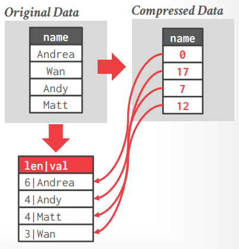

  - **Hash Table**: 快速且紧凑，但明显无法支持范围/前缀查询，因此使用场景有限，实际系统中罕见
  - **B+ Tree**: 较慢，且占用更多的内存，但优点在于支持范围/前缀查询，且增量维护代价不那么高

    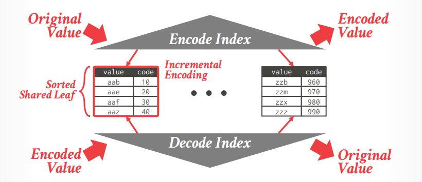

*Parquet/ORC格式并没有提供API来访问文件的压缩字典，从而导致DBMS无法进行算子下推，或是直接在未解压的数据上执行操作*

### Bitmap Encoding

若数据可能的值较少（**low cardinality**），则每一种值采用一个位图来表达出现的位置

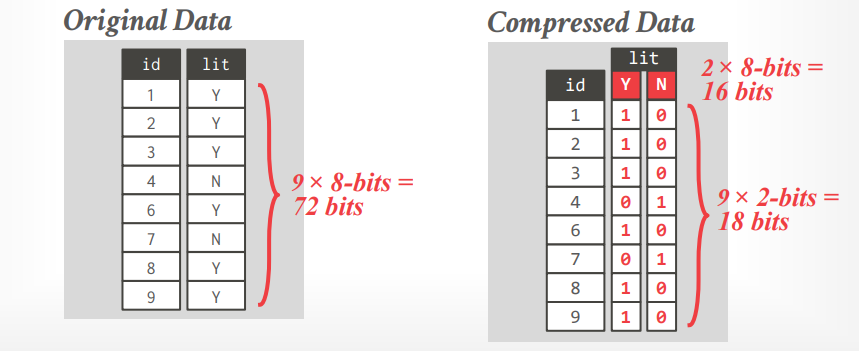

显然当cardinality略微大一些时，就会有大量的位图需要存储，那么对**于位图本身可以考虑的压缩算法**有

- **General Purpose Compression**: 采用通用的标准压缩算法，LZ4，zstd等，但往往就要求DBSM整块数据都解压才能真正执行查询
- **Byte-aligned Bitmap Codes**: 即类似Run-Length Encoding, RLE
  - Oracle Byte-aligned Bitmap Codes: 分为**Gap Byte**（所有位都是`0`）和**Tail Byte**（部分位是`1`）这两种字节，随后每一个**数据块都由一些Gap Bytes后跟随着一些Tail Bytes**组成，前面的Gap Bytes采用RLE压缩，而后面的Tail Bytes则不进行处理（除非全是`1`或是只有1个`1`例外）

    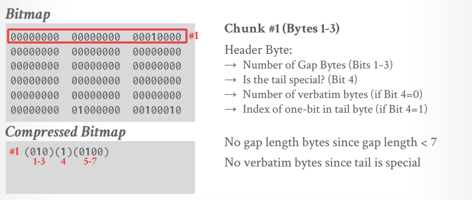

    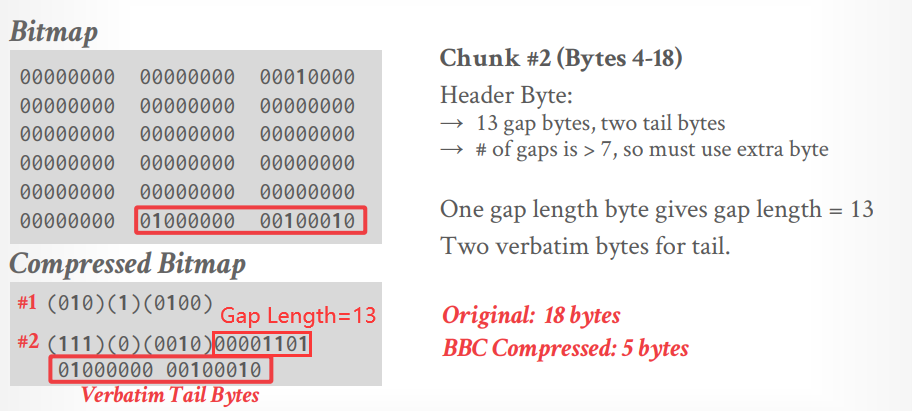
  
    Oracle的该BBC算法是过时的，另外有一个专利保护的变种算法Word-Aligned Hybrid, WAH更高效，但两者**都不支持随机读取访问**，且分支判断过多**对现代CPU的超标量、SIMD并不友好**，现代硬件支持下即使有大量的`0`，也是整体压缩解压缩、批量扫描更高效
- **Roaring Bitmaps**: 混合使用bitmap（数据密度高的分区）和value lists（数据密度低的分区），并且**根据数据的密度可以自适应调整每个分区的策略，在绝大多数现代系统中使用**
  - 32-bit integers in compact two-level: 部分值以原始值的形式存储，例如下图partition #3的数据，而另一部分值以bitmap的形式存储

    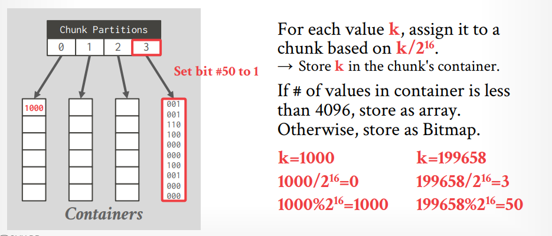

### Delta Encoding

记录**差值difference**而不是完全值，通常应用在值的变化不大且有预期的数据，例如室温、时间，而基数可以内置存储**in-line**或者在一个表**look-up table**中

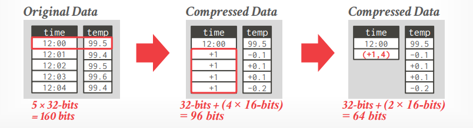

### Bit Packing

当一个列的实际数值可以**由更小的数据类型**所存储时，压缩额外占用的无意义位

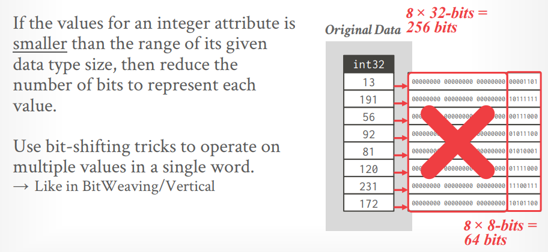

但是显然假如**有少量数据实际上确实需要大的数据类型**，而其他大多数数据并不需要时，可以采用**Mostly Encoding**这一变种算法

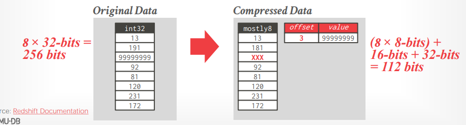

## Intermediate Date

例如join等算子执行时，从压缩数据中读取并施加谓词，随后*通常*不会再重新压缩这些中间数据，**否则压缩和解压缩的环节必须贯穿整个执行流水线**（个人认为压缩的主要优点在于减少磁盘IO，在执行流水线上反复压缩和解压缩只是额外浪费CPU资源）

在[Late Materialization](https://github.com/JasonYuchen/notes/blob/master/cmu15.721/Column_Stores_Row_Stores.md#late-materialization)中讲到延迟解压缩有利性能提升，但实际上由于上述原因，**往往压缩和解压缩仅在存储层完成，将压缩逻辑带到执行层有诸多害处**，即使是C-Store的商业版本Vertica也删除了这种"优化"，并且目前**没有实际系统采用这种延迟解压缩**的技术

## Thoughts

字典存储并不总是最高效的，但属于使用最广泛的压缩算法，大部分DBMS会根据设计目标结合使用多种不同的压缩技术来达到最高的综合性能
