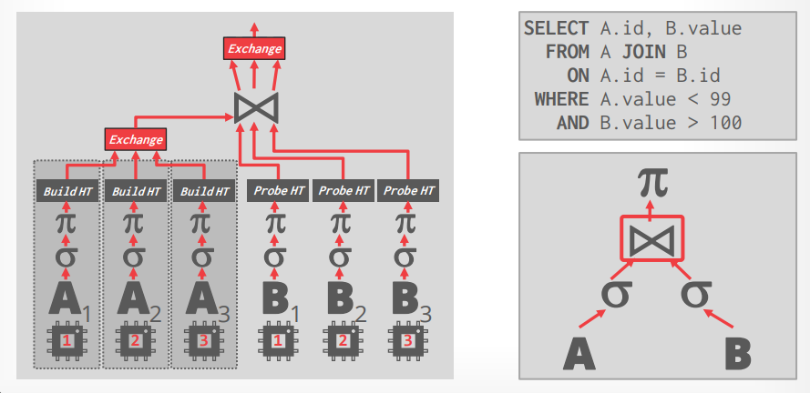

# Lecture 06 - Query Execution

[material note](MonetDB.md)

## Optimization Goals

> DBMS engineering is an orchestration of a bunch of optimizations that seek to **make full use of hardware**.

- **Reduce Instruction Count**
- **Reduce Cycles per Instruction**
- **Parallelize Execution**

## MonetDB/X100

### DBMS / CPU Problems

现代CPU将指令以并发多流水线的形式组织运行，非常深的**多级流水线**加上**乱序执行**来掩盖一条指令不同阶段可能造成的停顿，从而使CPU所有组件都时刻运行，提高整体的吞吐量和性能，但一旦出现"问题"时就会显著影响性能：

- **数据依赖 Dependencies**
  当一条指令的输入依赖了另一条指令的数据时，前者就不能被立即推入流水线而必须等后者的结果
- **分支预测 Branch Prediction**
  CPU在遇到分支情况时必须猜测执行流并推后续指令进入流水线，一旦预测错误就必须清空错误的执行流水线，在DBMS中相关的操作主要是**顺序扫描并施加filter的过程**，显然与数据本身有关，因此分支预测很难准确，例如`SELECT * FROM table WHERE key > ${low} AND key < ${high}`，在无分支的版本中如果不满足条件则一直覆盖同一个位置直到出现满足条件的数据，最后真正的结果就是`output[:i]`，**重复复制数据但对流水线更友好**

  

  

  另外DBMS还有**过多指令 Excessive Instructions**的问题，为了支持一些类型引入大量操作（并非是CPU的性能陷阱），比如为了判断每个值的类型需要一个giant switch statements导致CPU极难预测，例如Postgres为了支持`NUMERIC`类型，需要不停的判断类型和具体情况来决定如何执行四则运算

## Processing Model

### Iterator Model

也称为Volcano或Pipeline模型，每个查询计划算子需要实现一个`next`接口，从而每次调用都会返回下一条记录用于处理，并且自身的处理结果也会返回给上层调用的`next`

- **几乎在所有的DBMS中都有所使用**
  允许流水线化处理数据pipelining，一些特殊的算子需要子节点返回所有数据才可以生成自己的结果，例如`join`、`order by`等

### Materialization Model

每个算子都一次性处理所有输入数据，并且一次性生成所有数据，即"materialization"，通常DBMS通过`LIMIT`等方式避免冗余处理，输出数据可以是行形式全部的记录NSM或者是列的子集DSM

- **更适用于OLTP的工作负载**
  单次访问较少数据，从而函数调用次数也更少
- **不适用于OLAP的工作负载**
  单次可能访问海量数据导致内存溢出风险高，并且每个算子之间可能需要传递大量数据

### Vectorized / Batch Model

类似Iterator模型，但是差别在于`next`每次返回一批数据，批次大小可以根据硬件、查询特征进行调整

- **非常适用于OLAP工作负载**
  每次处理批量数据，显著减少每个算子的调用次数，且每个算子都**易于对批量数据加上SIMD优化**，即vectorization

### Plan Processing Direction

- **Top-to-Bottom (Pull)**
  前述的三种处理模型的实例都属于从查询计划的root开始，将数据从存储层pull到最上层获得结果，属于Top-to-Bottom的处理模式，数据总是由函数调用来获取
  - 采用`LIMIT`来控制输出结果
  - 父算子会在子算子返回结果前一直阻塞
  - 通常`next`接口采用虚函数实现，会有额外的虚函数调用开销（尤其是当数据量庞大时）
  - 由于分支难以预测，每次`next`接口调用都涉及到分支开销
- **Bottom-to-Top (Push)**
  从查询计划的leaf节点开始，将数据从存储层push到最上层获得结果
  - 在流水线执行过程中更紧凑的缓存控制
  - 难以通过`LIMIT`的方式来控制结果，因为底层并不知道推送了多少数据最终结果才抵达所需值
  - 难以支持Sort-Merge Join

  

  ***HyPer执行流程就是push-based***，[见此](Morsel.md#morsel-driven-execution)

## Parallel Execution

DBMS可以通过并发执行任务来提升硬件使用率，显然这些任务未必需要属于同一个查询，这就进一步可以将并发分为查询间inter并发和查询内intra并发

### Inter-Query Parallelism

通过**同时执行多个查询**来实现查询间并发，大部分DBMS采用最简单的first-come first served策略，核心目标在于**充分利用所有CPU核心**，例如[Morsel-Driven Parallelism](Morsel.md#dispatcher-scheduling-parallel-pipeline-tasks)

### Intra-Query Parallelism

- Inter-Operator, **Horizontal**
  同类型的算子可以被分解为独立的不同实例（类似于数据sharding）从而**并行处理不同的数据子集**，DBMS可以通过插入一个额外的`exchange`算子来合并所有子算子的结果

  

- Inter-Operator, **Vertical**
  也称为**流水线化并行pipelined parallelism**，同一个查询多个算子并发执行，操作和数据可以互有重叠来使得**数据能够流水线推入下一阶段而不需要materialization**，依然需要`exchange`算子来协调中间结果，例如下图中由4个CPU不停执行四个环节（流水线式的处理，下级算子的结果输出给上级算子的输入）
  
  通常**实际系统中并不会这么实现**，这种架构更常见于流数据处理而不是OLAP系统

  

## Thoughts

> The easiest way to implement something is not going to always produce the most efficient execution strategy for modern CPUs.

**Vectorized + Bottom-to-Top**的模式更适用于OLAP工作负载
