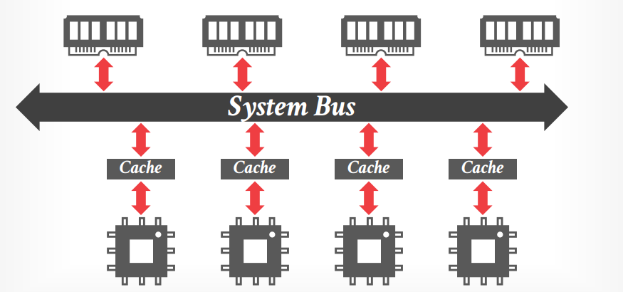

# Lecture 07 - Query Scheduling

## Scheduling

DBMS需要调度查询的执行，决定任务数量、分配的CPU资源、输出结果的存储和使用等，**假定数据已经完全在内存中，本节中暂时忽略磁盘/网络IO**

> The DBMS **always** knows more than the OS.

- **Throughput**
- **Fairness**
- **Query Responsiveness**
- **Low Overhead**

通常**OLTP的请求并不特别关心查询计划的调度执行**，因为只有一个流水线，例如A向B转账就是索引找到A，随后再更新一条数据，而**OLAP往往有多流水线来提高处理效率，且流水线间存在数据依赖**需要调度来解决依赖并提升性能

### Process Model

- **One Worker per Core**: 也称为Thread Per Core TPC架构，每个内核绑定一条线程，通常搭配完全异步的流程执行任务避免阻塞
- **Multiple Workers per Core**: 采用每核心一组线程，当某个线程阻塞等待时就由OS调度其他线程

### Task Assignment

- **Push**: 中心化的dispatcher分配task给worker并且监控任务进度
- **Pull**: workers主动从队列中获取任务并执行

## Data Placement

- **Uniform Memory Access, UMA**

  

- **Non-Uniform Memory Access, NUMA**

  

  [2x 80 Cores Arm Server Performance Monster](https://www.anandtech.com/show/16315/the-ampere-altra-review/3)

DBMS可以将内存分区后**指定某个CPU访问某个内存分区**，从而就可以控制该CPU对应的workers只会访问NUMA-local的数据，参考Linux的`move_pages`和`numactl`，在内存分配（例如`malloc`）的过程中：

1. 分配器拓展进程的data segment，此时新的虚拟内存并不会立即有对应的物理内存区域，OS会在**触发page fault时才真正分配物理内存**
2. 分配物理内存时可以采用Interleaving或First-Touch的方式分配，并且OS也可以**根据内存访问模式将内存在NUMA节点间移动**
   - **Interleaving**: 在所有CPU对应的内存区域上均匀分配内存
   - **First-Touch**: 仅在触发page fault的线程那一刻所在CPU的内存区域上分配内存

   

   图中另外可以看出当线程数达到物理核数时，TPS增速急剧平缓，这是由于内存带宽已经达到了瓶颈（[超线程技术](https://en.wikipedia.org/wiki/Hyper-threading)本质上是对CPU任务进一步细粒度并发，例如物理核当前虚拟线程等待内存IO时可以执行另一个虚拟线程的任务），**通常OLAP系统会建议关闭超线程技术**

注意区分：

- **Data Partitioning**: 基于某些策略将数据分区
- **Data Placement**: 基于某些策略来决定分区存放/处理的位置

## Static Scheduling

最简单的方式，在生成查询计划时就决定了执行任务的线程数量，执行过程中不再改变

## Morsel-Driven Scheduling

- 以**morsel为最小调度单位**，在所有CPU上动态调度所有的任务
  - thread-per-core
  - morsel-per-task
  - pull-based task assignment
  - round-robin data placement
- **没有单独的dispatcher thread**
- 所有thread优先处理本地数据morsel对应的任务，其次再从无锁全局任务队列中获取新task
- **支持work-stealing**，空闲的thread会去其他忙碌thread获取任务，但需要注意**跨核获取任务会有额外的代价**，并不一定比等待该数据原有线程继续执行要快
- **不支持查询任务的优先级**，可能导致短查询被长查询阻塞

Morsel系统假定了每一个task（包含一个定长的morsel数据块）的处理时间相似，但**实际上不同任务、不同数据（即使同样数量）对执行时间的影响很大**，例如简单选择和字符串匹配任务；从而有了更好的**Morsel 2.0 - Umbra**

## Umbra - Morsel Scheduling 2.0

- 以task为最小调度单位，可以包含**多个morsel**
- 每个查询**根据依赖关系**实际上可以分割成多个task set，并且是在**运行中生成**的而不是提前静态构造
- **Stride scheduling**
- 支持**优先级衰减priority decay**，每一个任务一开始都有最高优先级，并**随着时间指数衰减**，从而一个实际上很长的任务在中后期就有更多的机会让新的短任务先执行

- 每个线程本地维护`thread_local`数据包含了可执行的任务信息，并且每个worker都**对所有worker的TLS数据**采用CAS的原子更新，来广播自己的修改
  - **Active Slots**: 记录了在全局任务表**Global Task Set Slots**中有active task set的表项
  - **Change Mask**: 全局任务表中某一项出现了变化，从而任何其他缓存了该表项相关数据的线程都可以由此知道缓存已过期
  - **Return Mask**: 提示worker完成了一个task set中最后的task
- 当一个worker完成某查询中一个active task set中的最后一块morsel数据时，其就会根据查询的情况构造并加载下一个active task set，加入到全局任务表中，随后更新所有worker的**Return Mask**来提示自己完成了一个任务
- 上述这种每个线程维护自己的数据，就是为了尽可能减少大核海量线程瞎Morsel 1.0中对全局队列的竞争

## SAP HANA - NUMA-Aware Scheduler

同样也是pull-based调度：

- 多个workers以worker group的形式工作，每个CPU可以有多个groups
- 每个group包含**一对soft和hard优先队列**，worker可以从其他group的soft队列中抓取任务
- 每个group内的thread分为四种状态：
  - **Working**: 活跃执行task
  - **Inactive**: 由于latch处于内核阻塞状态
  - **Free**: 短暂sleep中并会定期查看是否有新任务可以执行
  - **Parked**: 处于等待状态（内核阻塞状态）并需要watchdog主动唤醒
- 额外有一个watchdog线程用于监控groups的负载情况，并且可以根据负载动态调整task所属
- 基于task是CPU还是memory bound的情况在运行中**动态调整thread和CPU的亲和性**
- **传统的work-stealing在海量NUMA节点的情况下较低效**
  - HyPer (2-4 socket) vs. HANA (64 sockets)
- 采用group的方式允许调度CPU执行一些非查询的任务，例如后台垃圾回收任务等，在Morsel系统中垃圾回收、网络IO等都有专门的线程执行

## SQL Server - SQLOS

SQLOS属于**user-mode NUMA-aware OS layer**，在DBMS内部运行并且管理硬件资源：

- 决定不同的task由哪些threads来执行
- 管理并调度IO请求、数据库锁等
- **协作式调度，non-preemptive**

这种用户层系统框架还有另外的例子**ScyllaDB ([Seastar](https://github.com/scylladb/seastar))、FaunaDB、CoroBase**

## Flow Control

- **Admission Control**: 超过负载的请求直接被拒绝，例如返回`SYSTEM OVERLOADDED`错误
- **Throttling**: 主动延迟返回给client的响应，从而降低QPS

## Thoughts

没有深入disk IO scheduling（推荐ScyllaDB的[New Disk IO Scheduler](../seastar/New_Disk_IO_Scheduler_For_RW.md)），这里的核心思想就是DBMS比OS有更多的信息，从而可以更细致的控制方方面面来达到更好的性能表现，**DBMS可以充分利用数据特征、硬件特征而不是依赖OS**

> Do **not** let the OS ruin your life.
