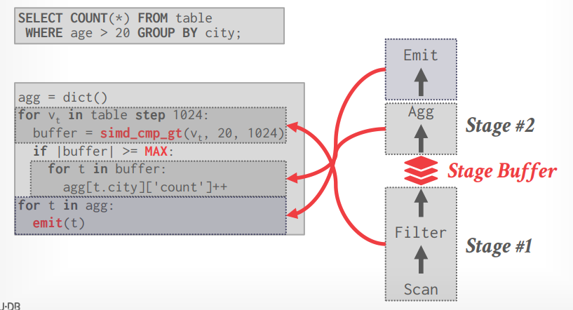
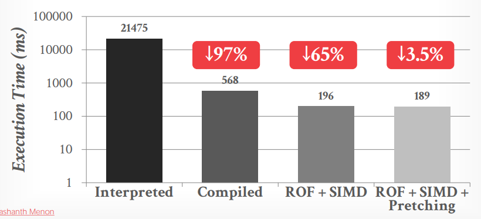

# Lecture 08 - Vectorized Execution

## SIMD Background

- Single Instruction, Single Data: SISD

  

- Single Instruction, Multiple Data: SIMD

  

- **Vectorization Direction**
  - Horizontal: `[0, 1, 2, 3] --SIMD ADD-> [6]`
  - Vertical: `[0, 1, 2, 3], [1, 1, 1, 1] --SIMD ADD-> [1, 2, 3, 4]`

## SIMD Fundamentals

### SIMD Instructions

- **数据移动 Data Movement**
- **计算操作 Arithmetic Operations**
- **逻辑指令 Logical Instructions**
- **比较指令 Comparison Instructions**
- **洗牌指令 Shuffle Instructions**
  - 在SIMD寄存器间移动数据
- **其他 Miscellaneous**
  - 直接将数据从SIMD寄存器存入内存，即cache bypassing，例如join完成后的数据短期不会再被访问，没必要放在cache中
  - 在x86和SIMD寄存器间转换数据

### AVX-512

在Intel的AVX-512指令中，支持了**高效的数据gathering、scattering指令**，并且AVX-512被具体分为多个组，CPU可以选择性支持不同组的指令（除了基本组必须支持）

**AVX-512并不总是快于AVX2**，且部分CPU在使用AVX-512时发热严重导致降频

### Implementation

- **Automatic Vectorization**
  编译器检测到符合要求的循环代码，并自动改写为向量化的操作，通常只能用于简单的循环，而在数据库中这种机会非常少

  ```cpp
  void add(int *X, int *Y, int *Z) {
    for (int i = 0; i < MAX; ++i) {
      Z[i] = X[i] + Y[i];  // may point to the same address
                           // not legal to auto vectorization
    }
  }
  ```

- **Compiler Hints**
  给与编译器额外的信息来辅助判断，从而提高编译器自动向量化的可能性

  ```cpp
  // restrict means the arrays are distinct locations in memory
  void add(int *restrict X, int *restrict Y, int *restrict Z) {
    for (int i = 0; i < MAX; ++i) {
      Z[i] = X[i] + Y[i];  // cannot point to the same address
    }
  }

  void add(int *X, int *Y, int *Z) {
  #pragma ivdep  // ignore loop dependencies
    for (int i = 0; i < MAX; ++i) {
      Z[i] = X[i] + Y[i];  // caller should make sure its safety
    }
  }
  ```
  
- **Explicit Vectorization**
  通过CPU intrinsics（有一些库封装）来手动进行数据的SIMD操作，通常**不能跨CPU移植**，因此对于硬件各有不同的on-premise来说难以适用，而对于云厂商来说非常适合根据硬件针对性优化，实际上的**数据库厂商均采用这种手工优化**，而不依赖编译器

  ```cpp
  void add(int *X, int *Y, int *Z) {
    __mm128i *vecX = (__m128i*)X;
    __mm128i *vecY = (__m128i*)Y;
    __mm128i *vecZ = (__m128i*)Z;
    for (int i = 0; i < MAX/4; i++) {
      _mm_store_si128(vecZ++, _mm_add_epi32(*vecX++, *vecY++));
    }
  }
  ```

### Vectorization Fundamentals

DBMS可以采用以下SIMD方法来构造更复杂的DBMS所用的算法：

- **Masking**
  仅在掩码位为1的位置执行操作，其余位置直接拷贝原数据

  ```text
               Merge Source [9 9 9 9]
  Vector 1 [3 3 3 3]         |   |
              v   v          v   v
      Mask [0 1 0 1] -ADD-> [9 5 9 5]
              ^   ^
  Vector 2 [2 2 2 2]
  ```

- **Permute**
  将数据按照索引向量的位置进行复制

  ```text
  Input Vector [A B C D]
         index  0:A, 1:B, 2:C, 3:D

  Index Vector [3 0 3 1]
  Value Vector [D A D B]
  ```

- **Selective Load/Store**
  根据掩码按顺序加载内存数据到掩码标注的向量位置（LOAD），或者根据掩码的位置将掩码标注的向量元素存储到内存的连续位置（STORE）

  ```text
  LOAD:

  Vector [A B C D]  -LOAD->  [A U C V]
    Mask [0 1 0 1]
            ^   ^
           / ___|
          / / 
  Memory [U V W X Y Z]


  STORE:

  Memory [U V W X Y Z]  -SAVE->  [B D W X Y Z]
          ^ ^
          | |___
           \    \
    Mask [0 1 0 1]
  Vector [A B C D]
  ```

- **Compress/Expand**
  根据索引向量位置将有效的元素连续存储在向量中（COMPRESS），或者根据索引向量的位置将连续的内存元素分散存储在掩码有效的向量位置（EXPAND）

  *lecture关于`EXPAND`算法的解释有误*，与[material](SIMD_Investments.md#background)和[intel intrinsic guide](https://www.intel.com/content/www/us/en/docs/intrinsics-guide/index.html#techs=AVX_512&expand=21,3104,91,3897,3900,3922,3944,4745,4754,4787,4798,4807,4816,4760,4766,4772,4778,2945,4029,3922,2873,1164,1166,1165,2203,1176,2202&text=expand&ig_expand=3013,3013)不一致

  ```text
  COMPRESS:

  Input Vector [A, B, C, D]
  Index Vector [1, 0, 0, 1]
                |   _____/
                |  /
                v  v
  Value Vector [A, D, 0, 0]


  EXPAND:

  Input Vector [A, B, C, D]
                \_ \____
                  \     \
                   v     v
  Index Vector [0, 1, 0, 1]
                   v     v
  Value Vector [0, A, 0, B]
  ```

- **Selective Gather/Scatter**
  根据索引向量的索引读取内存中对应的位置来填充目标向量（GATHER），或者将向量元素存储到索引向量所指代的内存位置（SCATTER）

  ```text
  GATHER:

  Value Vector [W, V, Z, X]
  Index Vector [2, 1, 5, 3]
                ^  ^  ^  ^
                 \_|__ \_|_____
                   |  \  |     \
        Memory [U, V, W, X, Y, Z]
                0  1  2  3  4  5
  

  SCATTER:

                0  1  2  3  4  5
        Memory [U, B, W, D, Y, C]
                   ^  ^  ^     ^
                 __|_/ __|____/
                /  |  /  |
  Index Vector [2, 1, 5, 3]
  Value Vector [A, B, C, D]
  ```

## Vectorized DBMS Algorithm

### Selection Scans


下左图由于*Xeon Phi协处理器并没有分支预测和深流水线*，因此采用branchless的方式反而导致额外的重复数据复制，性能略微劣化；另外在选择度低时由于最终其实并没有用上拷贝的数据，而*Xeion Phi的数据拷贝开销不容忽视*，因此late materialization减少了额外的数据拷贝有显著的优势


- **Relaxed Operator Fusion**
  将查询的流水线分为更细致的多个阶段，从而可以在向量上进行操作，并且**不同阶段之间都通过存储在寄存器上的缓存数据进行通信**

  

  

- **ROF Software Prefetching**
  DBMS可以在依然处理当前向量时，就直接通知CPU预读取下一个向量数据，从而能够隐藏cache-miss的延迟




### Hash Tables

- **Horizontal** Vectorized: 整合多个key到一个向量中
  
  

- **Vertical** Vectorized: **一次性探测多个key的散列值**，对于命中找到的就直接替换为下一个需要查找的元素，**第一次未找到的就（例如开放定址法）修正key后继续探测**散列表，从而形成类似于流水线式的向量化散列探测，提高SIMD寄存器的利用率

  

当散列表较大，无法填充进cache之后，利用SIMD的性能优势在**内存的相对高延迟**之下已经被掩盖


### Partitioning - Histograms

> Use scatter and gathers to increment counts.
> **Replicate** the histogram to handle collisions.

基本思路与[CRDT中的求和算法](../ddia/EX.CRDT_The_Hard_Parts.md)相同


## Thoughts

> **Vectorization** is essential for OLAP queries.

- Multiple threads processing the same query
- Each thread can execute a compiled plan
- The compiled plan can invoke vectorized operations
