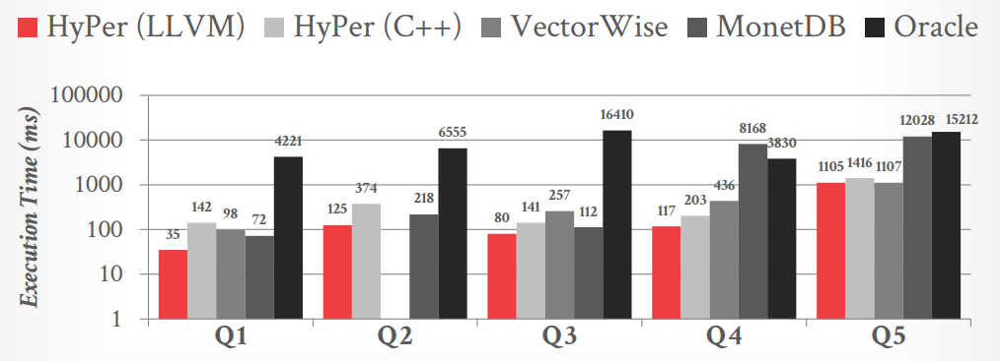

# Lecture 09 - Query Compilation & Code Generation

## Background

当磁盘I/O已经尽可能减少后，唯一继续提升DBMS性能的方式就是减少查询所需要的指令数量，方式之一就是**代码专用化 code specialization**，为了DBMS具体的任务生成更高效的专用代码

如下图是一个示例Volcano模型的查询计划，以及相应的每个算子的代码，其中对于一个谓词判断，往往会不断的重复对表达式求值，显然每次都按表达式求值引入了大量重复计算、虚函数调用等

**Code specialization**就是指DBMS为了**CPU密集型、执行模式相似**的任务来生成更高效的专用代码，可以在以下部分采用：

- Access Methods
- Stored Procedures
- Query Operator Execution
- **Predicate Evaluation**: 最常见
- Logging Operations

## Code Generation / Transpilation

将**查询计划转换为一种语言（例如C/C++）的源代码**，随后再通过相应的编译器来生成native code

### HIQUE

给定查询计划，直接生成相应的C/C++源码，并编译成动态链接库链接到DBMS的进程中，随后执行，这种方式下生成的代码允许和解释执行的查询一样完全利用DBMS的network handler、buffer pool manager、concurrency control、logging、indexes等

对比不同查询的执行方式，效果非常明显：

- Generic Iterators: 常规的迭代式执行，并且采用通用的谓词求值
- Optimized Iterators: 明确类型的迭代器，从而对于不同类型可以采用非通用的内联谓词
- Generic Hardcoded: 人工书写的代码，采用通用的迭代和谓词
- Optimized Hardcoded: 人工书写的代码，并且采用指针计算来直接访问数据
- HIQUE: 直接生成查询的专用代码

**编译成C/C++代码并执行优化有一定开销，并且HIQUE也不支持完全流水线化**

## JIT Compilation

生成**查询的intermediate representation IR**随后DBMS在将其编译为native code

### HYPER

HyPer实际上生成LLVM IR，随后再交给LLVM JIT编译器来生成native code，HyPer通过**pipeline和pipeline breaker/boundary**的抽象（如下图的4个pipeline），使得在一个pipeline内的执行流程能够生成非常高效率紧凑的native code，并且**多个pipeline直接构成push-based模式**

**LLVM IR的编译开销远远小于编译优化C/C++代码**，但是HyPer的编译耗时会**随着查询的复杂程度而显著增加**（join、predicate、aggregation的数量），这在OLTP中通常不是问题，而在OLAP中则非常明显

因此HyPer采用了一种**自适应的执行模型**，在生成LLVM IR后：

- 快速转换为字节码，开始解释执行（基本不会阻塞查询的执行）
- 在后台继续执行编译，但不进行优化（完成后才会被使用，极大提高效率）
- 在后台开启优化后编译成最高效率的native code（完成后才会被使用，耗时最长但进一步提升效率）

**每个[morsel](Morsel.md)开始执行前都检查是否有compiled query**可以使用，分为图中三种可能的实际执行情况，以达到考虑编译时间和运行时间的较佳综合性能

## Real-world Implementations

- **IBM System R**
  对每个算子选择不同的代码模板将SQL编译为汇编代码，在IBM构建DB2时废弃了这种方法，因为其外部函数调用代价高、复杂度高、可移植性差
- **Actian Vector**
  预先编译好海量的"primitives"来对不同类型的数据执行基本操作，例如`scan_lessthan_int32`、`scan_lessthan_double`等等，随后执行查询时若发现有可用的"primitive"则运行时使用
- **Amazon Redshift**
  将查询的片段转换为模板化的C++代码，并且AWS会与所有Redshift用户**共享**这些编译好的查询片段，*云厂商的优势*
- **Oracle**
  将PL/SQL存储过程转换为Pro*C代码，随后编译成原生C/C++代码
- **Microsoft Hekaton**
  存储过程和SQL均可以编译，从语法树生成C代码并编译成共享库在运行时链接
- **SQLite**
  将查询计划转换为操作码opcode，并在自身的虚拟机bytecode engine中执行
- **TUM Umbra**
  Umbra是HyPer的后继版本，"FlyingStart"自适应执行框架会生成映射到x86汇编代码的IR，而不再是通过LLVM，执行性能和编译开销都优于HyPer，*已经接近DBMS内置了定制编译器的层面，Pavlo:"that's the Germans"*
- **Apache Spark**
  将查询的`WHERE`表达式转换为Scala AST，随后将其编译为JVM字节码并执行，Databricks在2010年后采用新的Photon引擎（只做vectorization，不做任何code generation）替代这个做法
- **Java Databases**
  基于JVM的数据库（Neo4j、Splice Machine、Presto等）通常会将查询编译为JVM字节码随后执行，这种方式与生成LLVM IR随后执行相似
- **SingleStore (pre-2016)**
  与HIQUE相同，生成模板化的C/C++代码并采用GCC编译，随后会缓存编译好的查询以供相同类型的查询使用，例如`SELECT * FROM A WHERE A.id = 123`或其他值的谓词均可以使用`SELECT * FROM A WHERE A.id = {}`
- **SingleStore (2016-now)**
  将查询计划转换为一个MemSQL Programming Language MPL表达的计划，随后转换成MemSQL Bit Code MBC，最后生成LLVM IR并编译到native code
- **PostgreSQL**
  2018 v11引入了基于LLVM的JIT编译来处理谓词和反序列化
- **VitesseDB**
  采用LLVM + intra-query parallelism来加速Postgres/Greenplum的查询：
  - JIT predicates
  - Push-based processing model
  - Indirect calls become direct / inlined
  - Leverages hardware for overflow detection
- **CMU Peloton (2017)**
  类似HyPer的做法，整个查询计划由LLVM编译
- **CMU NoisePage (2019)**
  类似SingleStore的做法，将查询首先转换为面向数据库的DSL，随后编译为操作码，最后以类似HyPer的自适应执行模式先执行操作码，后台开启LLVM编译并在处理数据时检查是否有编译好的查询可供使用

  

## Thoughts

> Query compilation makes a difference but is **non-trivial** to implement. Any new DBMS that wants to compete has to implement query compilation.
