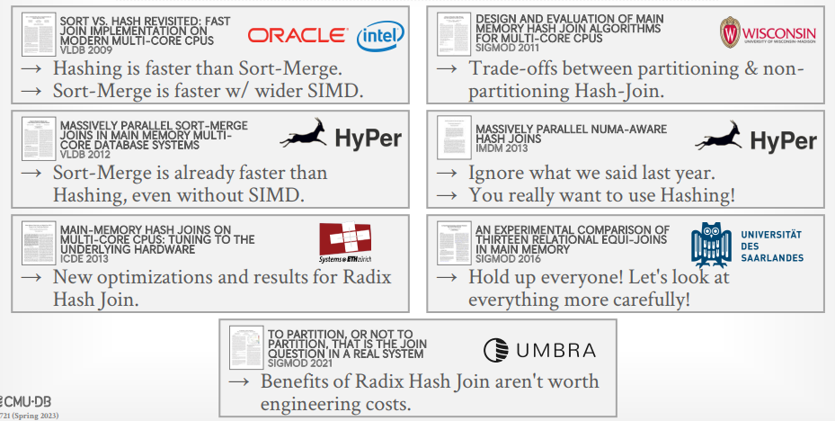

# Lecture 11 - Parallel Hash Join Algorithm

## Background

**Hash join是OLAP系统里最常见适用最广泛的join方式**，通常OLTP DBMS不会实现hash join，但是[index nested-loop join](../cmu15.445/11.Join_Algorithms.md#嵌套循环连接-nested-loop-join)可以认为是一种hash join，另一方面没有OLAP DBMS会选择nested-loop join

**Sorting vs. Hashing:**

- 1970s: Sorting
- 1980s: Hashing
- 1990s: Equivalent
- 2000s: Hashing
- 2010s: Hashing (Partitioned vs. Non-Partitioned)
- **2020s: Non-Partitioned Hashing** (both performance and implementation)
  **HyPer/Umbra系统的开发人员认为Radix Hash Join的提升相比于工程投入，不值得**

无论join的算法是**hardware-conscious**还是**hardware-oblivious**，其核心目标都是：

- **尽可能减少同步等待 Minimize Synchronization**
  执行期间尽可能无锁化，减少或避免latch
- **尽可能减少访存开销 Minimize Memory Access Cost**
  尽可能确保数据局部性，并重用依然在cache中的数据
  - Non-Random Access (Scan): 将数据聚合进一个cache line，并且每个cache line执行更多的操作
  - Random Access (Lookups): 分区能够适配cache和TLB

## Parallel Hash Join

Hash join是OLAP负载中最重要的算子之一，但*其开销并不是OLAP查询最主要的部分*，基本流程就是分区Partition（可选）、构建散列表Build、探测散列表Probe生成结果

### Partitioning Phase

将输入的关系根据key的散列值先进行一次分区，也被称为[Grace Hash Join](../cmu15.445/11.Join_Algorithms.md#grace散列连接-grace-hash-join)或Radix Hash Join，随后对两个关系匹配的分区（**co-partition**）进行逐分区探测连接，对于NSM模型往往整个tuple都被带入分区暂存，而对于DSM模型仅有join所需的列才会被带入分区暂存

- **Non-Blocking Partitioning**
  仅扫描输入的关系一次，并且在增量输出分区数据时由其他线程开始构建散列表
  - **Shared Partitions**: 单个全局分区集合，所有线程都写入该全局集合，采用latch来同步

    

  - **Private Partitions**: 每个线程有自己独立的分区集合，当所有线程完成分区时，再整合为全局分区集合

    

- **Blocking Partitioning (Radix)**
  往往会扫描输入的关系多次，但只在最后才会物化结果，以two-pass算法为例，往往需要：
  1. 扫描关系`R`，构建不同散列值的histogram
  2. 采用histogram、prefix sum来决定每个线程输出结果的位置，由于已经采用prefix sum直接计算出了位置，因此线程相互之间也不需要同步
  3. 再一次扫描`R`进行分区，这里也可以重复1-2直到输出满足要求的分区数量

  

在[阅读材料](Equi_Joins.md#optimizing-radix-partitioning)中提到两个比较关键的优化：

- **Software Write Combine Buffers**
  SWWCB也称为software managed buffers，用于缓存少量输出的tuples（通常**等于一个cache line的大小**）并一次性整个buffer写入到目的内存，通常buffer可以常驻在高速缓存种，并且以**批量的方式写入内存，避免per-tuple访存**的额外开销
- **Non-temporal Streaming Writes**
  允许数据**直接bypass所有caches直接写入内存DRAM**，通常join等场合已经处理过的数据**短期内不会再用到**，因此放入cache只会污染缓存影响其他常驻数据

### Build Phase

构建散列表的过程需要考虑以下两个关键因素

- **Hash Function**
  需要将large key space映射到small domain同时高效率且尽可能避免碰撞，常见如：
  - CRC-64 (1975): 往往用于网络通信的纠错
  - MurmurHash (2008): 快且通用的散列函数
  - Google CityHash (2011): 针对短key（少于64bytes）优化的散列函数
  - Facebook XXHash (2012): from the creator of zstd
  - Google FarmHash (2014): 优化后的CityHash，更低的碰撞率

  

- **Hashing Scheme**
  如何处理散列冲突，是构建大散列表还是小散列表但冲突多的权衡，常见如
  - [Chained](../ds/05.Hashing.md#2-分离链接法-separate-chaining)
    HyPer采用了更巧妙的链接方式，链接指针64bit中，其中48bit用于存储next bucket pointer，而剩余16bit用于存储布隆过滤器从而能够在不实际访问下一个bucket时迅速判断元素在后续链上的不存在性
  - **[Linear Probe](../ds/05.Hashing.md#3-非链接散列表-hash-tables-without-linked-lists)**
    **在大部分场景下都是最优的做法**，因为实现极其简单、分支少
  - Robin Hood
    属于Linear Probe的变种，核心思想在于*steal slots from "rich" keys and give them to "poor" keys*，插入时若发现实际插入位置与理想位置相距太远时，就会占用其他key的位置而不是继续探测，被替代的key则继续相同的思路向下探测寻找新位置
  - [Hopscotch](../ds/05.Hashing.md#跳房子散列-hopscotch-hashing)
  - [Cuckoo](../ds/05.Hashing.md#布谷鸟散列-cuckoo-hashing)

### Probe Phase

对用于探测的关系，每条tuple都散列后根据散列值去散列表寻找是否有匹配的项，可以考虑在构建散列表的时候同样构建**布隆过滤器bloom filter**来加速探测散列表的过程，对于不存在的key就可以立即回答，这也被称为**sideways information passing**

## Evaluation

见[阅读材料笔记](Equi_Joins.md#putting-it-all-together)

**No-Partitioning with Linear Probing往往是实际系统会选择的做法：**

- 性能差于精细调优的分区算法，但差距不大
- 不需要关心硬件，不依赖特定硬件调优，任意硬件都可以良好运行
- 实现维护最简单
- 分区算法的调优非常困难
- 涉及到join的查询中，join导致的性能开销占比往往不大

在Cloudera Impala (2014)中给出了TPC-H测试里不同查询算子的CPU时间开销，其中Hash Join占比达到一半（但**Andy更相信[HyPer/Umbra的Germans](#background)** XD）：

1. 49.6% Hash Join
2. 25.0% Seq Scan
3. 19.9% Aggregate
4. 3.1% Union
5. 2.4% Other

## Parting Thoughts

> **Partitioned-based joins outperform no-partitioning** algorithms in most settings, but it is non-trivial to tune it correctly.
> AFAIK, every DBMS vendor picks one hash join implementation and **does not try to be adaptive**.

**大部分情况下，查询采用不进行分区的No-Partitioning Join是综合性能最优的做法**，因为Partitioning Join非常难以调优，业界基本都选择了No-Partitioning Join，系统的其他部分更值得投入engineering effort
