# Lecture 12 - Sort-Merge Join Algorithm

## Background

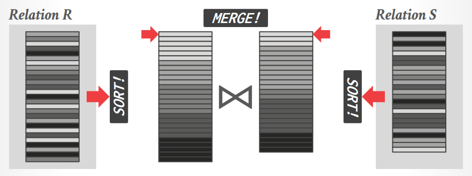

- Utilize as many **CPU cores** as possible
- Be mindful of **NUMA** boundaries
- Use **SIMD** instructions where applicable

## Parallel Sort-Merge Join

### Partition Phase (optional)

将输入关系`R`分区后分配给不同的cores，可以采用[radix partitioning](11.Hash_Join.md#partitioning-phase)中的分区算法

### Sort Phase

快速排序可能是较为广泛采用的算法，而归并排序则需要额外的`O(N)`空间来存储中间结果，由于排序是Sort-Merge Join中开销最大的部分，通常要充分考虑**Cache-Conscious Sorting**，将实际排序过程分为三个级别：

1. **In-Register Sorting** - Sorting Networks
   在CPU寄存器中能够完成的排序，采用**sorting networks**来完成，这种方式的优点在于**固定的计算流程、有限的数据依赖、没有分支**，对现代CPU架构极其友好

   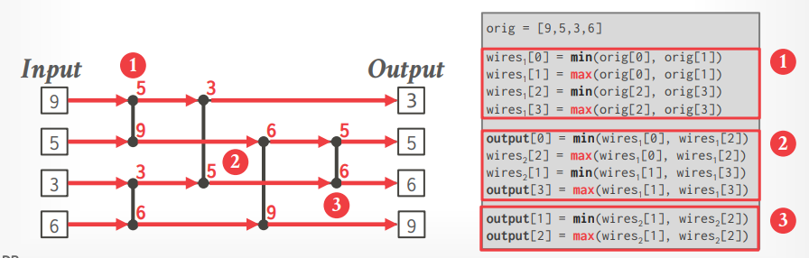

   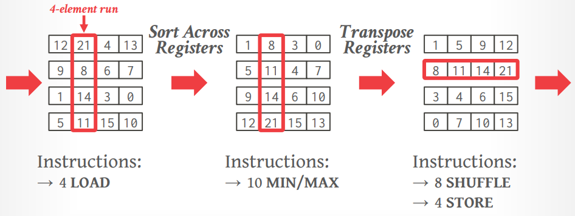

2. **In-Cache Sorting** - Bitonic Merge Network
   将Level 1的结果合并，并重复排序合并过程直到中间结果达到1/2缓存大小（由于归并排序需要`O(N)`的额外空间，因此当中间结果达到1/2缓存大小时，后续就不能再继续In-Cache Sorting了，可以采用**bitonic merge network**，Intel曾经给出的性能数据是该网络可以提升2.25-3.5倍速度

   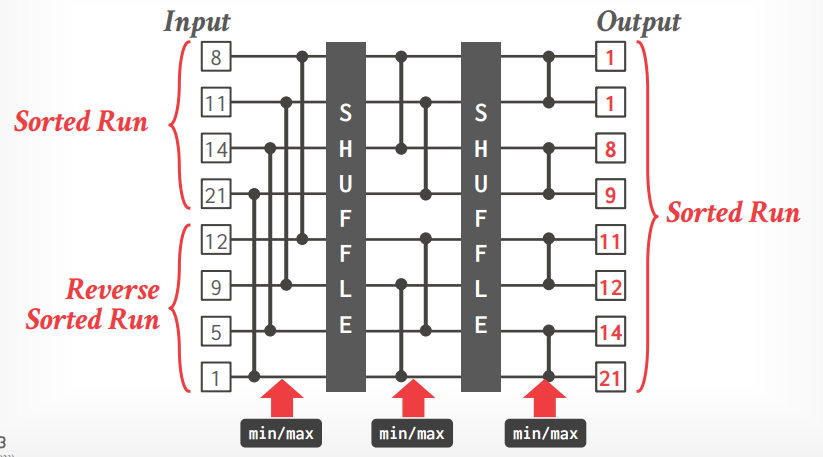

3. **Out-of-Cache Sorting** - Multi-Way Merging
   当Level 2达到1/2缓存大小后继续进行的归并排序过程，通常可以继续使用bitonic merge network作为kernel，**将数据切分成适合的小块交给kernel完成计算**，此时需要考虑CPU和内存带宽的平衡，输入的任务队列为空或是输出的下一级任务队列已满都**可能会导致阻塞**

   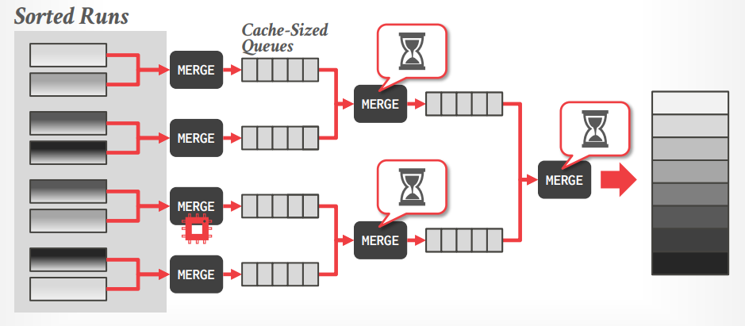

   需要**特别注意**的是，很多实现/论文在进行性能测试时，假定所有线程都在执行排序/归并，而实际上全功能的DBMS会有并发控制、事务管理、垃圾回收等各种任务在同时执行，**在现实系统中精确控制缓存中的数据是几乎不可能的**

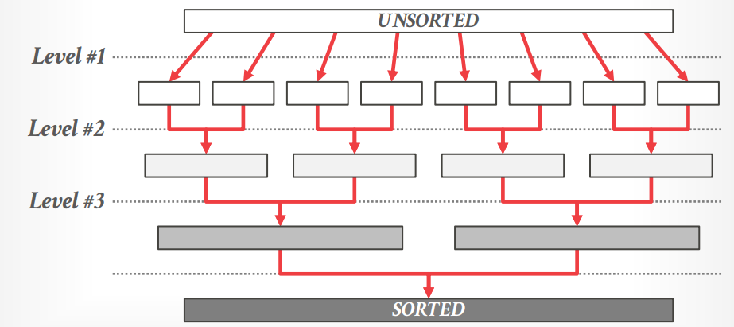

向量化的快速排序则可以考虑：

- [IPS4o algorithm (2017)](https://github.com/ips4o/ips4o)
- [Google vqsort (2022)](https://opensource.googleblog.com/2022/06/Vectorized%20and%20performance%20portable%20Quicksort.html)
- [Intel x86-simd-sort (2022)](https://github.com/intel/x86-simd-sort)

### Merge Phase

迭代排序后的内外表数据，实现连接，通常可以采用并行来加速连接过程

## Sort-Merge Join Variants

- Multi-Way Sort-Merge (**M-WAY**)
  内外表的处理相同，数据分区后，每个分区**独自并发排序**（level #1/#2），随后对排序后的数据进行**分区重分布redistribution，后再并发进行多路归并multi-way merge**（level #3），最终连接时每个分区可以并发连接，基本上是*这三种中最高效的算法*

  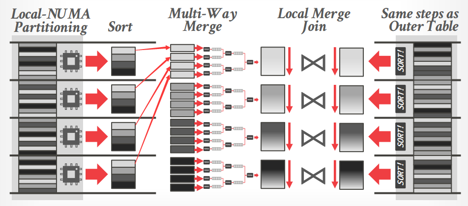

- Multi-Pass Sort-Merge (**M-PASS**)
  内外表的处理相同，分区阶段与**M-WAY**相同，后不再进行分区重整，而是直接进行全局**多轮简单连接multi-pass naive merge**

  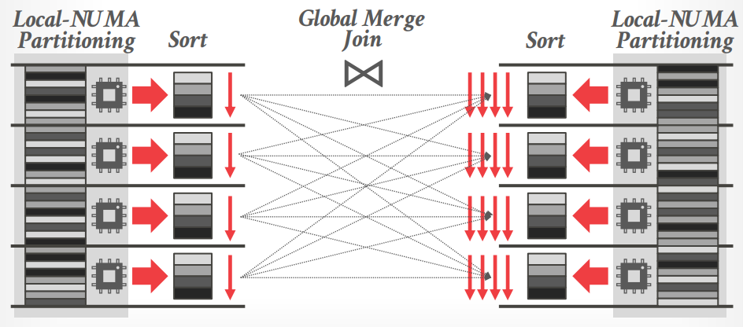

- Massively Parallel Sort-Merge (**MPSM**)
  内表仅分区后独自排序，外表进行范围分区后重分布到相应的节点，随后每个节点独自完成排序，最后进行全局连接
  
  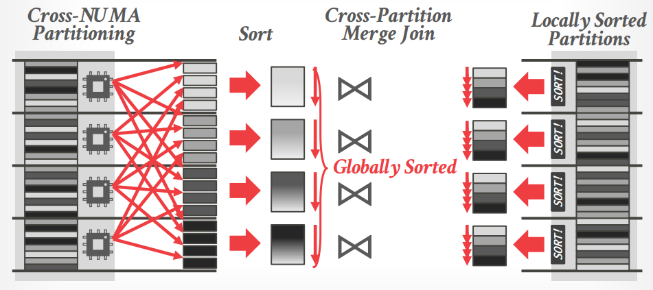

## Hyper's Rules for Parallelization

- **No random writes** to non-local memory
  Chunk the data, redistribute, and then each core sorts/works on local data
- Only perform **sequential reads** on non-local memory
  This allows the hardware prefetcher to hide remote access latency
- **No core should ever wait** for another
  Avoid fine-grained latching or sync barriers

类似[Seastar的设计思路](../seastar/Shared_Nothing.md)

## Evaluation

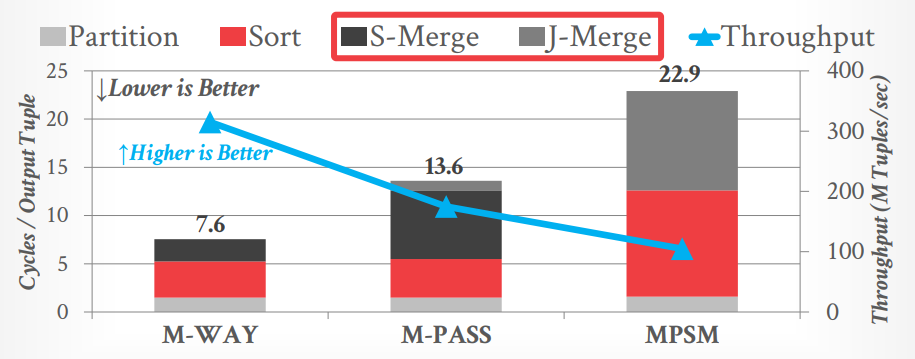

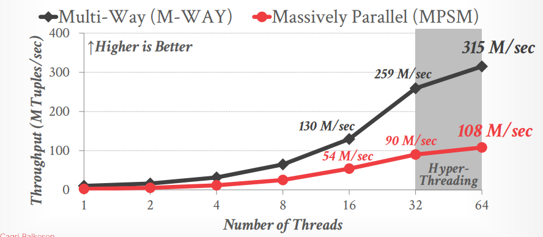

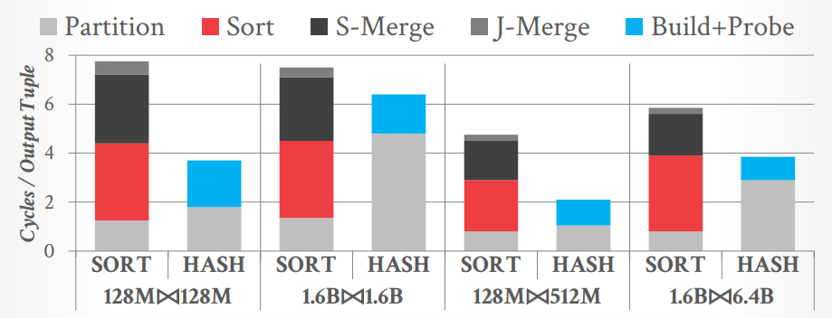

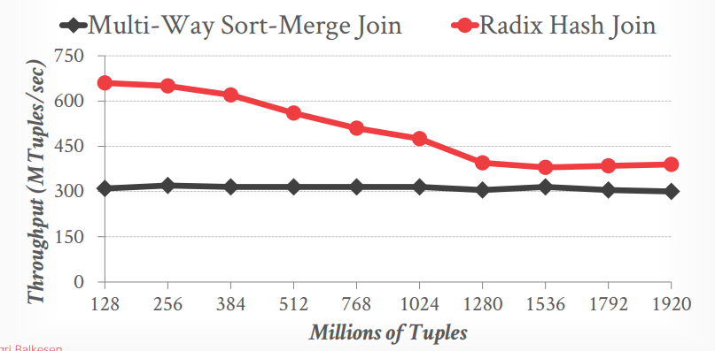

回顾Hash Join中的性能对比（右侧四个优化版本并没有实际广泛应用，简单的**No Partitioning Linear Probing Hash Join**是常见效果最好的实现）：

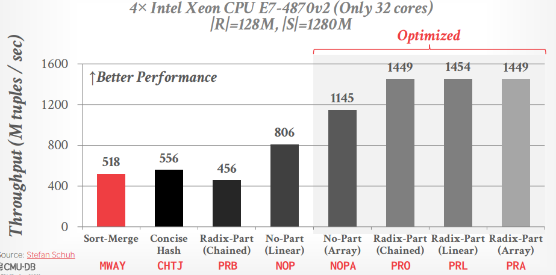

## Thoughts

> **Hash join is (almost) always the superior choice** for a join algorithm on modern hardware.
>
> Most enterprise OLAP DBMS support both, and let the optimizer choose.
