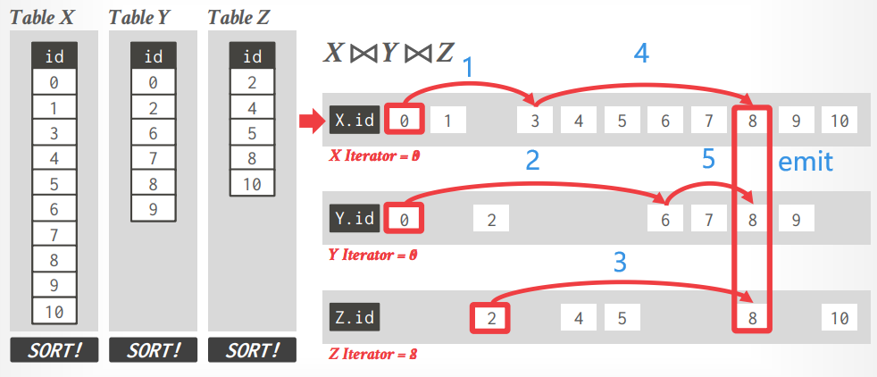
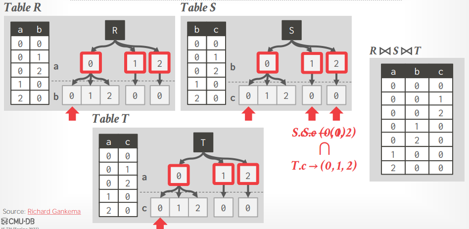
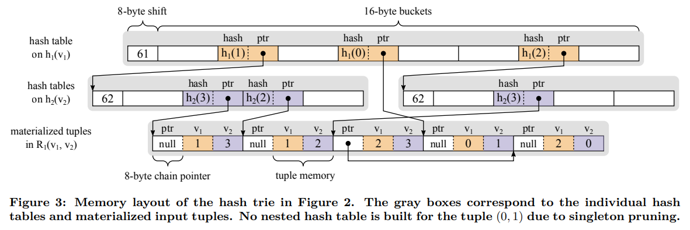
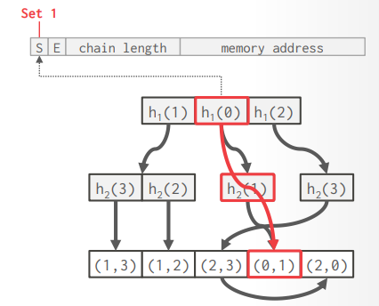
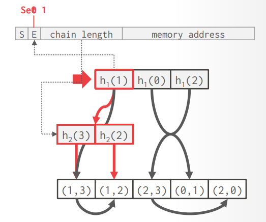

# Lecture 13 - Multi-Way Join Algorithm

## Motivation

常见的RDBMS均采用了binary join的方式来进行多表连接，通常当输出的结果集小于输入的两个表时，采用binary join的方式是最优的，但问题在于多表连接时**中间的binary join可能产生远多于结果的中间数据**

## Worst-Case Optimzal Joins

> **Alternative Definition #1**: The worst-case runtime of the algorithm meets a known lower bound for the worst-case runtime of any join algorithm.
>
> **Alternative Definition #2**: The runtime of the join algorithm is better than all other join algorithms when the query and data represent the worst possible scenario.

与binary join实现多表连接的核心差别在于，**multi-way join以直接搜索符合最终条件的tuple的方式来实现多表连接**

## Leap-Frog Trie Join

对每个表在join key上构建trie，从而在trie上迭代并生成符合join条件的tuples：`R: a=0 b=0, S: b=0 c=0, T: a=0 c=0`输出`(0, 0, 0)`，更新`S: b=0 c=1, T: a=0, c=1`输出`(0, 0, 0)`，以此类推**迭代的方式直到遍历完所有表的tries**

- 为每个表都构建trie的代价过高
- 替代方式是采用**nested hash tables**，但同样代价相当高
  - 至少需要一次key comparison来检测散列冲突
  - hash table中需要存储key（不等长的处理）或者pointers（引入间接不利cache hit）来应对散列冲突
  - 需要处理不等长key的情况，例如字典编码

## Multi-Way Hash Trie Joins

采用nested hash tables，并且**存储等长整型的`hash(v)`而不是key**，从而：

- 等长整型数据不需要采用字典编码，且key comparison就是纯粹的整数对比，效率极高
- 需要额外的散列冲突处理逻辑，在这里采用[产生结果前double check连接条件](Worst-Case_Optimal_Joins.md#probe-phase)的方式，即**延迟处理散列冲突**

- **Tagged Pointer**
  x86-64仅使用64位中的低48位存储真正的地址，因此可以额外利用高16位存储元信息：1-bit作为**singleton flag**，1-bit作为**expansion flag**，14-bit作为**chain length**（该地址所指向的未展开的链表长度）

- **Singleton Pruning**
  由于当散列表的层级越来越低时，越来越多的散列表实际上可能只包含一条数据，因此没有必要维护一条长单链，而是**通过一个指示位singleton bit提示指针直接指向的就是数据**
  
  

- **Lazy Child Expansion**
  由于集合求交的结果集可能很小，使得绝大多数节点不会被访问到，因此**仅在访问节点时才物化**，即lazy expansion

  

## Thoughts

> Multi-way joins are an active area of research.
>
> This will be the deathblow to graph DBMSs.
