# Lecture 14 - Server-side Logic Execution

## User-Defined Functions, UDFs

- **Advantages**
  - 利于代码模块化和重用
  - 更少的业务层和数据库层的数据交互、网络延迟
  - 相比SQL更灵活的表达方式
- **Disadvantages**
  - 优化器将UDF视为黑盒，无法评估UDF的执行代价
  - 难以并发执行，内部的逻辑可能存在一些依赖、竞争关系
  - 在`SELECT / WHERE`从句中使用UDF会导致语句被逐tuple迭代式计算求值，阻止了[批量/向量执行](08.Vectorized_Execution.md)，性能极其低下
  - 一些DBMS必须逐UDF表达式执行，无法实现跨表达式的优化

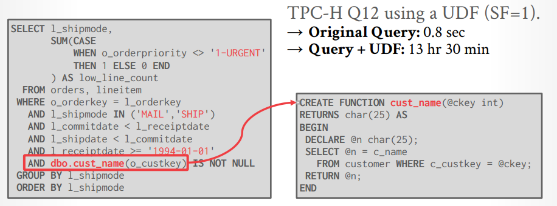

常见的UDF优化加速手段：

- **编译 Compilation**
  将UDF编译为native machine code（例如JIT），若DBMS支持**holistic query compilation**则UDF可以与查询一起被编译成[compiled query plan](09.Query_Compilation_Code_Generation.md)（例如HyPer）
- **并行 Parallelization**
  要求**用户提供标注annotation**来提示UDF是否可以被并行调用
- **内联 Inlining**
  将UDF转换为声明式的形式（例如SQL）并内联进调用UDF的查询

## Froid

### History

- 2001: Microsoft adds TSQL Scalar UDFs.
- 2008: People realize that UDFs are "evil".
- 2010: Microsoft acknowledges that UDFs are evil.
- 2014: UDF **decorrelation** research @ IIT-B.
- 2015: **Froid** project begins @ MSFT Gray Lab
- 2018: Froid added to SQL Server 2019.
- 2019: Huge performance wins in the wild.
- 2020: High praise from *Andy*.
- 2021: **ProcBench** paper released.

### Sub-Queries

Froid的核心思想在于根据转换规则，在查询**重写阶段rewrite phase**自动将UDFs转换为**语义等价的关系查询**，并作为**子查询内联**进调用UDF的查询中

DBMS通常有两种方式来处理`WHERE`从句中的子查询：

- **Rewrite to de-correlate** and/or flatten them
  例如MySQL早期无法对sub-query做任何decorrelation，导致每一行tuple都需要经过`WHERE`从句的sub-query执行一次，性能极低

  ```SQL
  /* Retrieve the first user that has made 
     at least two purchases. */
  SELECT user_id FROM orders AS o1
    WHERE EXISTS(
      SELECT COUNT(*) FROM orders AS o2
        WHERE o1.user_id = o2.user_id
        GROUP BY o2.user_id
        HAVING COUNT(*) >= 2
    )
    ORDER BY user_id ASC LIMIT 1;
  

  /* rewrite whole SQL */
  SELECT user_id FROM orders
    GROUP BY user_id
    HAVING COUNT(*) >= 2
    ORDER BY user_id ASC LIMIT 1;
  ```

- **Decompose** nested query and store result to **temporary table**, followed by outer joins

在`FROM`从句中的子查询，可以采用**lateral join**来处理，因为**lateral inner subquery可以引用同级别其他表的字段**（例如下例中的`o1.user_id, o1.first_order`引用的就是`FROM`从句中同级别的前一个子查询表`AS o1`）从而避免陷入不停嵌套循环的处理，DBMS迭代被引用表中的每一行，并逐行求值inner sub-query

```SQL
/* Retrieve the first user that has made at least 
   two purchases along with the timestamps of the
   first and next orders. */
SELECT user_id, first_order, next_order, id
  FROM
      (SELECT user_id, MIN(created) AS first_order
        FROM orders
        GROUP BY user_id)
      AS o1
    INNER JOIN LATERAL
      (SELECT id, created AS next_order
        FROM orders
        WHERE user_id = o1.user_id AND created > o1.first_order
        ORDER BY created
        ASC LIMIT 1)
      AS o2
    ON true
  LIMIT 1;
```

### Froid Overview

1. **Transform Statements**

   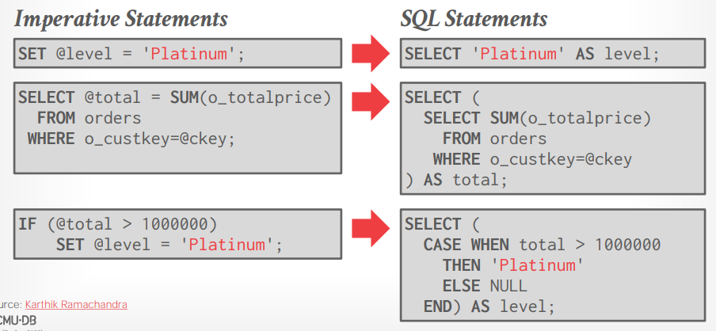

2. **Break into Regions**

   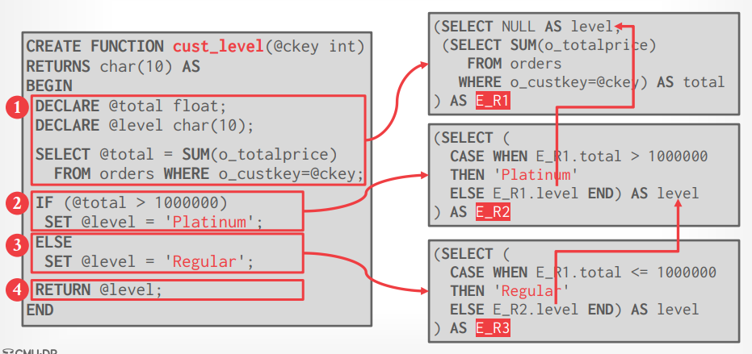

3. **Merge Expressions**

   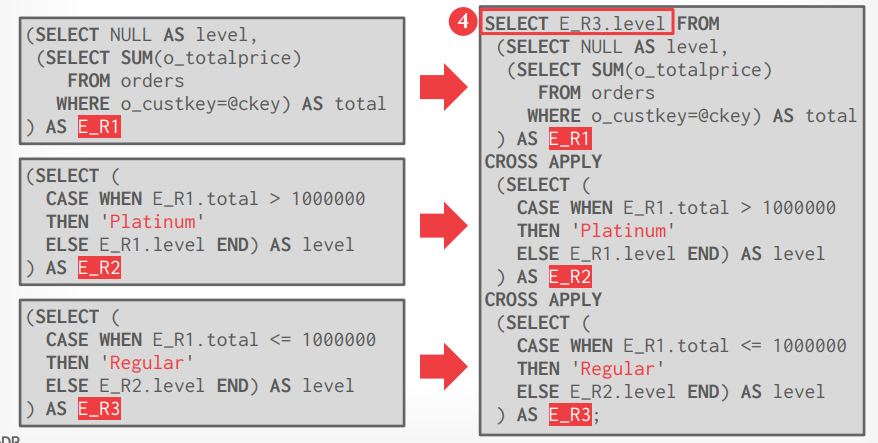

4. **Inline Expression**

   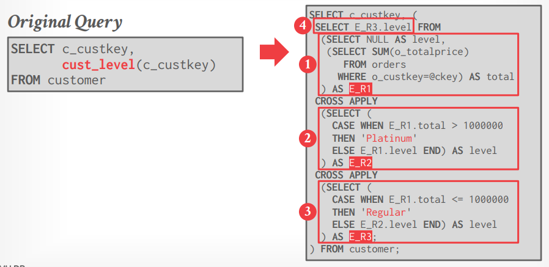

5. **Optimize**

   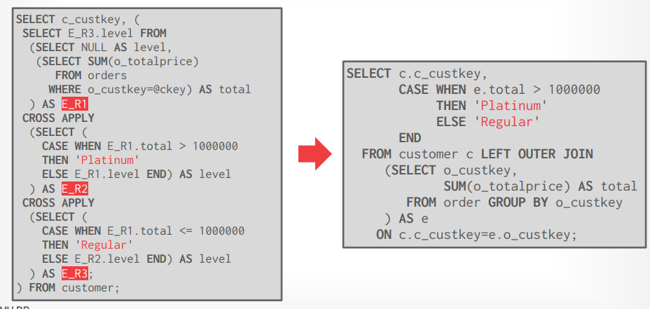

6. **Bouns Optimization**
   - Dynamic Slicing
   - Constant Propagation & Folding
   - Dead Code Elimination

   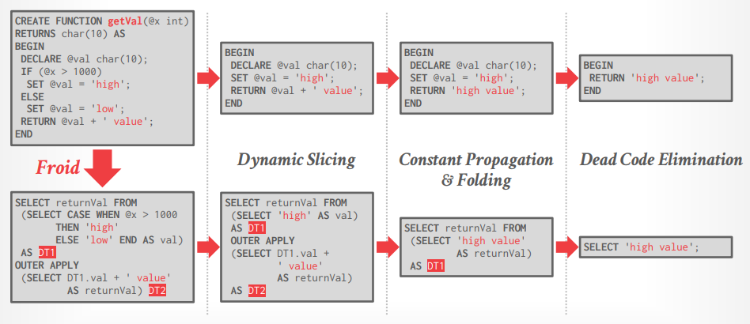

## APFEL: UDFs-to-CTEs

同样是将UDFs改写为SQL命令，采用**Recursive Common Table Expressions, CTEs**来支持迭代和其他Froid不支持的控制流

### UDFSs-to-CTEs Overview

1. **Static Single Assignment Form**

   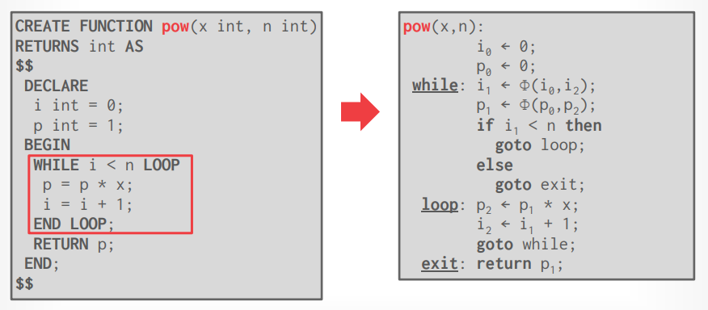

2. **Administrative Normal Form**

   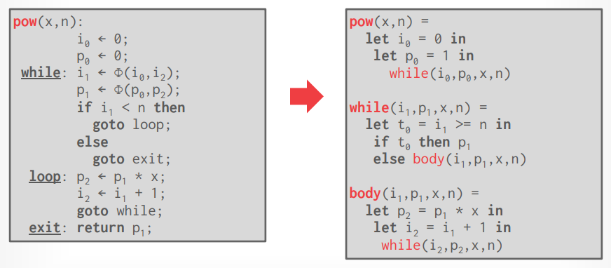

3. **Mutual to Direct Recursion**

   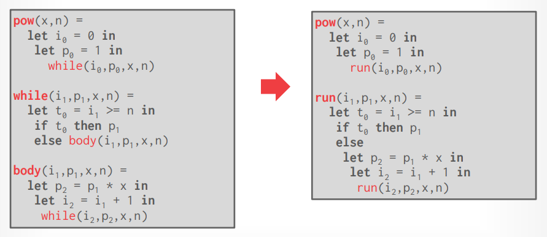

4. **Tail Recursion to `WITH RECURSIVE`**

   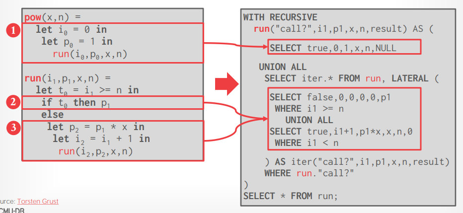

5. **Run Through Query Optimizer**

## ProcBench

微软研究团队公布了一项基于真实世界负载的UDFs、TVFs、Triggers、Stored Procedures性能研究，并声称其ProcBench框架能够诚实反映真实负载下的情况，而SQL Server能够decorrelate该框架中2/13的带参数UDFs，而**Umbra能够decorrelate其中13/13**

- Decorrelation of sub-queries in MSSQL
  
  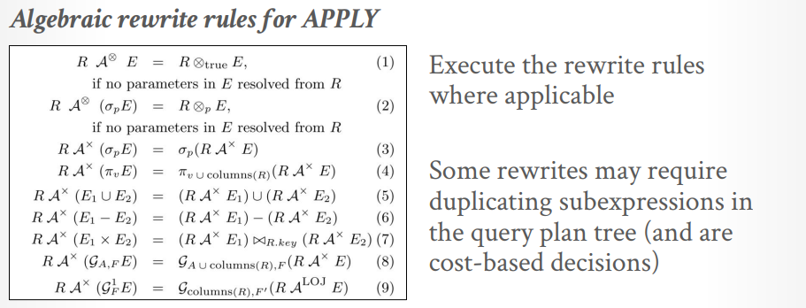

  采用规则改写的方式可能导致在查询的语法树上不同节点引入了**重复的子表达式**，从而decorrelate改写后的查询反而性能更差，因此**Froid将是否decorrelation的选择留给优化器**

- **Decorrelation of sub-queries in Umbra (Germans)**

  Umbra优化器**采用DAG而不是Tree**的方式来表达查询，并引入**Dependent Join Operator的方式来重用子表达式**，而不是重复，从而能够系统地decorrelate所有sub-queries

  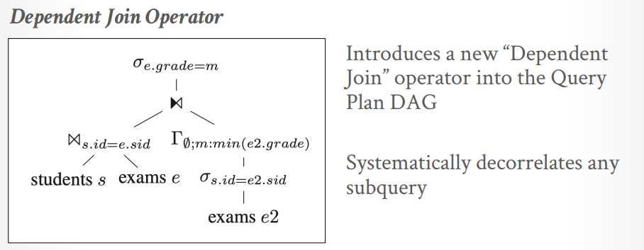

  TODO: [Dependent Join Operator](https://cs.emis.de/LNI/Proceedings/Proceedings241/383.pdf)

## Thoughts

优化UDF可以带来多个数量级的性能提升，甚至超过重写应用、更换DBMS带来的收益

另外常见的JIT方式编译UDF为机器码无法解决优化器难以优化的问题，即**依然无法评估成本**

> You need a **German-style optimizer**!
