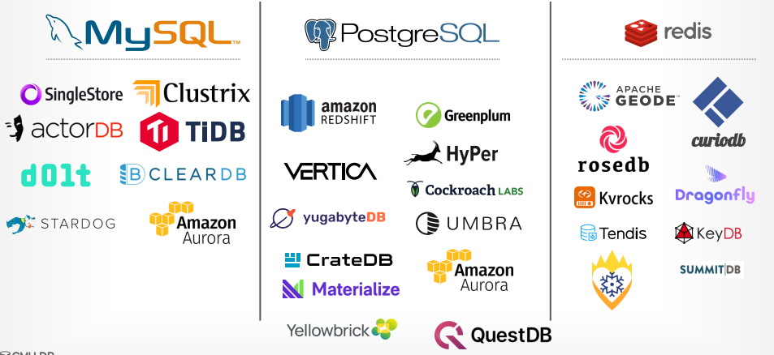

# Lecture 15 - Database Networking

通常数据库系统会选择兼容现有的协议，从而用户能够直接采用现有的client就访问新的数据库系统

## Protocol Design Space

- **Row vs. Column Layout**
  现在较优的做法时类似[PAX方式](03.Storage_Models_Data_Layout.md#hybrid-storage-model-pax)，采用**Vector-oriented** API
- **Compression**，例如Apache Arrow
  - Naive compression: lz4, gzip, zstd, etc (**很少系统支持**)
  - Columnar-Specific Encoding: dictionary, RLE, delta, etc (**没有系统支持**)

  > Heavyweight compression is better when network is slow. DBMS achieves better compression ratios for larger message chunk sizes.

- **Data Serialization**
  - Binary Encoding: ProtocolBuffers, Thrift, FlatBuffers, etc (性能更好，绝大多数系统采用)
  - Text Encoding: json, etc
- **String Handling**
  - Null Termination
  - Length-Prefixes: 可以根据前缀长度跳过不感兴趣的字符串内容
  - Fixed Width: 对一些特殊场景较优，例如字符串较短

## Kernel Bypass Methods

- **Data Plane Development Kit, DPDK**
  - TCP/IP in userspace
  - No data copying
  - No syscall
- **Remote Direct Memory Access, RDMA**
  - write remote memory directly without going through OS
  - remote is unaware
- **[io_uring](../linux/io_uring.md)**
- **[eBPF](../linux/BPF_Introduction.md)**

## Thoughts

- 通常DBMS的网络协议导致的性能瓶颈是被**忽视的**（因为practitioners默认都是兼容MySQL、PostgreSQL等协议？）
- Kernel bypass能够显著提高性能，但需要更多的用户层维护，通常可以用于DBMS多节点之间的网络通信
