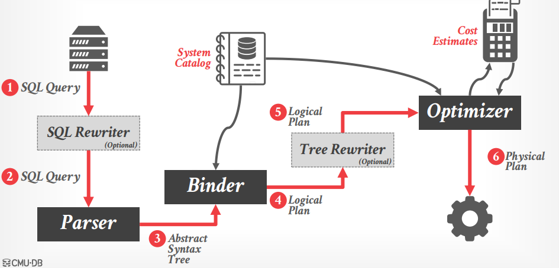
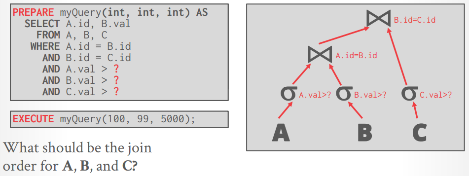
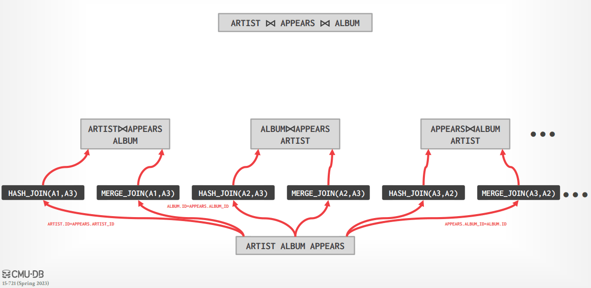
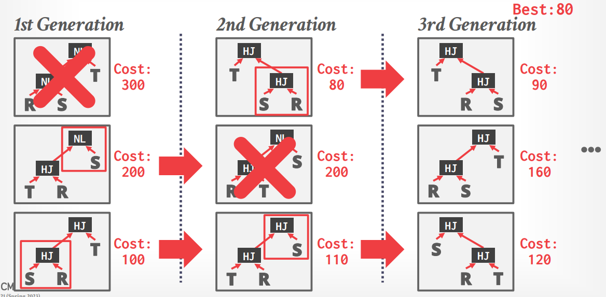
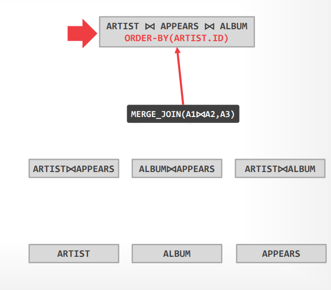

# Lecture 16 - Optimizer Implementation I

查询优化属于**NPC问题**，实际中没有查询优化器能够给出最优计划，**通常OLTP类的查询优化非常简单**，由于是点查询为主，优化器只需要基于简单的推理选择最佳的索引，而join也往往都是在foreign key上进行



## Cost Estimation

生成一个查询计划的估计代价，往往与数据库当前的状态有关：

- 当前DBMS其他在运行的任务
- 中间结果的大小
- 选择的算法、访问模式
- 资源占用（CPU, I/O等）
- 数据属性（数据存储位置、顺序、倾斜等）

## Design Decisions

### Optimization Granularity

- **Single Query**
  - 更小的搜索空间
  - DBMS不会跨多个查询复用结果
  - 为了整个DBMS的资源统筹，通常cost model也需要考虑当前DBMS的负载和其他在运行任务
- **Multiple Queries**
  - 当有大量类似查询时，可以显著提升性能
  - 但搜索空间会指数级增大
  - 对于数据/中间结果共享会有帮助

### Optimization Timing

- **Static Optimization**
  - 在优化器优化时确定执行方案并不再改变
  - 执行计划的效果主要取决于cost model的准确性
- **Dynamic Optimization**
  - 在查询执行的过程中on-the-fly自动选择物理算子
  - 通常多次执行后可能会重新优化
  - 实现难度较高，且debug困难（non-deterministic）
- **Adaptive Optimization**
  - 首先采用静态的方式确定执行计划，当过程中发现误差超过阈值时再动态调整进行再优化
  
### Prepared Statements



- **Reuse Last Plan**
  最简单的做法就是优化一次、一直复用
- **Re-Optimize**
  每次查询时都重新进行优化，但难以采用上一次的方案作为优化起点
- **Multiple Plans**
  对于不同的参数生成多个执行计划，即基于参数和统计信息，因为不同参数的较优计划可能不相同
- **Average Plan**
  直接采用参数的平均值来生成执行计划，后续无视实际参数值，均采用平均值生成的执行计划

### Plan Stability

延迟低性能高固然是用户和DBMS的追求，但是往往更重要的是**稳定性stability**，即每次查询延迟的可预测性，用户**不喜欢大方差**，出现偶发高延迟时很难确定是应用层问题还是DBMS问题

- **Hints**
  例如DBA指定一个查询的优化执行计划确定后不允许再优化/修改，从而减轻可能的抖动，例如：

    ```SQL
    /*+
        NestLoop(t1 t2)
        MergeJoin(t1 t2 t3)
        Leading(t1 t2 t3)
     */
    SELECT * FROM tables AS t1
    ```

- **Fixed Optimizer Versions**
  固定优化器的版本，当需要时逐query迁移到新的优化器上，达到新的查询执行时间稳定水平
- **Backwards-Compatible Plans**

### Search Termination

- **Wall-clock Time**
  限制优化器能运行的时间，在有限时间内选择当下最佳的执行计划
- **Cost Threshold**
  给定成本阈值，当发现某个执行计划达成阈值时即选择，不再继续寻找
- **Exhaustion**
  穷举直到enumerator无法再生成更多的候选执行计划

## Optimization Search Strategies

### Heuristics

采用**静态的改写规则**来转换逻辑算子到物理计划：

- Perform most **restrictive selection early**
- Perform all **selections before joins**
- Predicate/Limit/Project **operator pushdowns**
- **Join ordering** based on simple rules or cardinality estimates

**优点**：

- 实现难度低
- 对简单的查询能够迅速给出较好的执行计划

**缺点**：

- 比较**依赖magic常量**来预测执行计划的效果，例如谓词下推的代价
- **难以处理复杂查询**，当算子有复杂依赖关系时几乎不可能给出较好的执行计划

例如Ingres优化器可以将如下查询按步骤优化：

```SQL
SELECT ARTIST.NAME
  FROM ARTIST, APPEARS, ALBUM
  WHERE ARTIST.ID=APPEARS.ARTIST_ID 
    AND APPEARS.ALBUM_ID=ALBUM.ID
    AND ALBUM.NAME="Andy's Drill Remix"
  ORDER BY ARTIST.ID
```

1. 将查询分解为简单的子查询，注意`TEMP1`和`TEMP2`

    ```SQL
    /* Qeury #1 */
    SELECT ALBUM.ID AS ALBUM_ID INTO TEMP1
      FROM ALBUM
      WHERE ALBUM.NAME="Andy's Drill Remix"
    
    /* Query #2 */
    SELECT ARTIST.NAME
      FROM ARTIST, APPEARS, TEMP1
      WHERE ARTIST.ID=APPEARS.ARTIST_ID
      AND APPEARS.ALBUM_ID=TEMP1.ALBUM_ID
      ORDER BY APPEARS.ID
    ```

   显然Query #2具备进一步分割的可能：

    ```SQL
    /* Query #3 / #2.1 */
    SELECT APPEARS.ARTIST_ID INTO TEMP2
      FROM APPEARS, TEMP1
      WHERE APPEARS.ALBUM_ID=TEMP1.ALBUM_ID
      ORDER BY APPEARS.ARTIST_ID

    /* Query #4 / #2.2 */
    SELECT ARTIST.NAME
      FROM ARTIST, TEMP2
      WHERE ARTIST.ARTIST_ID=TEMP2.ARTIST_ID
    ```

2. 随后**按顺序处理Query** #1 >> #3 >> #4，将前序查询的结果相应替换进后序的查询

    ```SQL
    /* Qeury #1 */
    SELECT ALBUM.ID AS ALBUM_ID INTO TEMP1
      FROM ALBUM
      WHERE ALBUM.NAME="Andy's Drill Remix"
    +----------+
    | ALBUM_ID |
    +----------+
    |   9999   |
    +----------+

    /* Query #3 */
    SELECT APPEARS.ARTIST_ID INTO TEMP2
      FROM APPEARS, TEMP1
      WHERE APPEARS.ALBUM_ID=9999
      ORDER BY APPEARS.ARTIST_ID
    +-----------+
    | ARTIST_ID |
    +-----------+
    |    123    |
    +-----------+
    |    456    |
    +-----------+

    /* Query #4 */
    SELECT ARTIST.NAME
      FROM ARTIST, TEMP2
      WHERE ARTIST.ARTIST_ID=123
    +------------+
    |    NAME    |
    +------------+
    |   O.D.B.   |
    +------------+

    SELECT ARTIST.NAME
      FROM ARTIST, TEMP2
      WHERE ARTIST.ARTIST_ID=456
    +------------+
    |    NAME    |
    +------------+
    | DJ Premier |
    +------------+
    ```

### Heuristics + Cost-based Join Order Search

同样采用**静态的改写规则**来转换逻辑算子到物理计划，但随后对多表join使用**动态规划dynamic programming来决定最优连接顺序**：

- First **cost-based** optimizer
- **Bottom-up planning (forward chaining)**

例如System-R优化器会对每个逻辑算子生成一组物理算子，搜索所有join算法和access path的组合，可以将如下查询按步骤优化：

```SQL
SELECT ARTIST.NAME
  FROM ARTIST, APPEARS, ALBUM
  WHERE ARTIST.ID=APPEARS.ARTIST_ID 
    AND APPEARS.ALBUM_ID=ALBUM.ID
    AND ALBUM.NAME="Andy's Drill Remix"
  ORDER BY ARTIST.ID
```

1. 对每个表选择最佳的**访问模式 access paths**

    ```text
    ARTIST: Seq scan
    APPEARS: Seq scan
    ALBUM: Index lookup on NAME
    ```

2. 枚举所有可能的连接顺序

    ```text
    ARTIST x APPEARS x ALBUM
    ARTIST x ALBUM   x APPEARS
    ...
    ```

3. 动态规划选择代价最低的连接顺序
   - 每一种逻辑连接都可以由**多种物理连接算子**来实现，分别计算代价并选择最小者，从而计算出一个逻辑链接的最优物理计划及代价
   - 计算出多个连接顺序相应的最低成本物理计划，选择最好的连接顺序
   - 有一个缺点在于在执行计划中**没有考虑实际数据的属性**，查询中有`ORDER BY ARTIST.ID`的要求，但优化过程中没有考虑这一点

   

**优点**：

- 通常不需要穷尽所有可能性就足以找到一个合理的计划

**缺点**：

- 难以处理复杂查询、需要一些magic常量来评判效果（即heuristics中的缺点）
- 由于DP的方式决定连接顺序，因此属于**Left-Deep Join**，而这[未必是最佳顺序](Worst-Case_Optimal_Joins.md)
- 优化时必须考虑数据的属性导致的成本差异，例如是否有排序要求`ORDER BY`

### Randomized Algorithm

在所有有效计划中**随机漫步搜索**，直到遇到成本低于某个阈值、或是超时，实现例如**遗传算法 Postgres Genetic Optimizer**，每一轮迭代选择较优的上一轮方案，交换一些模块（**mutation**），再重新计算代价



**优点**：

- 在搜索空间中随机漫步，从而不容易陷入局部最优
- 内存开销小，通常不需要记录过多历史信息

**缺点**：

- 通常难以理解DBMS所选择的方案原因（随机漫步）
- 需要额外的保证使得查询方案是确定性的
- 依然需要采用正确性校验来确保方案正确有效

## Optimizer Generators

在过程式语言 procedural language 中使用查询转换规则 query transformation rules非常困难且容易出错，而**采用声明式DSL来编写规则**，并由optimizer在执行计划的过程中使用更好

Optimizer generator的目的就在于**解耦优化器的搜索策略和执行方案的生成**，采用规则引擎来转换查询算子

### Stratified Search

确定执行计划分为多个阶段，首先是heuristics，**规则引擎采用DSL编写的转换规则将查询改写**，随后进行cost-based search，将逻辑查询映射到最好的物理执行计划

例如Starburst Optimizer，属于**Bottom-up planning （forward chaining）**：

- 首先执行query rewrite，生成SQL-block-level的查询块（**relational calculus**-like representation of queries）
- 随后执行plan optimization，执行类似System R的DP优化

**优点**：

- 实践中效果良好且性能较佳

**缺点**：

- 难以对转换施加优先级
- 部分转换难以评估效果
- 维护规则极难

### Unified Search

在单个过程（混合逻辑计划改写、逻辑计划到物理计划映射）中确定执行计划，从而不需要引入多个阶段，将所有改写均视为转换

例如Volcano Optimizer，属于**Top-down planning（backward chaining）**：

1. 从查询输出开始考虑（自顶向下），对每个结点施加转换，创造新的节点并遍历，例如：
   - Logical >> Logical: `JOIN(A, B) -> JOIN(B, A)`
   - Logical >> Physical: `JOIN(A, B) -> HASH_JOIN(A, B)`
2. 遍历的过程中确定最优选择，且可以创建**enforcer规则来约束输入**数据必须满足的属性（从而间接限制了下层方案分支/搜索空间），例如：
   - 输出依赖`ORDER BY ARTIST.ID`，从而对于`HASH_JOIN`无法满足有序的特征直接拒绝，但可以额外搜索`QUICKSORT(ARTIST.ID)`的执行方案
   - 在`QUICKSORT(ARTIST.ID)`过程中满足了`ORDER BY`，从而继续向下搜索时就可以考虑`HASH_JOIN`（按下图中假如`HASH_JOIN`代价过高就可以直接被剪枝）



**优点**：

- 采用声明式的规则来执行转换
- 可扩展性更佳，并且充分利用**记忆化搜索memorization**来减少冗余重复（在越底层越容易重复）的代价计算

**缺点**：

- 所有等价的类都会被完全扩展出所有可能的逻辑算子，即完全展开，随后才会开始搜索
- 谓词难以修改

## Thoughts

> Query optimization is **hard**.
