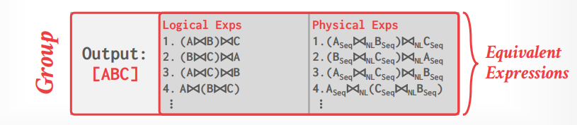
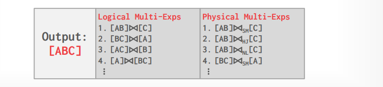
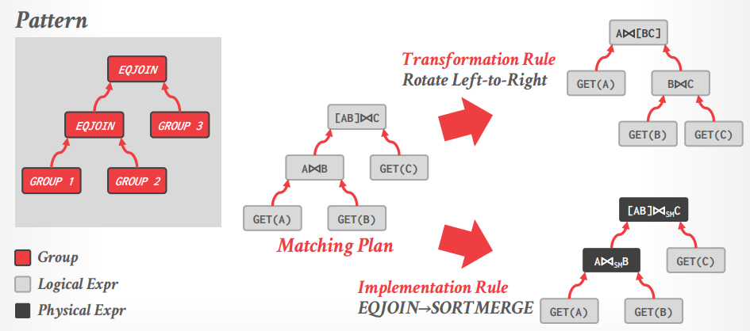
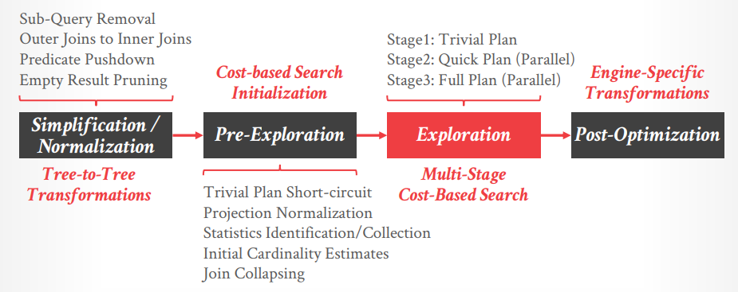
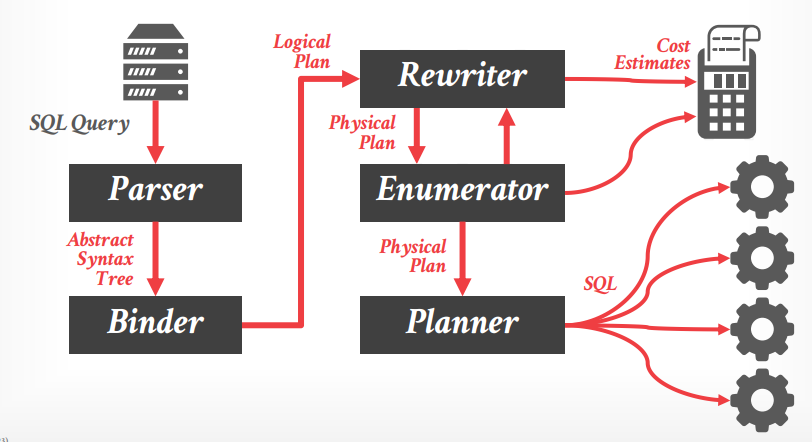

# Lecture 17 - Optimizer Implementation II

## Query Optimization Strategies

- Heuristics
  INGRES, Oracle (until mid 1990s)
- Heuristics + Cost-based Join Search
  System R, early IBM DB2, most open-source DBMSs
- Randomized Search
  Academics in the 1980s, current Postgres
- **Stratified Search**
  IBM’s STARBURST (late 1980s), now IBM DB2 + Oracle
- **Unified Search**
  Volcano/Cascades in 1990s, now MSSQL + Greenplum

## Top-Down vs. Bottom-Up

- Top-down Optimization
  从查询希望得到的结果开始，基于查询树自顶向下优化，例如Volcano、Cascades
- Bottom-up Optimization
  从底层最基本的查询块开始，逐步构建出最优的查询方案，例如System R、Starburst

## Cascades

- **Optimization tasks as data structures**
- **Rules to place property enforcers**
- **Ordering of moves by promise**
- **Predicates as logical/physical operators**

### Cascades Concepts

- **Expressions**: 代表了查询的表达式，可以分为逻辑表达式或者是物理表达式
- **Groups**: 代表了一组输出结果相同的**逻辑等价的逻辑/物理表达式组**

  

- **Multi-expressions**: 优化器避免显式实例化一个group内所有可能的expression，因此只采用一个**multi-expression来避免冗余**，从而减少了transformation的次数、storage开销、重复的cost estimations

  

- **Rules**: 转换规则，即transformation rule和implementation rule，前者为logical到logical的转换，后者为logical到physical的转换，每个规则包含：
  - Pattern: 可以应用该规则的logical expression
  - Substitute: 若采用该规则，则生成的新表达式结果

  

- **Memo Table**: 存储了所有在优化过程中探索/评估过的查询方案（紧凑的图/散列表形式），从而允许记忆化搜索、去重、避免冗余代价管理，**优化基本原则是任意一个最优执行方案，其子方案一定也是最优的**，从而优化器在选择时只需考虑满足physical properties下更优的子方案，**不需要考虑等价但代价更高的其他方案**

## Real-World Implementations

- **[Microsoft SQL Server (Cascades)](Cascades.md)**
  - 基于规则应用次数设计的**逻辑超时timeout**，从而对于overloaded的系统不会产生不同的最优方案
  - 基于heuristics初始化一些可能较佳的join顺序作为起始点，**pre-populate Memo Table**用于正式搜索

  

  - 其中第二阶段会进行cost的**初步评估（需要哪些统计数据）**，若当前system catalog中无法获取，则会**首先进行快速的sampling来获得关于数据的统计特征，随后再重新开始cost based优化**（而绝大多数其它系统往往会选择直接采用不那么准确的estimates或者干脆直接进行优化）
- Apache Calcite
  - 支持可插拔的query language、cost models、rules
  - 不区分逻辑算子和物理算子，采用annotation的形式提供physical properties
- Greenplum Orca (Cascades)
  - 为Greenplum设计，其他DBMS可以采用发送catalog + stats + logical plan给Orca的方式来获取physical plans
  - 支持多线程方案搜索
  - 自动检测所选择的计划执行的代价和预期的代价（feedback？）
- CockroachDB (Cascades)
- SingleStore
  - SQL在主节点上进行解析、优化之后，会重新构建成SQL再发送给具体的Executor节点执行
  - Executor节点收到SQL会**再进行一次解析、优化**
  - **主节点基于数据的分布情况等全局信息优化SQL，而执行节点则根据对局部数据的统计信息和代价估计优化SQL**

  

## Thoughts

> All of this relies on a **good cost model**, a good cost model needs **good statistics**.
