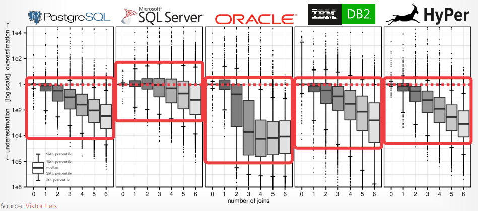
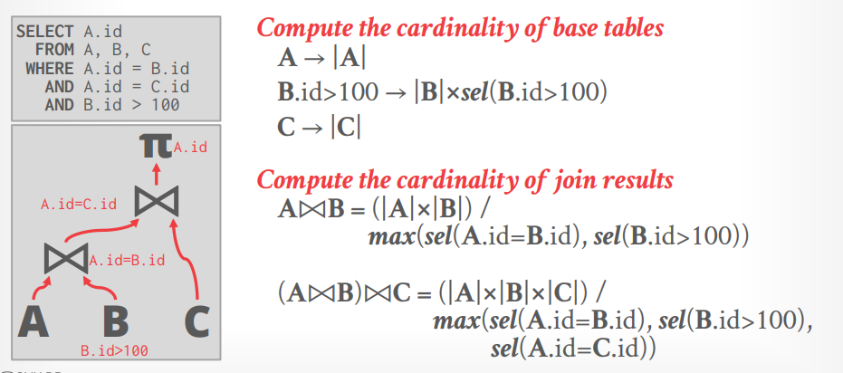

# Lecture 18 - Query Optimizer Cost Models

## Cost Model

Cost Model的组成部分往往有：

- **Physical Costs**
  例如CPU cycles、I/O、缓存命中率、RAM使用情况、数据预读取等，往往重度依赖硬件
- **Logical Costs**
  例如每个算子的预期结果集大小（selectivity）等，往往需要estimations
- **Algorithmic Costs**
  例如算子的算法复杂度等

常见的Cost Model分类：

- **Disk-Based DBMS Cost Model**
  **对磁盘的访问次数**总是会占据查询的大部分时间，通常可以忽略CPU代价，需要考虑sequential和random I/O的代价差异

  通常当DBMS对[buffer management](../cmu15.445/05.Buffer_Pools.md)有完全控制时，就能进而完全感知所有磁盘的I/O操作，从而可以容易实现这种cost model

  例如IBM DB2的cost model会在Catalog中记录各种参数，包括：
  - (microbenchmarks) hardware environment
  - (microbenchmarks) storage device characteristics
  - (distributed only) communications bandwidth
  - (buffer pools, sort heaps) memory resources
  - concurrency environment, e.g. users, isolation level, etc
- **In-Memory DBMS Cost Model**
  不考虑I/O，仅考虑**CPU代价和访存代价**，内存代价难以评估，因为DBMS无法像buffer management一样完全控制内存的行为（cache bypass、NUMA、shared cache等），而CPU代价则可以考虑直接使用一个算子要处理的tuple数量

  例如Smallbase的cost model会从logical model中两阶段生成硬件代价：
  1. identify execution primitives: 列出所需要使用的计算操作，例如排序、谓词求值、索引等
  2. microbenchmark: 直接对所需要使用的计算操作进行profile，基于microbenchmark的值求出整个计划的代价

## Selectivity

通常DBMS考虑以下方式来估计selectivity，可以组合使用达到更好的效果:

- **Domain Contraints**
- **Precomputed Statistics (Zone Maps)**
- **Histograms / Approximations**
  采用**sketches**的方法来生成有限误差的评估
  - Count Distinct
  - Quantiles
  - Frequent Items
  - Tuple Sketch
- **Sampling**
  在随机挑选的一组数据上执行谓词求值，以此来评估更大范围的数据会产生多少结果，而这组数据可以是：
  - Maintain Read-Only Copy: 维护一小部分数据的副本作为样本，周期性更新
  - Sample Real Tables: 采用`READ UNCOMMITTED`隔离级别来读取真实的表数据，逻辑上同一行数据可能会读取到多个不同数值的版本

计算selectivity时还需要考虑的问题就是数据本身的**分布**和属性之间的**相关性**：

- **Uniform Data**
- **Independent Predicates**
  属性之间往往有相关性，例如`WHERE maker='Honda' AND model='Accord`中的两个谓词实际上是存在强相关关系的，只有`Honda`会制造`Accord`

  一些DBMS支持指定不同的属性存在相关关系，从而DBMS不会简单的采用相互独立来估计
- **Inclusion Principle**
  join keys往往存在重叠，在inner relation出现的key应该也存在于outer table

## Estimation Problem

*原文中用了DBMS A/B/C来代替*：

当查询复杂、参与连接的表增多之后，estimates误差会随着算子逐级向上著增大

## Thoughts

- **Query Optimizer (planner, cost model) is more important than a fast engine (simd, query compilation, etc)**
  - Cost-based join ordering
- **Cardinality estimates are routinely wrong**
  - Try to use operators that do not rely on estimates ，即operator应尽量能**动态适应实际数据**，不能彻底依赖estimates来运行
  - 例如PostgreSQL 9.4版本的[rehashing问题](./How_Good_Are_Query_Optimizers.md#the-risk-of-relying-on-estimates)
  - 例如对predicates进行**动态调整求值顺序**，根据运行时实际的selectivity来优先判断更高选择度的谓词
- **Hash joins + sequential scans are a robust execution model**
  - the more indexes that are available, the more brittle the plans become (faster on average)
- **Working on accurate models is a waste of time**
  - better to improve cardinality estimation instead
- **Combination of sampling + sketches is a good way to achieve accurate estimations**
  - this is Andy's thought
