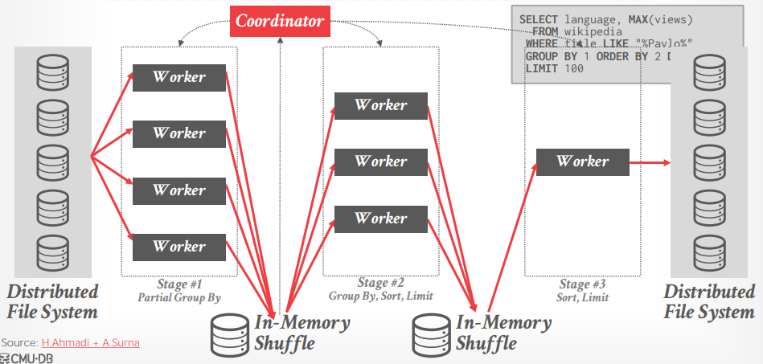
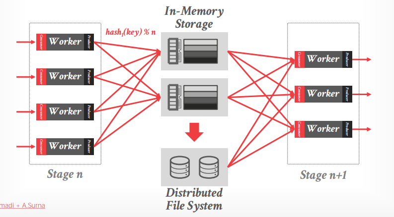
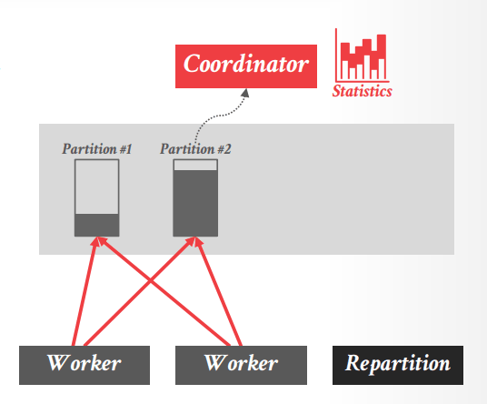

# Lecture 19 - Google BigQuery / Dremel

## Data Systems at Google

> Whenever Google released a research paper describing an internal system, other tech companies would write **open-source clones**.

- NoSQL

  - 2004 MapReduce => Hadoop, Spark
  - 2005 BigTable  => Hbase, Accumulo, Hypertable
  - 2006 Chubby    => Zookeeper, etcd

- SQL

  - 2010 Megastore
  - 2010 Vitess    => Vitess, Planetscale
  - 2011 Dremel    => Drill, Impala, Dremio
  - 2011 Spanner   => CockroachDB, TiDB
  - 2013 F1
  - 2014 Mesa
  - 2021 Napa

## In-situe Data Processing

直接在共享存储（例如object store等）中**原始数据文件上执行查询处理，而不需要首先通过ETL将数据导入数据库**，这也经常被称为**数据湖 data lake**

相应的，用户往往愿意牺牲一些查询性能，来换取立即开始的数据分析而不需要冗长的准备阶段（ETL过程）

## Dremel

- Shared-Disk / Disaggregated Storage
- Vectorized Query Processing
- Shuffle-based Distributed Query Execution
- Columnar Storage
  - Zone Maps / Filters
  - Dictionary + RLC Compression
  - Only Inverted Indexes
- Hash Joins Only
- Heuristic Optimizer + Adaptive Optimizations

### Query Execution

逻辑查询计划被切割为**多个阶段stages**，每个阶段可以包含多个允许**并行运行的子任务tasks**（HyPer有类似的做法[morsel-driven execution](Morsel.md#morsel-driven-execution)）

根节点会获取所需要的所有**元信息，编码进查询内**，从而其他下游所有节点直接使用查询内的元信息，而不需要都去数据文件中读取

### In-Memory Shuffle

Shuffle节点仅在内存无法容纳时才会将数据溢出存储到分布式文件系统中，**Shuffle操作也代表着checkpoints**，用于：

- **Fault Tolerance / Straggler Avoidance**
  故障节点/慢节点的任务会被其他节点重新执行
- **Dynamic Resource Allocation**
  根据需求和每个阶段输出结果的数量，动态扩容/缩容shuffle后下一阶段的worker数量

*传统的OLAP系统考虑到性能，并不会有类似的checkpoint设计，假如某个节点宕机，则相应的查询整体失败*

### Query Optimization

很多数据文件并不一定有统计信息，或者数据来源是其他上游系统的API（对象存储、共享文件等），Dremel采用的优化方式是分层的做法（**stratified approach**），首先采用简单的方式生成初步的计划开始执行**preliminary physical plan**：

- **rule-based**: predicate pushdown, start schema constraint propagation, key hints, join ordering
- **cost-based**: if data has statistics

随后在运行过程中再根据运行情况执行动态优化**dynamic query optimization**

- 在每个stage开始前，**根据前一个stage的运行统计数据，优化后续的执行计划**，可以进行优化例如
  - 修改worker的数量
  - 调整shuffle/broadcast join的选择
  - 修改物理算子的实现
  - **动态再分区 dynamic repartitioning**，避免某个分区过载，split过载分区，部分数据重新散列到新分区中，随后整个抛弃旧过载分区，非过载分区不改变，从而最小化需要迁移的数据

    

### Storage

[Capacitor](Dremel.md#columnar-storage-for-nested-data)

## Thoughts

> Dremel is an innovative DBMS that predates all other major cloud-native OLAP DBMSs.
> The shuffle phase seems wasteful but it **simplifies  engineering and can improve performance**.
> It is also a good example of the benefit of  **decomposing a DBMS's components into individual services** to abstract raw resources. (cloud-native way)
