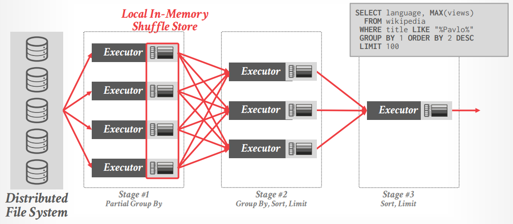
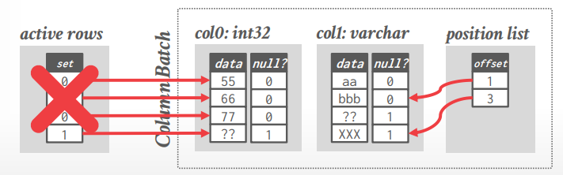
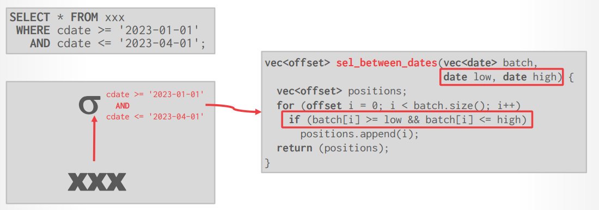
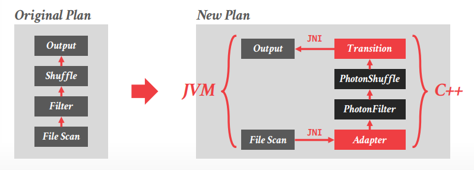
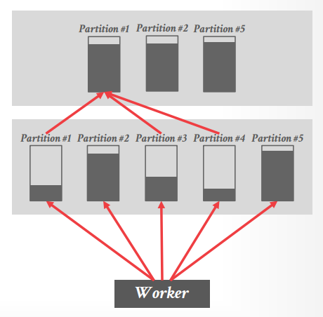

# Lecture 20 - Databricks Spark SQL / Photon

## JVM Problems

原先Databricks采用的Spark SQL执行引擎是基于JVM的，面临着**CPU成为瓶颈**的问题，见[原文](Photon.md#execution-engine-design-decisions)

## Databricks Photon

- **Spark Query Execution**
  [Pull-based Vectorized Query Processing](10.Vectorization_vs_Compilation.md)

  

- **Vectorized Query Processing**
  **Photon属于pull-based vectorized engine并且采用precompiled primitives作为算子kernel**，每个算子以`GetNext`从子算子获取批量数据，并向量化处理，参考[MonetDB/X100](MonetDB.md)，Databricks发现采用**position list**的方式比**active row bitmap**的方式效率更高

  

  另外，Photon并不支持[HyPer-style Operator Fusion](08.Vectorized_Execution.md#selection-scans)，这样才可以**在不同的operator上收集想要的统计信息**，并能够给予用户足够的信息监控执行计划和过程，而这*恰恰是学术界的系统往往不会考虑的*，Photon支持类似VectorWise的horizontal fusion：

  

- **Memory Management**
  由于必须同时允许基于JVM的Spark SQL引擎和基于C++的Photon引擎，内存管理上必须格外谨慎：
  - Photon依赖DBR的memory manger来管理内存，从而整个进程有**统一的内存管理**
  - 由于处理的数据并没有统计信息，因此更依赖灵活的运行时内存分配管理

- **Catalyst Query Optimizer**
  **自底向上bottom-up进行物理计划替换physical-to-physical**，来生成利于Photon执行的物理计划
  
  

- **Runtime Adaptivity**
  - **Query-Level Adaptivity (Macro)**
    类似[Dremel](19.Dremel.md#query-optimization)，每个shuffle stage结束就会根据执行情况调整下一阶段的查询计划，由DBR提供，例如Partition Coalescing

    

  - **Batch-Level Adaptivity (Micro)**
    在算子内部，根据每一批数据本身的特征选择不同的处理算法，由Photon提供，例如根据ASCII还是UTF-8提供不同的处理算子实现，对没有NULL值的向量进行额外优化等

  > **Adaptivity** helps for some things, but the DBMS can always do a better job if it knows something about the data.

## Thoughts

Databricks在21年宣布登顶TPC-DS榜，但通常选择一个系统的原因不会是因为TPC-DS排名高

> Do not build a Java/Scala/JVM-Based OLAP engine from scratch. Use C++ or Rust.
