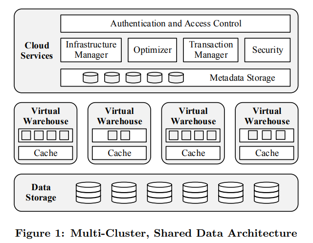
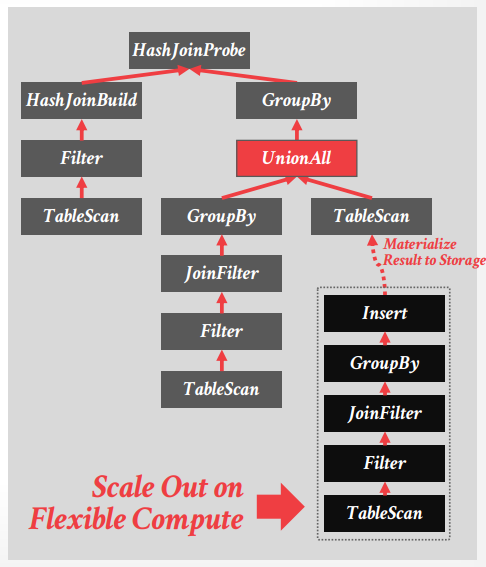

# Lecture 21 - Snowflake

## Architecture

基本特征：

- Shared-Disk / Disaggregated Storage
- Push-based Vectorized Query Processing
- Precompiled Primitives
- Separate Table Data from Meta-Data
- No Buffer Pool
- PAX Columnar Storage (support both proprietary + open-source formats)
- Sort-Merge + Hash Joins
- Unified Query Optimizer + Adaptive Optimizations

- **Data Storage**
  - AWS S3, Azure Store, Google Cloud Storage
- **Virtual Warehouses**
  - **local cache** of files + columns with LRU replacement policy
  - **consistent hashing** to assign files
- **Cloud Services**
  - transactional key-value store: FoundationDB

可以参考[Building An Elastic Query Engine on Disaggregated Storage](Query_Engine_on_Disaggregated_Storage.md)

## Vectorized Query Processing

- **Push-based vectorized** engine
- **Precompiled primitives for operator kernels**
- Codegen for tuple serialization/deserialization between workers
- **Not rely on shuffle** between stages
- **Not support partial retries**, entire query has to restart in face of worker failure

## Flxible Compute

- Deploy additional workers to accelerate
  - the additional worker write results to storage **as if it was a table**
  - **data partitioned, results union**

## Data Storage

- custom data types to store semi-structured data
  - `VARIANT / ARRAY / OBJECT`
- **micropartition** table files in **PAX** format
  - **automatically clusters / re-arranges micropartitions** based on access patterns
- invest heavily on **caching layer**

## Query Optimizer

- unified **Cascades-style top-down** optimization
- maintains **statistics** for data
  - statistics are cached locally to ensure fast evaluation during pruning (skip uninterested micropartitions)
  - specialized expression evaluators that work on zone map

## Snowflake Hybrid Tables - Unistore

hybrid (row + columnar) for HTAP:

- write updates to row-based storage with strong ACID
- backgound jobs merge updates into micropartition files (columnar)

## Thoughts

> Snowflake created the **roadmap on how to build a scalable cloud-based OLAP DBaaS.**
