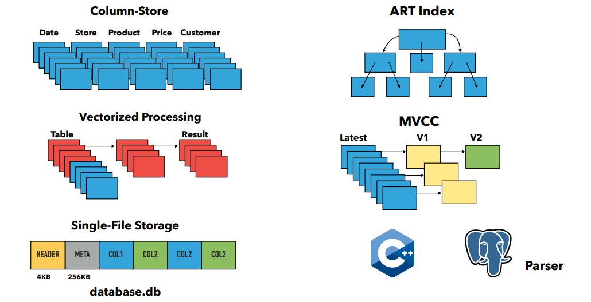
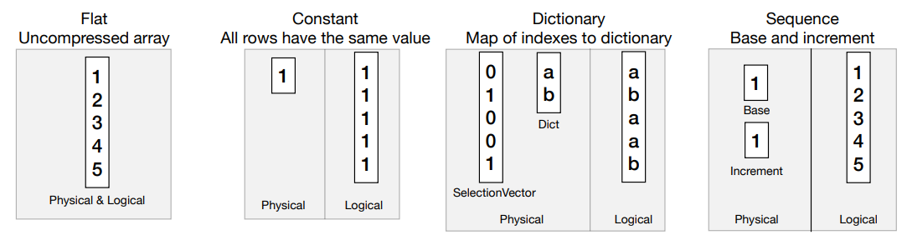
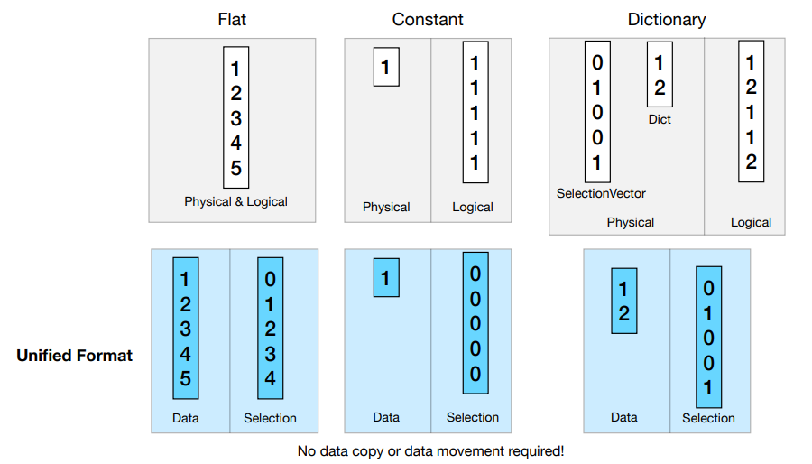
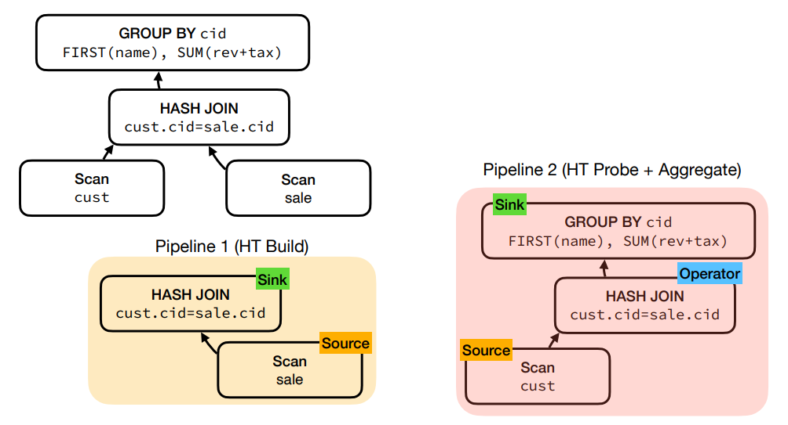
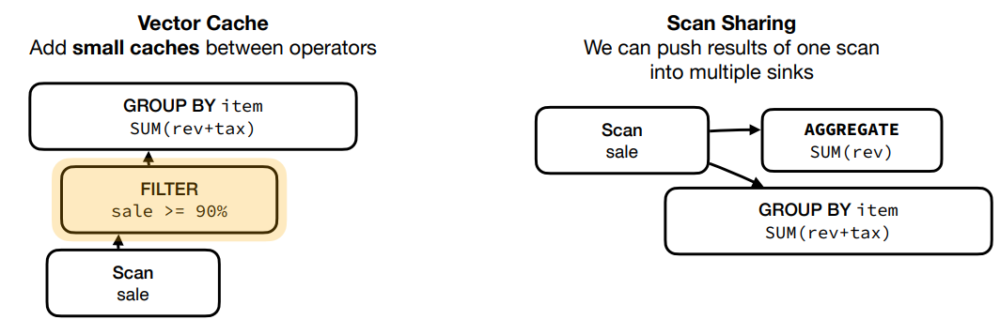
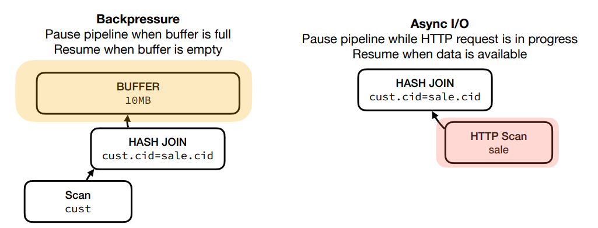

# Lecture 22 - DuckDB

## System Overview

vectorized push-based model



## Vector

向量的四种物理表达方式：

- **Flat** (uncompressed)
- **Constant**
- **Dictionary** (map of indexes)
- **Sequence** (base and increment)



采用压缩的格式处理需要大量的代码（针对不同的压缩形式和数据类型，计算函数需要考虑大量情况，例如flat-flat，flat-constant，constant-flat，etc），而全采用flatten处理则需要解压缩、频繁复制移动数据，考虑采用统一的处理格式：**unified format**



- string采用Umbra的做法
  - SSO的方式至多inline不长于12bytes的字符串
  - **额外存储4bytes的前缀用于早期比较、排序、过滤**

  ```cpp
  struct String {
    uint32_t size_;
    char prefix_[4];
    union {
      char inlined[8];
      const char* data;
    } value_;
  }
  ```

- **嵌套类型采用child vector存储**
  - struct采用**validity mask**以及**child vector**来表达（但不支持嵌套，且**不支持结构不同的struct**，更像是*list of structs然后转换成有schema的columnar数据?*）

    ```text
    {'item': pants, 'price': 42}
    NULL
    {'item': t-shirt, 'price': 20}
    {'item': shoes, 'price': NULL}

    =>

    validity   item    price
               pants    42
        .        .       .
              t-shirt   20
               shoes     .
    ```

  - list采用**offset/lengths**以及**child vector**来表达（*list of lists?*）

    ```text
    [1, 2, 3]
    []
    [4, NULL, 6, 7, 8]
    NULL

    =>

    offset - length    child vector
        0 - 3              1
        3 - 0              2
        3 - 5              3,
          .                 ,
                            4
                            .
                            6
                            7
                            8
    ```

## Execution

- **initially pull-based**: "vector volcano"，每个算子都实现`GetChunk`接口，批量读取子算子的数据

  ```cpp
  // Simplified hash join example
  void HashJoin::GetChunk(DataChunk &result) {
    if (!build_finished) {
      // build the hash table
      while(right_child->GetChunk(child_chunk)) {
        BuildHashTable(child_chunk);
      }
      build_finished = true;
    }
    // probe the hash table
    left_child->GetChunk(child_chunk);
    ProbeHashTable(child_chunk, result);
  }
  ```

- 在pull-based基础上需要采用[exchange operator](06.Query_Execution.md#intra-query-parallelism)实现并发，有较多问题
  - plan explosion
  - load imbalance / data skew
  - materialization costs
- 转为采用[morsel driven parallelism](Morsel.md#morsel-driven-execution)并动态调整输入数据的分布，**push-based**模式: **Source, Sink, Operator**，前两者能感知并发
  
  

  push-based模式并采用**中心化的控制流**可以实现更多优化
  - **Vector Cache**: 在算子之间可以有小的向量缓存
  - **Scan Sharing**: 数据可以复用推送给多个下游算子
  - **Pause Execution**: 中心化的状态存储允许**暂停/取消**执行，backpressure/async io

  

  

## Storage

数据存储采用**single-file block-based**模式，而WAL在另一个单独的文件

- 数据表分分区为**row groups**，每个row gourp包含约120K行数据，row group是**并发和快照的基本单元**
- **压缩算法**
  - 通用算法例如`gzip, zstd, snappy, lz4`等，优点在于通用且压缩率高，缺点在于执行时需要解压缩，并且必须以批量的方式，没有random seek
  - 特化算法例如`RLE, dictionary, delta`等，优点在于效率高，但需要在执行的过程中处理适配的模式，假如没有适配的压缩模式则无法进行任何压缩

  DuckDB的做法是**compression per-column per-row group**，采用**Analyze-Compress的两阶段**方式来实现压缩

## Lightning Round

- Custome **lock-free buffer manager**
- Support **larger-than-memory execution**
  - **steaming** engine (special join/sort/window algorithms)
- **ACID**
  - **Snapshot Isolation** based on HyPer's MVCC model that is optimized for vectorized processing
- **Optimistic concurrency control**
  - change the same row => abort
- Support **querying directly over many format**
  - Parquet, CSV, JSON, Arrow, Pandas, etc
- **pluggable catalog**
- **pluggable file system**
- support **extensions**
