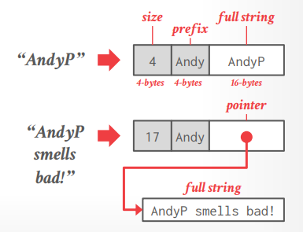
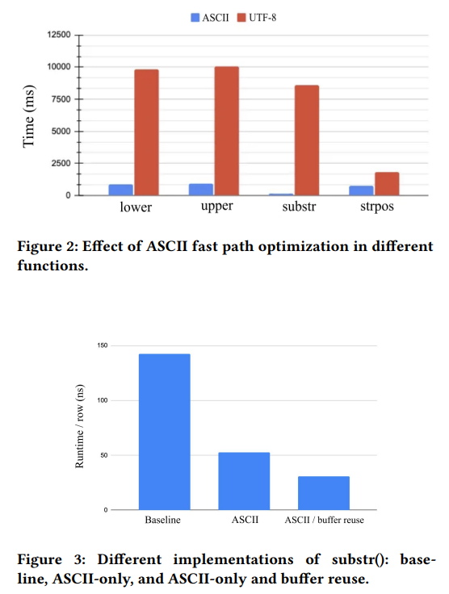

# Lecture 23 - Velox

## Data Systems at Meta

- 2008 Scribe (DEAD)
- **2008 Cassandra**
  - DataStax, FaunaDB, ScyllaDB
- 2010 Hive
- **2012 RocksDB**
  - YugaByteDB, Terark, CockroachDB, TiKV, Kvrocks, ...
- 2013 Scuba
- **2013 PrestoDB**
  - Ahana, Trino/Starburst
- 2014 WebScaleSQL (DEAD)
- 2015 Gorilla/Beringei (DEAD)
- 2017 LogDevice (DEAD)
- **2021 Velox**

## Meta Velox

Extensible **C++ library** to support high performance **single-node** query execution

- No SQL parse
- No meta-data catalog
- No cost-based optimizer

### Overview

- **Push-based vectorized query processing**
- **Precompiled primitives + codegen expressions**
- **Arrow compatible (extended)**
- **Adaptive query optimization**
- **Sort-merge + hash join**

### Storage

Velox实际上可以认为没有存储层也没有存储格式，而是暴露APIs允许定义**connectors**和**adapters**从其它系统中读取、转换文件，支持的系统例如S3、HDFS等，支持格式例如Parquet、ORC等

### Internal Representation

[Vector](./Velox.md#vectors)

- **Lazy Vector Materialization**
- **HyPer String Storage**

  

- **Out-of-order Writes/Population**

### Query Adaptivity

- **Predicate Reordering**
- **Column Prefetching**
- **Elide ASCII Encoding Checks**

  

## Thoughts

> Starting with something like Velox that was designed to be **embedded + extended** seems like the better move.
>
> Differentiating factors between DBMSs will be **UI/UX** factors and **query optimization**.
